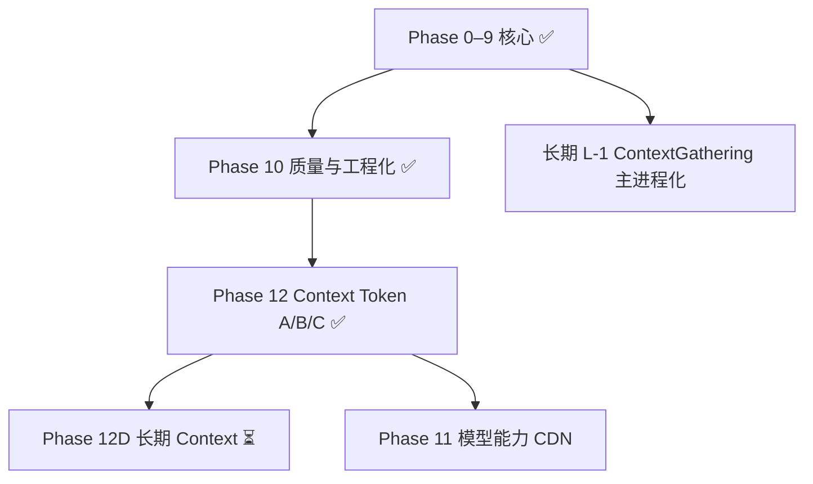

# MCode RAG / LlamaIndex 分阶段实施任务清单

> **维护说明**：本文件为**可勾选的任务追踪表**；各阶段的设计细节见 [设计方案_RAG分阶段实施路线图.md](./设计方案_RAG分阶段实施路线图.md)。**文档总索引**：[README.md](./README.md)（`代码分析/` 目录）。  
> **实现状态基线（2026-06）**：Phase 0–**10**、Phase **12A/B/C** 已全部落地——本地/Milvus 混合索引（Milvus **可选懒加载**）、tree-sitter 切片与建图、Git/文档索引、编排层、Context Token 优化、跨平台 RAG 单测。  
> **已知限制与后续**：见 [§ 已知限制](#已知限制当前实现) · [设计方案_LlamaIndex §8.5](./设计方案_LlamaIndex接入与优化方案.md#85-已知限制与后续) · [路线图 §10](./设计方案_RAG分阶段实施路线图.md#10-phase-10-与已知限制)

**图例**：`- [ ]` 待做 · `- [x]` 已完成 · `P0` 最高优先级 · `P5` 低优先级/技术债

---

## 总览

| 阶段 | 状态 | 主题 |
| :--- | :--- | :--- |
| Phase 0–9 | ✅ | RAG 核心链路、Milvus、编排、智能推荐 |
| Phase 10 | ✅ | 检索质量、增量一致性、工程化 |
| Phase 11 | ⏳ | 模型能力动态同步（设计文档 §3，非 RAG 阻塞） |
| Phase 12 | ✅ | Context Token 优化（Phase A/B/C） |
| Phase 12D | ⏳ | Context Token 长期项（chunk 256 / 跨轮指纹 / Autocomplete merge） |

---

## Phase 0 — 文档与基线对齐（已完成）

- [x] 本地 LlamaIndex 索引 + manifest + `forceRebuild`
- [x] 语义代码切片（`semanticCodeChunker.ts`）
- [x] 增量索引（`mcodeRagSyncContrib.ts`）
- [x] Settings UI + Chat RAG 注入
- [x] 编写 [解析_切片规则.md](./解析_切片规则.md)

---

## Phase 1 — LSP + 向量双通道融合 `P0` ✅

**目标**：启用已有 `ContextGatheringService`，与向量检索结果合并，提升 Chat 上下文精度。  
**设计文档**：[解析_RAG与上下文检索机制.md](./解析_RAG与上下文检索机制.md) §7

| ID | 任务 | 涉及文件 | 验收标准 |
| :--- | :--- | :--- | :--- |
| P1-1 | 在 `mcode.contribution.ts` 注册 `contextGatheringService` | `mcode.contribution.ts` | ✅ |
| P1-2 | 定义 `RagContextBundle` 类型 | `mcodeRagTypes.ts` | ✅ |
| P1-3 | 实现 `mergeRagContexts(lsp, vector)` | `common/helpers/ragContextMerger.ts` | ✅ |
| P1-4 | `chatThreadService` 并行 LSP + 向量检索 | `chatThreadService.ts` | ✅ |
| P1-5 | 无活跃编辑器时仅走向量通道 | `chatThreadService.ts` | ✅ |
| P1-6 | Autocomplete 恢复 ContextGathering | `autocompleteService.ts` | ✅ |

**依赖**：无  
**预估工作量**：1–2 天

---

## Phase 2 — 索引与同步 UI 反馈 `P0` ✅

**目标**：用户可见索引进度、增量同步状态，减少「黑盒等待」。  
**设计文档**：[设计方案_LlamaIndex接入与优化方案.md](./设计方案_LlamaIndex接入与优化方案.md) §6.1

| ID | 任务 | 涉及文件 | 验收标准 |
| :--- | :--- | :--- | :--- |
| P2-1 | 主进程索引事件 | `llamaIndexService.ts`, `mcodeRagMainService.ts` | ✅ |
| P2-2 | IPC 暴露进度订阅 | `mcodeRagTypes.ts`, `mcodeRagService.ts` | ✅ |
| P2-3 | Settings Local Index Status | `Settings.tsx`, `services.tsx` | ✅ |
| P2-4 | 增量同步状态展示 | `llamaIndexService.ts`, Settings | ✅ |
| P2-5 | Rebuild 禁用 + 进度条 | `Settings.tsx` | ✅ |

**依赖**：无  
**预估工作量**：1–2 天

---

## Phase 3 — 切片与增量质量补强 `P1` ✅

**目标**：弥补正则切片的已知缺口，完善 ignore 变更行为。  
**设计文档**：[解析_切片规则.md](./解析_切片规则.md) §9–§12

| ID | 任务 | 涉及文件 | 验收标准 |
| :--- | :--- | :--- | :--- |
| P3-1 | `.mcodeignore` 变更 → purge | `llamaIndexService.ts` | ✅ `purgeIgnoredFilesFromIndex` |
| P3-2 | TS/JS 箭头函数、`export default` | `semanticCodeChunker.ts` | ✅ |
| P3-3 | C/C++ 头文件声明 | `semanticCodeChunker.ts` | ✅ |
| P3-4 | 超大符号二级拆分（512 行） | `semanticCodeChunker.ts` | ✅ `partIndex` / `partTotal` |
| P3-5 | Scilab `.sci/.sce` | `semanticCodeChunker.ts` | ✅ `function`/`endfunction` |
| P3-6 | 单元测试 | `semanticCodeChunker.test.ts`, `scratch/test_semanticCodeChunker.mjs` | ✅ |

**依赖**：无（可与 Phase 1 并行）  
**预估工作量**：2–3 天

---

## Phase 4 — 检索增强（Reranker / Parent-Child）`P1` ✅

**目标**：在本地 VectorStoreIndex 上提升召回精度，不依赖 Milvus。  
**设计文档**：[设计方案_LlamaIndex接入与优化方案.md](./设计方案_LlamaIndex接入与优化方案.md) §7.2

| ID | 任务 | 涉及文件 | 验收标准 |
| :--- | :--- | :--- | :--- |
| P4-1 | Markdown Parent-Child | `ragQueryHelpers.ts`, `llamaIndexService.ts` | ✅ `doc_parent_map.json` |
| P4-2 | Hybrid Reranker | `ragReranker.ts` | ✅ 12 → rerank → 5 |
| P4-3 | `RagQueryOptions` + Settings | `mcodeRagTypes.ts`, Settings | ✅ |
| P4-4 | 代码 chunk 父级扩展 | `ragQueryHelpers.ts` | ✅ `code_symbol_map.json` |

**依赖**：Phase 3 建议先完成 P3-4  
**预估工作量**：2–4 天

---

## Phase 5 — tree-sitter AST 切片 `P2` ✅

**目标**：用 AST 替代/增强正则切片，解决模板、宏、嵌套等边界问题。  
**设计文档**：[解析_切片规则.md](./解析_切片规则.md) §12 · [设计方案_LlamaIndex接入与优化方案.md](./设计方案_LlamaIndex接入与优化方案.md) §7.4

| ID | 任务 | 涉及文件 | 验收标准 |
| :--- | :--- | :--- | :--- |
| P5-1 | 调研 Electron Main 加载 `@vscode/tree-sitter-wasm` 方案 | `electron-main/rag/TREE_SITTER_LOADER.md` | ✅ `importAMDNodeModule` + fs 读 grammar |
| P5-2 | 实现 `treeSitterChunker.ts`（C++/TS/JS/Python 语法） | 新建 + `llamaIndexService.ts` | ✅ 与 regex chunker 输出 metadata 一致 |
| P5-3 | 混合策略：AST 优先，失败 fallback `semanticCodeChunker` | `chunkCodeForIndexing()` | ✅ 无 AST 语言仍可用 |
| P5-4 | manifest `version: 2` 标记切片引擎变更，触发 rebuild | `index_manifest.json` schema | ✅ `chunkEngine: tree-sitter-hybrid-v1` |
| P5-5 | 更新 [解析_切片规则.md](./解析_切片规则.md) AST 章节 | 文档 | ✅ §12.2 与实现一致 |

**依赖**：Phase 3  
**预估工作量**：3–5 天

---

## Phase 6 — Git 与文档索引（本地）`P2` ✅

**目标**：在不接 Milvus 的前提下，扩展索引类型至 Git 历史与文档跨域检索。  
**设计文档**：[解析_Git与文档索引机制.md](./解析_Git与文档索引机制.md) §4

| ID | 任务 | 涉及文件 | 验收标准 |
| :--- | :--- | :--- | :--- |
| P6-1 | `gitLogIndexer.ts`：提取最近 N 次 commit → `docType: git_commit` nodes | `electron-main/rag/gitLogIndexer.ts` | ✅ metadata 含 hash/author/date |
| P6-2 | 全量/增量索引流程集成 Git 分区（本地 JSON 存储） | `llamaIndexService.ts` | ✅ manifest v3 含 `gitCommitCount` |
| P6-3 | Chat 意图检测：Git 相关问题触发 `git log`/`git diff` 动态上下文 | `gitDynamicContext.ts` + `queryContext` | ✅ 「昨晚改了什么」类问题有效 |
| P6-4 | Markdown 链接解析：metadata `linkedFiles` | `markdownLinkParser.ts` | ✅ doc chunk 关联代码路径 |
| P6-5 | `compile_commands.json` 变更时 Git 索引可选刷新策略 | `llamaIndexService.ts` + 文档 | ✅ 全量 rebuild 时一并重建 git |

**依赖**：Phase 4 可选  
**预估工作量**：3–5 天

---

## Phase 7 — Milvus 混合索引 `P3` ✅

**目标**：接入 Milvus 2.4+ Dense + Sparse + RRF，统一 code/git/doc 分区。  
**设计文档**：[设计方案_Milvus混合索引与检索设计.md](./设计方案_Milvus混合索引与检索设计.md)

| ID | 任务 | 涉及文件 | 验收标准 |
| :--- | :--- | :--- | :--- |
| P7-1 | `MilvusVectorStore` 适配层 + 连接配置 | `electron-main/rag/milvusStore.ts` | ✅ Settings **Test Connection** |
| P7-2 | Schema 对齐：`code_chunk` / `git_commit` / `doc_chunk` | Milvus collection | ✅ 三分区 + metadata JSON |
| P7-3 | Dense + BM25 Sparse + RRF 混合检索 | `queryMilvusContext()` | ✅ HNSW + SPARSE_INVERTED + RRFRanker |
| P7-4 | `useMilvus: true` 不再 fallback 本地（可配置双写） | `llamaIndexService.ts` | ✅ 连接失败抛错；`ragMilvusDualWrite` |
| P7-5 | Docker compose 文档与 `milvus/` 目录维护 | `milvus/docker-compose.yml`, README | ✅ `milvus/README.md` 一键启动 |
| P7-6 | Milvus SDK **懒加载**，未选 Milvus 索引时不阻塞启动 | `milvusLazyModule.ts`, `milvusSdkLoader.ts`, `milvusConstants.ts` | ✅ 仅 `indexType=milvus` 或 Test Connection 时 `import()`；`thrift→uuid@8.3.2` override |

**说明**：默认 `indexType: local` 用户无需安装/连接 Milvus；主进程启动不加载 `@zilliz/milvus2-sdk-node`。

**依赖**：Phase 5–6 建议完成（metadata 稳定）  
**预估工作量**：1–2 周

---

## Phase 8 — LlamaIndex 高级编排 `P3` ✅

**目标**：复杂问答与多索引路由。  
**设计文档**：[设计方案_LlamaIndex接入与优化方案.md](./设计方案_LlamaIndex接入与优化方案.md) §8 · [设计方案_LangChain与CodeGraph改造方案.md](./设计方案_LangChain与CodeGraph改造方案.md)

| ID | 任务 | 涉及文件 | 验收标准 |
| :--- | :--- | :--- | :--- |
| P8-1 | `PropertyGraphIndex`：AST 节点 + Calls/Imports 边 | `codeGraphBuilder.ts`, `code_graph_map.json` | ✅ 向量命中后 1-hop 图扩展 |
| P8-2 | `SubQuestionQueryEngine`：复杂问题拆分子查询 | `ragQueryOrchestrator.ts` | ✅ 多子句问题并行召回 + 去重 |
| P8-3 | `RouterQueryEngine`：按意图路由 code/git/doc 索引 | `ragQueryOrchestrator.ts`, Milvus 分区 | ✅ 毫秒级意图分流 |
| P8-4 | Code-Doc 混合图召回（文档 mentions → 源码） | `linkedFiles` + `buildLinkedCodeSnippets` | ✅ doc 命中后拉取链接源码 |

**实现摘要**：`queryContext()` 默认启用编排层（Router → SubQuestion → 向量检索 → Rerank → Graph 扩展 → Doc 链接源码）。侧车 `code_graph_map.json` 在索引时由 imports/calls 构建；需 **重建索引** 以生成图（旧索引无图时 graph 扩展自动跳过）。

**依赖**：Phase 7（Milvus 分区）或本地 docType 过滤  
**预估工作量**：2+ 周

---

## Phase 9 — 智能推荐与模型路由（扩展）`P4` ✅

**目标**：侧边栏依赖推荐、意图路由（与 RAG 协同，非阻塞核心 RAG）。  
**设计文档**：[设计方案_RAG智能推荐与模型路由.md](./设计方案_RAG智能推荐与模型路由.md)

| ID | 任务 | 涉及文件 | 验收标准 |
| :--- | :--- | :--- | :--- |
| P9-1 | `getRelatedDependencies(fileUri)` 基于 LSP/图的一级依赖 | `contextGatheringService.ts`, `codeGraphBuilder.ts`, RAG IPC | ✅ CodeGraph 优先，LSP references 回退 |
| P9-2 | Sidebar `@file` staging 依赖推荐 UI | `DependencyRecommendations.tsx` | ✅ 一键添加推荐文件 |
| P9-3 | 轻量意图分类 → 模型路由（可选） | `modelIntentRouter.ts`, Settings General | ✅ 解释/调试分流至 fast/reasoning 模型 |

**实现摘要**：
- `@file` 选中文件后，侧边栏显示 **Related files**（imports / used by / calls / references）
- Settings → General → **Model Intent Routing** 可启用 fast/reasoning 模型分流
- 需 **重建索引** 后 CodeGraph 依赖推荐才生效；无图时自动回退 LSP

**依赖**：Phase 1（LSP）、Phase 8（CodeGraph 可选）  
**预估工作量**：1 周+

---

## 已知限制（当前实现）

> 交叉引用：[设计方案_LlamaIndex §8.5](./设计方案_LlamaIndex接入与优化方案.md#85-已知限制与后续) · [路线图 §10](./设计方案_RAG分阶段实施路线图.md#10-phase-10-与已知限制) · [解析_Git §0 / §1.1](./解析_Git与文档索引机制.md#0-实现状态) · [长期项 L-1～L-4](#长期可选非近期)

| 项 | 说明 | 关联 |
| :--- | :--- | :--- |
| 本地 Router 为**检索后过滤** | 已通过过量采样（4× topK，上限 64）缓解；极端小索引仍可能缺 doc/git 块 | [P10-1](#phase-10--质量补强与工程化-p1p2) ✅ |
| CodeGraph 边提取 | tree-sitter 优先，regex 回退；C++ 模板/宏仍可能漏边 | [P10-2](#phase-10--质量补强与工程化-p1p2) ✅ · [解析_切片规则 §12](./解析_切片规则.md) |
| 图扩展 hop | Settings / `RagQueryOptions` 可配 1–2 hop | [P10-3](#phase-10--质量补强与工程化-p1p2) ✅ |
| SubQuestion 拆分 | 默认启发式；可选 LLM（需 key，8s 超时回退） | [P10-4](#phase-10--质量补强与工程化-p1p2) ✅ |
| `git_commit` 增量 | 增量批次后 `refreshGitCommitIndex` | [P10-5](#phase-10--质量补强与工程化-p1p2) ✅ · [解析_Git §4.4](./解析_Git与文档索引机制.md#44-compile_commandsjson-与-git-刷新策略) |
| 缺 `code_graph_map` | Graph 扩展 / 依赖推荐跳过或 LSP 回退；需 **Rebuild**（`graphEngine: code-graph-v2`） | [P10-11](#phase-10--质量补强与工程化-p1p2) ✅ |
| 模型意图路由 | 每轮 user 消息分流；tool 续跑保持已路由模型 | [P10-6](#phase-10--质量补强与工程化-p1p2) ✅ |
| Git **Blame → CodeGraph** | 设计目标未实现（仅 commit 向量 + 动态 diff） | [解析_Git §1.1](./解析_Git与文档索引机制.md#11-静态提交历史索引git-commit-indexing) |
| Doc **mentions 建图** | 检索期 `linkedFiles` 召回已实现；CodeGraph 文档节点边未建 | [解析_Git §3](./解析_Git与文档索引机制.md#3-代码与文档的跨域混合设计hybrid-code-doc) |
| 模型能力硬编码 | `modelCapabilities.ts` 待 CDN 同步 | [Phase 11](#phase-11--模型能力动态同步扩展-p4) |
| 轻量 JSON 侧车图 | 非官方 PropertyGraphIndex；深链 >2 hop 需更大 topK | [L-2](#长期可选非近期) |
| Milvus 与启动解耦 | 已懒加载；未配置 Milvus 时主流程不受影响 | [P7-6](#phase-7--milvus-混合索引-p3-) ✅ |

---

## Phase 10 — 质量补强与工程化 `P1–P2` ✅

**目标**：修复已知限制、提升可维护性，不引入新存储后端。

| ID | 任务 | 涉及文件 | 验收标准 |
| :--- | :--- | :--- | :--- |
| P10-1 | 本地索引 Router **过量采样**再 docType 过滤 | `ragQueryOrchestrator.ts`, `llamaIndexService.ts` | ✅ 4× topK（max 64）→ filter → 截断至 similarityTopK |
| P10-2 | CodeGraph 边提取改用 **tree-sitter**（import/call） | `codeGraphTreeSitter.ts`, `codeGraphBuilder.ts` | ✅ AST 优先，regex 回退；`graphEngine: code-graph-v2` |
| P10-3 | 可配置 **graph 扩展 hop**（默认 1，上限 2） | `ragQueryOrchestrator`, Settings | ✅ `ragGraphExpandHops` |
| P10-4 | SubQuestion 可选 **LLM 拆分**（关闭时保持启发式） | `ragQueryOrchestrator.ts` | ✅ `ragUseLlmSubQuestions` + 8s 超时回退 |
| P10-5 | 增量索引后 **刷新 git_commit**（或定时/手动） | `llamaIndexService.applyIncrementalChanges` | ✅ `refreshGitCommitIndex` + `git_commit_index.json` |
| P10-6 | 模型路由：**每轮 user 消息**重新分类（非 tool 中间步） | `chatThreadService.ts` | ✅ 新消息路由；tool 续跑保持已选模型 |
| P10-7 | 补全 `defaultRagQueryOptions` 编排默认值 | `mcodeRagTypes.ts` | ✅ 与 orchestrator 默认一致 |
| P10-8 | RAG 单元测试 **接入 CI**（14 个 `*.test.ts`） | `scripts/test-rag.js`, `npm run test-rag` | ✅ 跨平台（Win/macOS/Linux）；Electron runGlob |
| P10-9 | 移除 `contextGatheringService` **debug console.log** | `contextGatheringService.ts` | ✅ |
| P10-10 | `milvus/volumes/` 加入 **.gitignore** | 根 `.gitignore` | ✅ |
| P10-11 | manifest 缺 `graphEngine` 时 Settings **提示 Rebuild** | Settings Index 区块 | ✅ `graphEngineReady` 警告 |
| P10-12 | Settings 暴露编排开关（Graph/SubQuestion/Router） | `Settings.tsx`, `RagQueryOptions` | ✅ Orchestration 区块 |
| P10-13 | `DependencyRecommendations` 统一走 **contextGatheringService** | UI + service | ✅ Graph + LSP 回退集中 |
| P10-14 | 清理 `scratch/test_*.mjs` 或迁入正式测试 | `scratch/` | ✅ 已删除临时脚本 |
| P10-15 | `npm run test-rag` **Windows 跨平台** | `scripts/test-rag.js`, `test-rag.bat`, `test-rag.sh` | ✅ Node 入口；63 passing / 4 pending（Electron 内 tree-sitter skip） |
| P10-16 | merge 分块 **GRAPH IMPORT** 正则 + 超大 chunk 预算截断 | `ragContextMerger.ts` | ✅ `\n+` 分段；git 块超 budget 截断而非丢弃 |

**依赖**：Phase 8–9  
**预估工作量**：1–2 周

---

## Phase 11 — 模型能力动态同步（扩展）`P4`

**目标**：[设计方案_RAG智能推荐与模型路由.md](./设计方案_RAG智能推荐与模型路由.md) §3 — 缓解 `modelCapabilities.ts` 硬编码漂移。  
**说明**：与 RAG 索引无强依赖，可与 Phase 10 并行。

| ID | 任务 | 涉及文件 | 验收标准 |
| :--- | :--- | :--- | :--- |
| P11-1 | 启动时 CDN 拉取 `models.json` + 本地缓存 | 主进程 + `modelCapabilities.ts` | 缓存命中则合并硬编码表 |
| P11-2 | Ollama/自定义端点 **Handshake Probe**（tools/system） | `mcodeSettingsService.ts` | 新增模型自动探测能力 |
| P11-3 | Settings 展示「能力来源：缓存 / 内置 / 探测」 | Settings Models 区块 | 用户可知上下文窗口从哪来 |

**预估工作量**：1 周+

---

## Phase 12 — Context Token 优化 `P0` ✅

**目标**：降低 Chat Agent 每次 LLM 调用的输入 Token 消耗。  
**设计文档**：[context痛点与优化.md](./context痛点与优化.md)

### Phase 12A（已完成）

| ID | 任务 | 涉及文件 | 验收标准 |
| :--- | :--- | :--- | :--- |
| CTX-A1 | Agent 循环 **RAG 单次缓存** | `chatThreadService.ts` | ✅ |
| CTX-A2 | **SELECTIONS 路径排除** | `ragContextMerger.ts` | ✅ |
| CTX-A3 | merge **分块修复**（含 GRAPH IMPORT） | `ragContextMerger.ts` | ✅ 相对/绝对路径排除；独立 Git 段 |
| CTX-A4 | Settings **合并预算** | `Settings.tsx` | ✅ |
| CTX-A5 | **Git 独立预算** | `ragContextMerger.ts` | ✅ |

### Phase 12B/C（已完成）

| ID | 任务 | 涉及文件 | 验收标准 |
| :--- | :--- | :--- | :--- |
| CTX-B1 | **意图驱动编排**（简单问句关 SubQuestion/Graph） | `ragQueryOrchestrator.ts`, `llamaIndexService.ts` | ✅ `classifyRagQueryComplexity` + Settings 开关 |
| CTX-B2 | **编排分层预算**（TopK → Graph → Linked） | `llamaIndexService.ts` | ✅ `appendSectionWithinBudget` + `assemblyMaxChars` |
| CTX-B3 | System **紧凑目录树**（2k chars） | `directoryStrService.ts`, `convertToLLMMessageService.ts` | ✅ `getSystemDirectoriesStr` |
| CTX-B4 | 降低默认 TopK（8/3） | `mcodeRagTypes.ts`, Settings | ✅ 默认值 + Settings 可调 |
| CTX-B5 | **@File 摘要模式** + Full 切换 | `prompts.ts`, `SidebarChat.tsx` | ✅ Summary 默认，chip 切换 Full |
| CTX-C1 | **Token 估算**（CJK + code） | `tokenEstimate.ts`, `convertToLLMMessageService.ts` | ✅ 裁切按 token 权重 |
| CTX-C2 | **修正 reserved 输出**（15% context） | `convertToLLMMessageService.ts` | ✅ 非 50% 硬占 |
| CTX-C3 | **RAG compact 模式** | `ragCompactFormat.ts`, Settings | ✅ `ragCompactMode` |
| CTX-C4 | Tool 软上限（read 8k / terminal 16k） | `prompts.ts`, `terminalToolService.ts` | ✅ 常量 + 截断提示 |
| CTX-C5 | **MMR 多样性**（每文件 ≤2 chunk） | `ragReranker.ts` | ✅ `applyMMRDiversity` |

**依赖**：Phase 12A  
**预估工作量**：Phase B+C 1–2 周（已完成）

### Phase 12D（待做）

| ID | 任务 | 涉及文件 | 验收标准 |
| :--- | :--- | :--- | :--- |
| CTX-D1 | 检索 chunk 上限 **512→256** 行 | `semanticCodeChunker.ts` | 需 **Rebuild** 索引 |
| CTX-D2 | **跨 Turn 上下文指纹** | `chatThreadService.ts` | 相似 query + 未改 @file 时跳过 RAG 刷新 |
| CTX-D3 | **Autocomplete 共享 merge** | `autocompleteService.ts`, `ragContextMerger.ts` | 补全 LSP snippets 纳入同一预算工具 |

**设计文档**：[context痛点与优化.md](./context痛点与优化.md) § Phase D

---

## 长期可选（非近期）

| ID | 任务 | 说明 |
| :--- | :--- | :--- |
| L-1 | ContextGathering **主进程化** | [设计方案_LangChain与CodeGraph改造方案.md](./设计方案_LangChain与CodeGraph改造方案.md)：编辑器 ±15 行 + IPC RAG，减轻渲染线程 LSP 递归 |
| L-2 | 真 · LlamaIndex `PropertyGraphIndex` | 当前为轻量 JSON 侧车；可评估是否引入官方 Graph 库 |
| L-3 | Cross-encoder Reranker | 替换/增强现有 keyword+vector 混合 rerank |
| L-4 | Embedding **量化 / 本地 batch** 优化 | 大仓库首次索引耗时 |

---

## 文档维护任务

| ID | 任务 | 文档 | 状态 |
| :--- | :--- | :--- | :--- |
| DOC-1 | 保持 §1 实现状态表与代码一致 | [设计方案_LlamaIndex接入与优化方案.md](./设计方案_LlamaIndex接入与优化方案.md) | ✅ |
| DOC-2 | 双通道融合方案随 Phase 1 更新 | [解析_RAG与上下文检索机制.md](./解析_RAG与上下文检索机制.md) | ✅ |
| DOC-3 | 切片规则随 Phase 3/5 更新 | [解析_切片规则.md](./解析_切片规则.md) | ✅ |
| DOC-4 | Git/文档索引随 Phase 6/7/10 更新 | [解析_Git与文档索引机制.md](./解析_Git与文档索引机制.md) | ✅ |
| DOC-5 | Milvus 前置条件与 Phase 7 对齐 | [设计方案_Milvus混合索引与检索设计.md](./设计方案_Milvus混合索引与检索设计.md) | ✅ |
| DOC-6 | Phase 8–9 编排与推荐写入路线图 §7 | [设计方案_RAG分阶段实施路线图.md](./设计方案_RAG分阶段实施路线图.md) | ✅ |
| DOC-7 | 新增「已知限制 / Phase 10」交叉引用 | 本文 + 设计方案_LlamaIndex §8.5 + 路线图 §10 | ✅ |
| DOC-8 | Context Token 优化 Phase A–C 与 TODO 对齐 | [context痛点与优化.md](./context痛点与优化.md) §7 | ✅ |

---

## 推荐实施顺序

**下一迭代建议（按收益/成本）**：

1. **Phase 12D** — chunk 256、跨轮指纹、Autocomplete 共享 merge（[context痛点与优化.md](./context痛点与优化.md)）
2. **Phase 11** — 模型能力 CDN / Handshake Probe（[§ Phase 11](#phase-11--模型能力动态同步扩展-p4)）
3. **验证** — 未配置 Milvus 时 `.\scripts\code.bat` 正常启动；`npm run test-rag` 在 Windows 通过
4. **DOC 维护** — 大功能变更时同步 [路线图](./设计方案_RAG分阶段实施路线图.md) 与 [LlamaIndex 方案 §1](./设计方案_LlamaIndex接入与优化方案.md#1-实现状态总览)
5. **长期 L-2 / L-3** — Cross-encoder Reranker 或官方 PropertyGraph（非阻塞）
