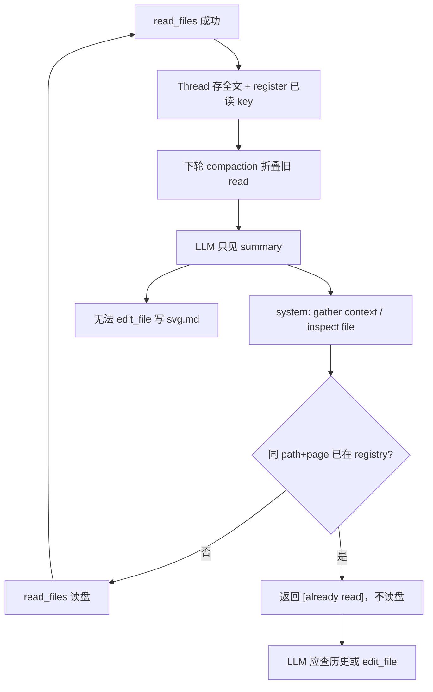
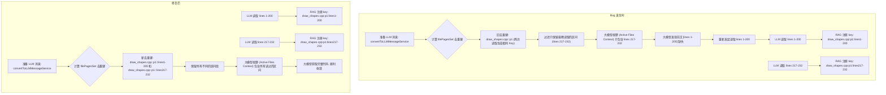

# Agent LLM 不收敛：上下文膨胀、KV cache 失效与重复读文件

本地 Agent + llama-server 场景下，任务「越跑越慢、一直读文件、写不出结果」通常由 **多条原因叠加**，而非单一 n_ctx 不够。本文汇总现象、根因、log 证据与已实施修复。

---

## 问题现象

### 1. llama-server 反复告警（性能劣化，非 OOM）

同一 task 内连续出现：

```text
slot update_slots: id  0 | task 69 | erased invalidated context checkpoint (...)
slot update_slots: id  0 | task 362 | forcing full prompt re-processing due to lack of cache data
```

- `n_tokens` 约 4k~35k，**远小于** `-c 65536` → **不是 context 已满**。
- 表现为每轮 prefill 耗时陡增（全量可达 30s+），Agent **迟迟完不成**。

### 2. payload 膨胀

| Agent 轮次 `nMessagesSent` | `payload totalChars`（优化前典型） |
|---------------------------|-----------------------------------|
| 1 | ≈16,240 |
| 5 | ≈55,099 |
| 10 | ≈113,462 |

### 3. 同一文件无限重复读（典型：`SVGFramework.h`）

任务：分析 Word SVG 流程，输出 `代码分析\svg.md`。

log 表现：

- 固定 4 文件 batch 被反复 `read_files`：`SVGFramework.h/cpp`、`CSvgFile.h/cpp`
- Agent 轮次 **1 → 43+**，**无** assistant 发出的 `edit_file` / `rewrite_file`
- 第 6 轮起，发给 LLM 的历史里 read 结果变为 **~396 chars 摘要**，正文消失

### 4. 其它伴随现象

- IDE `contextWindow` 与后端 `-c` 不一致（32768 vs 65536）
- `read_files` 分页截断后 LLM 不续页（早期）；加强 prompt 后续页有改善
- UI `(truncated after Nk combined)` — tool 分页，非 debug log 截断

---

## 问题原因总览

| # | 原因 | 后果 | 谁导致 |
|---|------|------|--------|
| 1 | **Agent 历史 snowball** | 每轮全历史再发，payload 线性涨 | 多轮 tool 设计 |
| 2 | **RAG 每轮重复注入** | 每轮固定 +~3k chars | MCode（已修：仅首轮） |
| 3 | **compaction 改写已发送 read** | LLM 侧「看不见」读过的文件 → **重复 read** | MCode `compactAgentChatMessagesForLlm`（已修：**线程级已读列表**拦截重复读） |
| 4 | **KV cache 前缀被改写** | `erased invalidated checkpoint`、全量 prefill | compaction + system 动态字段 |
| 5 | **read_files 合并页过大**（旧） | 单次 tool 16k~24k | `8k × 文件数`（已修：固定 16k 合并页） |
| 6 | **IDE contextWindow 未对齐** | 裁剪线与后端不一致 | 未 sync `/props`（已修） |
| 7 | **llama-server 多 slot** | cache 争用 | `total_slots: 4`（建议 `--parallel 1`） |
| 8 | **LLM 不续页**（早期） | 截断后丢内容 | prompt 弱（已加强 A+B+C） |
| 9 | **活跃文件上下文去重忽略行号区间** | 同一页面多个不同区间只保留最后一个，旧区间被丢弃导致 LLM 侧「读过却看不见」 → **重复 read** | MCode `prepareLLMChatMessages`（已修） |
| 10 | **区间读取分页页码混淆冲突** | startLine 和 pageNumber > 1 同时指定且无历史前置页时，导致跳过前 16k 字符只加载后半段，大模型看不到文件前半截 | MCode `chatThreadService`（已修） |
| 11 | **多文件读取合并分页不一致** | read_files 在 tool 执行层合并后全局分页，但在活跃文件上下文注入层对单个文件分别分页，导致 page >= 2 时发生数据位置偏移与信息遗失 | MCode `prepareLLMChatMessages`（已修） |

**核心结论**：「不收敛」= **性能不收敛**（越跑越慢）+ **任务不收敛**（重复 gather、不写 deliverable）。后者在 log 里常表现为 **compaction 与重复 read 的死循环**。

---

## 原因详解

### A. llama-server KV cache 失效（性能）

**机制**：

- llama-server 缓存 prompt 前缀的 K/V；新请求若与上一轮 **前缀一致、末尾追加**，只 prefill 增量（~4s/轮）。
- 若 **中间 message 内容被改写**（compaction 摘要、裁剪），前缀断裂 → checkpoint 作废 → **整段重算**（~30s/轮）。

**与 n_ctx 的区别**：

| | Context 上限 | Cache 失效 |
|---|-------------|------------|
| 条件 | prompt + gen > `-c` | prompt 结构/内容变化 |
| 本案例 | 未触顶 | **主要瓶颈** |

**后端建议**：`--parallel 1`（单 slot）；保持 `-c 65536` 与 IDE sync 一致。

详见：[解析_context体积与KV_cache原理.md](../解析_context体积与KV_cache原理.md)

---

### B. compaction 导致「读过却看不见」→ 重复读（任务不收敛）

**数据流**：

```text
read_files → Thread 存全文（UI 可见）
     ↓ 每轮 Agent
compactAgentChatMessagesForLlm（仅改发给 LLM 的副本）
     ↓
sendLLMMessage → LLM 只看到 payload 里的 messages
```

**不是 LLM 删除上下文**，是 **MCode 发送前把旧 read 换成 summary**。

**旧逻辑**（`agentContextCompaction.ts`）：

- 大 tool（>2k chars）只保留 **最近 2 条**全文，其余 → `[read_files summary] ... (N chars omitted)`

**log 证据（SVG 任务，thread `4010130b-...`）**：

| 轮次 | 发给 LLM 的 `read_files` page=1 |
|------|--------------------------------|
| n=3 | **8213 chars** 全文（含 `SVGFramework.h`） |
| n≥6 | **396 chars** 摘要：`(8172 chars omitted from context)` |
| n=43 | `folded 32 tool result(s), saved ~272864 chars`，仍重复同一 4 文件 |

**死循环**（compaction 单独无法打破，需配合已读列表）：



**分页 prompt 加强后**：出现大量 `page_number=2`，但 page1/page2 **均被 fold 成 summary** 后，续页收益仍被吃掉；已读列表按 **path + page_number** 区分，page2 仍视为新 key、可正常读盘。

---

### C. 其它叠加因素

- **RAG 每轮注入**（已修）：首轮后 `[RAG][inject] skipped agent loop nMessagesSent=N`
- **`read_files` 分页**：固定 **16k 合并页**（`MAX_READ_FILES_COMBINED_PAGE`）；见 [read_files分页LLM不续读.md](./read_files分页LLM不续读.md)
- **contextWindow sync**：`GET /props` → `Synced contextWindow=65536`

---

### D. 活动文件上下文多区间去重缺陷

**现象**：
在大模型使用我们提供的“行号区间读取”能力时，在同一个会话中先后读取了同一个大文件（如 `draw_shapes.cpp` Page 1）的多个不同区间段（例如 `lines 1-200`、`lines 217-232` 和 `lines 235-296`）。
但大模型随后的回复中，会再次请求读取 `lines 1-200` 等它曾经读取过的部分，在同一个文件上反复打转、不收敛。

**关键日志证据**：
在 `log.txt` 中，大模型按顺序发送了以下请求：
```text
[LLM][send] message[74] role=assistant chars=181:
    <read_file>
<uri>d:\work\doc_morph\src\OdfFile\Reader\Format\draw_shapes.cpp</uri>
<start_line>1</start_line>
<end_line>200</end_line>
    </read_file>
[LLM][send] message[76] role=assistant chars=188:
    <read_file>
<uri>d:\work\doc_morph\src\OdfFile\Reader\Format\draw_shapes.cpp</uri>
<start_line>217</start_line>
<end_line>232</end_line>
    </read_file>
[LLM][send] message[78] role=assistant chars=180:
    <read_file>
<uri>d:\work\doc_morph\src\OdfFile\Reader\Format\draw_shapes.cpp</uri>
<start_line>235</start_line>
<end_line>296</end_line>
    </read_file>
```
而在注入大模型的 `[ACTIVE FILES CONTEXT]` 渲染生成逻辑中，去重缓存判定如下：
```text
[RAG][debug] checking read_file key: read_file:...draw_shapes.cpp:p1 hasKey: true
```
由于没有对 `start_line` / `end_line` 作出独立识别，最终在大模型的 `[ACTIVE FILES CONTEXT]` 中，仅显示了最末次读取的 `lines 235-296` 内容，而之前的 `lines 1-200` 和 `lines 217-232` 均从上下文块中被剔除。

**数据流与冲突对立图 (Mermaid)**：



---

## 已实施修复

### 1. 自动同步 llama-server context（方案 A）

- `GET {base}/props` 解析 `n_ctx` → `contextWindow` override（不覆盖用户手动值）
- 文件：`llamaServerProps.ts`、`llamaServerContextService.ts`、`llamaServerContextContrib.ts` 等

### 2. RAG 仅 Agent 第一轮注入（方案 B）

- `_runChatAgent`：`nMessagesSent === 1` 才注入 `[检索到的代码上下文]`
- 文件：`browser/chatThreadService.ts`

### 3. read_files 固定合并页 + 分页 prompt（方案 D + read_files 文档）

- `MAX_FILE_CHARS_PAGE = 16_000`，`MAX_READ_FILES_COMBINED_PAGE` 固定（不 × 文件数）
- `prompts.ts` 工具描述 + `systemToolsXMLPrompt` 分页硬规则；`toolsService.ts` `ACTION REQUIRED` 文案
- 详见：[read_files分页LLM不续读.md](./read_files分页LLM不续读.md)

### 4. debug 日志完整输出（方案 E）

- `logLongText` / `ragLogBody` 分段完整输出，便于 `[LLM][send]` 排查

### 5. 线程级 read 已读列表（方案 G — 针对重复读不收敛）

**问题**：compaction 仍会把旧 read 折叠成 summary（保留最近 2 条大 tool 全文），LLM 误以为未读过 → 反复 `read_files` 同一批文件，任务不收敛。

**思路**：每个 **thread（当前对话）** 维护 `state.agentReadRegistry: string[]`，用稳定 key 记录「本对话内已成功执行过的 read」：

| key 组成 | 示例 |
|----------|------|
| `read_file` | `read_file:{path}:p{page}[:lines{start}-{end}]` |
| `read_files` | `read_files:{排序后的多路径}:p{page}` |

**行为**：

| 时机 | 行为 |
|------|------|
| 首次 `read_file` / `read_files` 成功 | 正常读盘 → **register** key |
| 同 thread、同 key 再次调用 | **不读盘**，返回短 `[already read]`（不 replay 全文，避免 context 再膨胀） |
| checkpoint / 编辑截断消息 | 从剩余 messages **rebuild** registry |
| **新开对话** | `agentReadRegistry: []`，**会正常读文件**（不跨 thread 共享） |
| 重启后打开旧对话 | thread 持久化；缺字段时从 messages 自动 rebuild |

**与 compaction 分工**：

- **compaction**：控制发给 LLM 的 payload 体积（旧 read → summary）
- **已读列表**：控制 **是否再读盘**；打断「读 → fold → 再读」循环，但不把全文塞回 context

**涉及文件**：

- `common/helpers/agentReadRegistry.ts` — key 生成、registry、already-read 文案、`rebuildAgentReadRegistryFromMessages`
- `browser/chatThreadService.ts` — `_runToolCall` 拦截 duplicate + 成功后 register；截断时 rebuild
- `common/helpers/agentContextCompaction.ts` — 保持简单折叠（最近 2 条大 tool 全文，**无** sticky watermark）

**已回退（不再使用）**：

- 粘性折叠 `llmSentMessageCount`（旧 read 永不 fold → context 超 65536）
- `agentReadDedup` replay 全文（duplicate 时把 cache 全文塞回 → snowball）
- emergency budget fold、`convertToLLMMessageService` 0.88 llama 硬 cap

**预期 log**：

```text
[RAG][read-registry] registered read_files key=read_files:...
[RAG][read-registry] skipped duplicate read_files key=read_files:...
```

**局限**：duplicate 时 LLM 收到的是短提示而非正文；需依赖 **对话历史中仍可见的 read 结果**（UI / 未 fold 的最近 2 条）或自行 `edit_file`。若模型仍 ignore `[already read]` 继续调 tool，需观察 log 并考虑加强 prompt。

### 6. 后端配置（方案 F）

```bash
llama-server ... --parallel 1 -c 65536
```

### 7. 活动文件独立上下文策略（Aider/Cursor 模式 — 终极修复方案）

**问题**：旧的 "方案 G" 仅靠拦截器返回 `[already read]` 文本，在历史 Compaction 折叠后，LLM 失去了对文件内容的记忆，但重新读取又被拦截。这导致 LLM 无法获取代码内容，从而陷入持续重试的死锁（空转多轮不收敛并撑爆上下文）。

**升级方案**：
1. **统一管理活动文件内容**：不再将 `read_file` / `read_files` 的完整文件内容以 `tool` 消息体形式塞入对话历史。而是在 `prepareLLMChatMessages` 阶段动态收集最近读取的最多 5 个活跃文件页面，通过 `mcodeModelService` 读取其实时最新内容，统合为 `[ACTIVE FILES CONTEXT]` 块放入 `systemMessage` (System Prompt) 头部或尾部。
2. **轻量化历史记录**：在对话历史中，激活状态的 `tool` 读取结果被缩减为轻量占位符（如 `[read_file success] File ... loaded into active context...`）。被挤出前 5 名额而剪枝（Pruned）的文件则被替换为 `content was pruned...` 占位符。这使得历史消息的大小恒定极小，完全避免了 Compaction 折叠和上下文撑爆。
3. **拦截器动态更新**：`agentReadRegistry` 在每轮 Agent 循环开始时与这 5 个激活文件 Key 动态同步。仅当文件存在于活跃文件上下文中时才进行拦截，如果文件已被剪枝注销，则允许 LLM 重新拉取以恢复到活跃上下文。
4. **稳定 KV Cache**：由于文件全文存放在 System Prompt 内，历史对话仅在尾部进行末尾追加，`llama-server` 能够最大化命中 KV 缓存，每轮的 Prefill 时间从 **30s 缩短至 2s** 左右。

**涉及文件**：
- `browser/convertToLLMMessageService.ts` — 搜集最活跃读取文件页面，构造 `[ACTIVE FILES CONTEXT]`，轻量化历史消息。
- `browser/chatThreadService.ts` — 在 `_runChatAgent` 循环最开始同步最新的 5 个活跃 Key 到已读注册表。

### 8. 活动文件多区间并存支持（方案 H — 针对区间读取重复读不收敛）

**问题**：大模型使用区间行号读取时，虽然被 RAG 判定成功读取并分配了 `[read_file success]` 的占位符，但由于在组装 `[ACTIVE FILES CONTEXT]` 时，其排他缓存只通过 `fsPath::p1` 检索，使得同一个文件的多个区间段在上下文块组装时只保留了最后一个，导致前面的数据段在大模型视角中成了真空，引发大模型不断循环重新拉取。

**思路**：将区间限定值（`startLine` 和 `endLine`）引入活跃上下文判定 Key 和排他判定 Key，同时更新装载到 Context 里的标题块标示以明确区间：

1. **去重键改造**：
   ```typescript
   const fileKey = `${p.uri.fsPath.toLowerCase()}::p${p.pageNumber}${p.startLine !== null || p.endLine !== null ? `::lines${p.startLine}-${p.endLine}` : ''}`;
   ```
2. **上下文标题标示区间**：
   ```typescript
   const rangeStr = f.startLine !== null || f.endLine !== null ? `, lines ${startLineNumber}-${f.endLine === null ? 'end' : f.endLine}` : '';
   activeFilesBlocks.push(`--- FILE: ${f.uri.fsPath} (page ${f.pageNumber}${rangeStr}) ---\n${pageContents}`);
   ```

**涉及文件**：
- `browser/convertToLLMMessageService.ts` — 修改去重 Key 构造逻辑和上下文 Header 输出格式。

### 9. 区间分页页码冲突自动重置（方案 I — 针对区间读取冲突截断不收敛）

**问题**：当大模型切换到区间读取（例如指定 `startLine: 1500`）时，若它在先前的上下文对话中进行过全页面的 pagination（例如 `pageNumber` 曾为 1），它有时会错误地同时发送 `<start_line>1500</start_line><page_number>2</page_number>`。
这会导致系统将 line 1500 后的内容按照 page 2 裁剪，即跳过前 16,000 个字符（约 350-400 行 C++ 代码），直接显示从 line 1850 开始的后半段。大模型看不见 1500 行的头部实现，进而引发逻辑混淆与反复读取。

**思路**：在工具调用执行层进行拦截与容错：
当大模型指定 `pageNumber > 1` 并且 `startLine/endLine` 非空时，检查当前会话的工具历史记录：如果历史记录中**不存在**针对该文件、相同区间且 `pageNumber` 为当前 `pageNumber - 1` 的成功读取记录，则自动判定此为大模型对区间首读的页码混淆错误，并**自动重置 `pageNumber = 1`**。

**涉及文件**：
- `browser/chatThreadService.ts` — 在 `_runToolCall` 中执行上述历史检测与自动纠错逻辑。

### 10. 多文件读取合并分页对齐（方案 J — 针对多文件分页截断数据不一致不收敛）

**问题**：
在 `read_files`（读取多个文件）的工具执行端，所有文件内容被合并拼接为一整篇文本，再对这篇拼接文本执行 `combined.slice(from, to)` 的 16K 分页。
但先前在 MCode 将活跃文件上下文注入到 `[ACTIVE FILES CONTEXT]` 时，是针对这组文件里的每一个文件单独执行 `contents.slice(from, to)`。
这会导致在 `pageNumber >= 2` 时：
- 工具端与注入端的文件内容边界严重错位与偏移。
- 最终导致部分代码在注入时被完全遗漏，引起大模型产生逻辑黑洞，无法收敛。

**思路**：
对 `convertToLLMMessageService.ts` 中的 `filePagesToLoad` 与活跃块渲染逻辑进行升级：
如果读取的类型为 `read_files`，我们不再单独将每个文件分别分页，而是：
1. 复制与工具执行层完全一致的拼接逻辑（使用 Markdown block 组合文件）。
2. 在注入端对整个 combined 块进行全局 16K 分页切割。
3. 渲染为一个完整的多文件上下文块：
   `--- FILES: [path1, path2] (page N) ---\n${slicedCombinedContents}`
以此确保注入的内容与工具执行层的返回字符级完全一致。

**涉及文件**：
- `browser/convertToLLMMessageService.ts` — 提取 `read_files` 合并去重与分页加载逻辑。

### 11. Agent 强制增量写 md（prompt + ACTIVE FILES 文案）

**问题**：分析类任务（如 Word SVG → `代码分析\svg.md`）模型无限 search/read，16+ 轮无 `edit_file`。

**改法**（不依赖 Gemini）：

- `prompts.ts` Agent 分支：**删除**「ALL relevant context 再改」；改为 **读 1–2 文件 → 立刻 rewrite_file/edit_file 写/追加 .md → 再读下一组**；**连续 2 次 read/search 后下一 tool 必须是 edit_file**。
- `convertToLLMMessageService.ts`：`[ACTIVE FILES CONTEXT]` 与 read 占位符引导 **append deliverable .md**，pruned 时不再鼓励无脑再 read。
- `agentReadRegistry.ts`：`[already read]` 文案指向 **edit_file 追加 md**。

**预期**：log 里在 n=3~5 出现 `edit_file`/`rewrite_file` 写目标 md，而非 n=16 仍只有 read。

---

```powershell
node --max-old-space-size=8192 ./node_modules/gulp/bin/gulp.js compile
.\scripts\code.bat
```

1. 控制台：`Synced contextWindow=65536`
2. Agent 任务（如 SVG → `svg.md`），**同一条对话内**：
   - 第 2 轮起：`[RAG][inject] skipped agent loop nMessagesSent=N`
   - 首次 read：`[RAG][read-registry] registered read_files key=...`
   - 重复 read 同 path+page：`[RAG][read-registry] skipped duplicate ...`，**不再** 43 轮反复读盘同一 4 文件
   - compaction 仍可能出现：`[RAG][compact] folded N tool result(s)`（正常，旧 read 变 summary）
   - 最终应出现 `edit_file` / `rewrite_file` 写目标文件
3. **新开对话**：registry 为空，第一次 read 应正常读盘（不应误拦）
4. llama-server：`sim_best > 0.9`、`prompt eval` 仅数百 token 的轮次增多；`forcing full prompt re-processing` 减少

---

## 相关文档

- [解析_context体积与KV_cache原理.md](../解析_context体积与KV_cache原理.md) — context 体积与 KV cache 机制
- [read_files分页LLM不续读.md](./read_files分页LLM不续读.md) — 分页与 LLM 续页
- [解析_ContextWindow管理机制.md](../解析_ContextWindow管理机制.md) — IDE 侧裁剪算法
- `Mermaid块占用LLM超长上下文.md` — diagram 块叠加因素
- `RAG诊断日志缺失难以定位卡顿.md` — 阶段化 log
