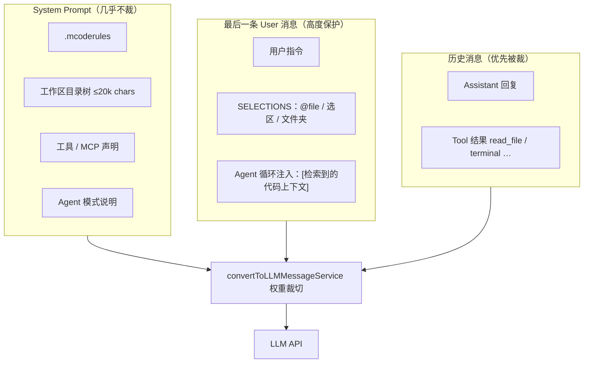
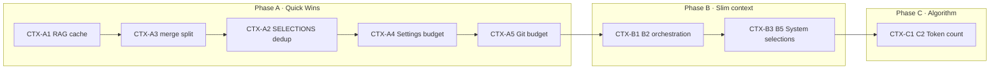

# Context 痛点与 Token 优化计划

> **目标**：在不影响回答质量的前提下，系统性降低每次 LLM 调用的 **输入 Token 消耗**。  
> **基线（2026-06）**：RAG Phase 0–10 已落地；本文聚焦 **Chat Agent 链路** 的上下文组装与重复注入问题。  
> **关联文档**：[解析_ContextWindow管理机制.md](./解析_ContextWindow管理机制.md) · [解析_RAG与上下文检索机制.md](./解析_RAG与上下文检索机制.md) · [TODO.md](./TODO.md)

---

## 1. 上下文从哪里来（Token 流向）

一次 Chat Agent 调用的最终 Payload 由多条独立管道拼装，**彼此几乎不感知、也不去重**：



**估算换算**：当前统一使用 `CHARS_PER_TOKEN = 4`（见 `convertToLLMMessageService.ts`），下文 **≈Token = chars ÷ 4**。

| 来源 | 典型上限（chars） | 约合 Token | 裁切权重 |
| :--- | ---: | ---: | :--- |
| 目录树 `directoryStr` | 20_000 | ~5_000 | 极低（System） |
| RAG 合并输出 `mergeRagContexts` | 12_000 | ~3_000 | 低（附在最后 User 上） |
| SELECTIONS 单文件 | 100_000（Folder 内）/ 2M（选区硬限） | ~25_000+ | 低（User） |
| `read_file` 单页 | 500_000 | ~125_000 | 高（Tool，×10） |
| Git 动态上下文 | 12×150 行 diff + stat | ~2_000–8_000 | 占用 RAG vector 预算 |
| 编排附加 Graph / Linked | 无独立上限 | 波动大 | 与最后一 FILE 块绑定 |

---

## 2. 核心痛点（按 Token 影响排序）

### P1 · Agent 循环每轮重复检索并全量注入 RAG

**现象**：`chatThreadService` 在 **每一次** Agent tool-loop 迭代中，都会对**同一条**用户消息重新调用 `_gatherHybridRagContext`，并把结果拼进发送副本：

```849:854:src/vs/workbench/contrib/mcode/browser/chatThreadService.ts
							const context = await this._gatherHybridRagContext(queryText)
							if (context) {
								chatMessages[lastUserMsgIdx] = {
									...lastUserMsg,
									content: `${queryText}\n\n[检索到的代码上下文]:\n${context}`
```

**影响**：

- **计算**：每轮重复 Embedding + Milvus/本地检索 + LSP cache 刷新。
- **Token**：`[检索到的代码上下文]` 挂在 **最后一条 User** 上；裁切算法对首尾消息权重 ×0.05，**RAG 块几乎不会被裁掉**。
- 5 步 Agent ≈ 同一段 ~3k Token RAG **发送 5 次**（≈15k Token 纯重复），且历史中还累积 Tool 输出。

**根因**：RAG 未按 `(threadId, userMessageId)` 缓存；注入发生在循环内而非首次发送前。

---

### P2 · SELECTIONS 与 RAG / LSP 三路重复同一文件

**现象**：

- `chat_userMessageContent` 对 `@File` / `@Folder` 读取**完整文件内容**（Folder 内单文件上限 **100_000 chars**）。
- 同一次请求中，RAG 向量检索极可能再次命中这些文件 chunk；LSP 也可能抓取相同符号片段。
- `mergeRagContexts` 仅做 LSP ↔ Vector 文本近似去重，**不感知 SELECTIONS 已嵌入的全文**。

**影响**：用户 @ 了 3 个 500 行文件时，SELECTIONS  alone 即可 ~30k+ chars；RAG 再补 12k chars，重复率可达 **30–60%**。

**根因**：缺少「已提供上下文文件清单」的跨通道黑名单 / 指纹去重。

---

### P3 · 合并预算 12k 固定、不可配，且切分逻辑对编排内容不友好

**现象**：

- `mergeRagContexts` 默认 `maxTotalChars = 12_000`，**Settings 未暴露**；Chat 调用时也未传入 `RagContextMergeOptions`。
- `filterVectorContext` 仅按 `\n(?=--- FILE:)` 分块；**Graph / Linked / Git** 段使用 `--- GRAPH` / `--- LINKED CODE` 前缀，会被 **粘在最后一块 FILE 尾部**，导致：
  - 最后一块极易超预算被整段丢弃，或
  - 前面 FILE 块占满预算后 Graph/Linked 完全进不了上下文。

**影响**：要么浪费检索算力（构建了却裁掉），要么 Graph 扩展「全有或全无」，Token 利用 uneven。

---

### P4 · Phase 8 编排默认全开，检索「先放大、后裁剪」

**默认**（`defaultRagQueryOptions`）：

| 开关 | 默认 | Token 副作用 |
| :--- | :--- | :--- |
| `useSubQuestions` | true | 多子问 → 多路 retrieve → dedupe 前膨胀 |
| `useGraphExpand` | true | 最多 +4 邻域 snippet |
| `useDocLinkedCode` | true | 最多 +3 linked 代码段 |
| `similarityTopK` / `finalTopK` | 12 / 5 | 单 chunk 最大 **512 行**（`MAX_SYMBOL_LINES`） |

编排路径 `assembleOrchestratedContext` 在 **merge 之前** 拼接全部 section，大量内容在 12k 合并阶段被丢弃——**CPU 与 Embedding 成本已消耗，Token 未受益**。

---

### P5 · System Prompt 常驻 20k 字符目录树

**现象**：`MAX_DIRSTR_CHARS_TOTAL_BEGINNING = 20_000`，每次 Chat 调用写入 System Message，权重 ×0.01，**几乎永不裁切**。

**影响**：稳定占用 ~**5k Token**；大 monorepo 下目录信息对具体 coding 任务 often 冗余（Agent 已有 `ls_dir` / `get_dir_tree` 工具）。

---

### P6 · 上下文窗口预算被「保留输出区」过度挤压

**现象**：

```272:275:src/vs/workbench/contrib/mcode/browser/convertToLLMMessageService.ts
	reservedOutputTokenSpace = Math.max(
		contextWindow * 1 / 2, // reserve at least 1/4 of the token window length
		reservedOutputTokenSpace ?? 4_096 // defaults to 4096
	)
```

注释写 1/4，代码实际为 **50% contextWindow**。128k 模型仅 ~64k chars（≈16k Token）可用于输入历史 + System + RAG + SELECTIONS，**过早触发对 Tool 历史的暴力裁切**，间接促使 Agent 再次 `read_file` → Token 反弹。

---

### P7 · Tool 输出上限过大，与裁切策略博弈

| 常量 | 值 | 说明 |
| :--- | ---: | :--- |
| `MAX_FILE_CHARS_PAGE` | 500_000 | read_file 单页 |
| `MAX_TERMINAL_CHARS` | 100_000 | 终端输出 |

Tool 消息权重 ×10 **优先被裁**，但单条可先进来 ~125k Token，裁切循环最多 100 次——**峰值内存与单次 API 成本**仍高；裁后 Agent 往往重复读文件。

---

### P8 · Git 动态上下文与代码 RAG 抢同一 vector 预算

**现象**：`queryContext` 将 `buildGitDynamicContext` 与向量结果拼接后，一并进入 `mergeRagContexts` 的 vector 通道（70% ≈ **8_400 chars**）。

Git 意图查询（diff 最多 12 文件 × 150 行）可占满 vector 预算，**挤掉真正相关的代码 chunk**。

---

### P9 · 字符估算粗糙，小语种 / 代码密度下偏差大

代码与中文混合时，实际 Token/char 常 **高于** 0.25，导致：

- 以为未超限，API 侧 413 / context overflow；
- 或过早裁切 User/RAG 内容。

---

## 3. 量化场景（估算）

| 场景 | 主要 Token 构成 | 粗算输入 Token |
| :--- | :--- | ---: |
| 普通问答（无 @file，1 轮） | System 5k + User 0.5k + RAG 3k | ~8_500 |
| @3 文件 + 5 步 Agent | System 5k + SELECTIONS 15k + RAG×5 15k + Tool 20k | **~55k+** |
| 128k 模型 + 50% 输出保留 | 可用输入上限 | **~16k** → 易溢出 |

> 以上仅为 order-of-magnitude，用于排优先级；落地时需用目标模型的 Tokenizer 抽样校准。

---

## 4. 优化计划（以减少 Token 为主）

### Phase A — Quick Wins（1–2 周，预期省 20–40% Chat Token）

| ID | 任务 | 做法 | 预期收益 |
| :--- | :--- | :--- | :--- |
| **CTX-A1** | RAG 单次缓存 | `_gatherHybridRagContext` 结果按 `threadId + lastUserMsgIdx` 缓存；Agent 循环后续轮 **复用** 不再 query | 多步 Agent **RAG Token ×N → ×1** |
| **CTX-A2** | SELECTIONS 路径排除 | 将 `@file` / 选区 URI 传入 RAG merge；vector 过滤掉同文件 chunk；LSP 跳过已选 URI | 减少 20–50% 重复代码块 |
| **CTX-A3** | 修复 merge 分块 | `filterVectorContext` 支持 `--- FILE:` / `--- GRAPH` / `--- LINKED` / `## Git` 独立分块 + **按 score 优先**填充预算 | 同等 12k 下有效信息密度 ↑ |
| **CTX-A4** | Settings 暴露合并预算 | `ragContextMaxChars`（默认 12000）、`ragLspBudgetRatio`（默认 0.3）；Chat 传入 `mergeRagContexts` | 用户可按模型调小（如 8k） |
| **CTX-A5** | Git 独立预算 | Git 段从 vector 分离为第三段 `[Git Context]`，固定 cap（如 2000 chars） | 避免 diff 挤掉代码 chunk |

**涉及文件**：`chatThreadService.ts`、`ragContextMerger.ts`、`mcodeSettingsTypes.ts`、`Settings.tsx`、`llamaIndexService.ts`（可选：query 层返回分段结构）。

---

### Phase B — 编排与 System 瘦身（2–3 周，预期再省 15–25%）

| ID | 任务 | 做法 | 预期收益 |
| :--- | :--- | :--- | :--- |
| **CTX-B1** | 意图驱动编排 | 简单单文件编辑 / 解释类问题：自动关 SubQuestion + GraphExpand；仅架构 / 跨模块问句全开 | 减少无效 retrieve 与拼接 |
| **CTX-B2** | 编排分层预算 | `assembleOrchestratedContext` 内：TopK 块 → 剩余预算再给 Graph → 再给 Linked；**不足则跳过扩展** | 避免「先全量后丢弃」 |
| **CTX-B3** | 目录树按需加载 | System 只保留 workspace 根 + 一级目录摘要（如 2k chars）；完整树由 `get_dir_tree` 按需拉取 | System **−3k Token** 常态 |
| **CTX-B4** | 降低默认 TopK | 将 `finalTopK` 默认 5→3（Settings 可调）；`similarityTopK` 12→8 | RAG 块 **−40%** 量级 |
| **CTX-B5** | SELECTIONS 智能模式 | `@File` 默认只发 **选区 / 相关 symbol 摘要**；全文需用户显式「Include full file」 | 大文件 @ 场景 **−70%** |

---

### Phase C — 预算算法升级（3–4 周）

| ID | 任务 | 做法 | 预期收益 |
| :--- | :--- | :--- | :--- |
| **CTX-C1** | Token 精确计数 | 按模型引入轻量 Tokenizer（或 API countTokens）；替换纯 char 估算 | 溢出/过度裁切双降 |
| **CTX-C2** | 修正 reserved 输出 | 改为 `max(modelDefault, contextWindow * 0.15)`，注释与实现一致 | 128k 模型输入可用 **+30–40%** |
| **CTX-C3** | RAG 紧凑格式 | Settings 选项 `ragCompactMode`：仅保留签名 + 关键行，折叠 `{ ... }` 块体 | 单 chunk **−50%** chars |
| **CTX-C4** | Tool 输出软上限 | read_file 默认分页 8k chars；终端 16k；超出提示 Agent 缩小范围 | 抑制 Tool 历史膨胀 |
| **CTX-C5** | MMR 多样性 | retrieve 后对同文件多 chunk 做 MMR，避免 5 块全来自同一文件 | 有效信息 / Token ↑ |

---

### Phase D — 索引与长期（可选）

| ID | 任务 | 说明 |
| :--- | :--- | :--- |
| **CTX-D1** | 检索 chunk 上限 512→256 行 | 索引更细粒度，单次注入更短；需重建索引 |
| **CTX-D2** | 跨 Turn 上下文指纹 | 多轮对话中，若用户未改 @file 且 query 相似度低，跳过 RAG 刷新 |
| **CTX-D3** | Autocomplete 共享 merge | 补全链路接入同一预算工具，避免 LSP snippets 无上限增长 |

---

## 5. 优先级与里程碑



**建议实施顺序**：A1 → A3 → A2 → A4 → A5 → B2 → B1 → C2 → C1。

---

## 6. 验收指标

| 指标 | 基线（估） | Phase A 目标 | Phase C 目标 |
| :--- | :--- | :--- | :--- |
| 5 步 Agent 总输入 Token | ~55k | ≤35k | ≤25k |
| 单次 RAG 注入 Token | ~3k | ≤2.5k（可配置） | ≤1.5k（compact） |
| System Prompt Token | ~5k | ~5k | ≤2k |
| RAG 重复 query（5 步） | 5 次 | **1 次** | 1 次 |
| 同文件 chunk 重复率 | 未测 | <20% | <10% |

**测量方法**：在 `sendLLMMessage` 前打点 `messages` 各段 char/Token 计数，写入 `metricsService`（采样即可）。

---

## 7. 与现有 TODO 的关系

建议将 **CTX-B1～C5** 写入 [TODO.md](./TODO.md) [Phase 12](./TODO.md#phase-12--context-token-优化-p0-) 子任务。**Phase A/B/C 均已落地**（2026-06-27）。

**已交付闭环**：CTX-A1–A5 + CTX-B1–B5 + CTX-C1–C5；下一步见 Phase D（CTX-D1–D3）。

---

## 8. 相关代码索引

| 模块 | 路径 |
| :--- | :--- |
| Agent RAG 注入 | `browser/chatThreadService.ts` |
| LSP + Vector 合并 | `common/helpers/ragContextMerger.ts` |
| 编排拼接 | `electron-main/rag/llamaIndexService.ts` |
| Graph / Linked 格式 | `electron-main/rag/ragQueryOrchestrator.ts` |
| Git 动态上下文 | `electron-main/rag/gitDynamicContext.ts` |
| 窗口裁切 | `browser/convertToLLMMessageService.ts` |
| SELECTIONS 体积 | `common/prompt/prompts.ts` |
| 默认 RAG 参数 | `common/mcodeRagTypes.ts` |

---

## 9. 风险与权衡

| 优化 | 风险 | 缓解 |
| :--- | :--- | :--- |
| RAG 缓存（A1） | 用户改代码后上下文 stale | 缓存 TTL + 文件 save 事件失效 |
| 降低 TopK（B4） | 召回不足 | 保持 Settings 可调；复杂问句走编排全开 |
| 目录树瘦身（B3） | Agent 不知路径 | 保留 opened files 列表 + 工具兜底 |
| compact 模式（C3） | 丢实现细节 | 仅对 >N 行 chunk 折叠；保留函数签名 |

---

*文档版本：2026-06-27 · 作者：Context 优化专项*
