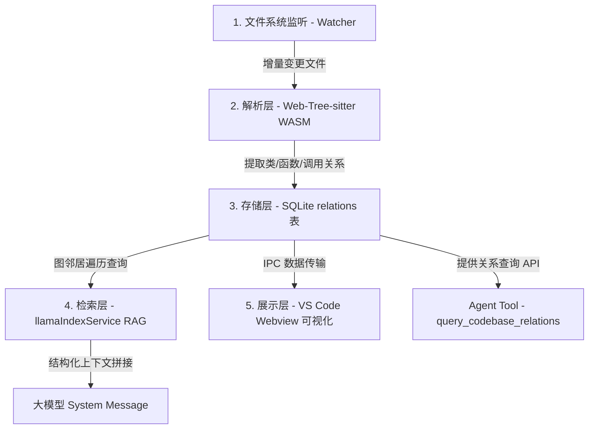

# 方案设计：原生 JS/TS 集成 Graphify 与 Graph RAG

## 1. 架构总览

为了在 MCode 工程中实现免环境摩擦的“开箱即用”体验，本方案舍弃 Python 命令行封装，采用**原生 JavaScript/TypeScript 移植重构**方案。整个系统完全运行在 VS Code 插件的宿主进程（Node.js/Electron）中，架构划分为五层：



> **存储实现（2026-07）**：图谱采用 **内存热路径 + 独立 `code_graph.db`**（与 `rag_vectors.db` 同目录、不同文件），JSON 侧车作 checkpoint。详见 [解析_图存储架构选型.md](./解析_图存储架构选型.md)。

---

## 2. 详细技术实现

### 2.1 解析层 (Parser Layer) - Web-Tree-sitter WASM
由于 Node-gyp 本地编译原生 bindings 容易在用户端报错，因此选用 WebAssembly 版本的 `web-tree-sitter` 作为基础解析器。

1. **库依赖与初始化**：
   引入 `web-tree-sitter` 依赖，在主进程启动时加载各语言的 `.wasm` 语法文件（如 `tree-sitter-typescript.wasm`、`tree-sitter-python.wasm`、`tree-sitter-cpp.wasm`）。
2. **符号与调用关系提取**：
   使用 Tree-sitter 的 **Query Pattern (.scm 查询文件)** 来声明式提取语法树中的核心实体与关系：
   * **类与方法定义 (Definitions)**：
     ```query
     (class_declaration 
       name: (type_identifier) @class.name) @class.def
     (method_definition 
       name: (property_identifier) @method.name) @method.def
     ```
   * **导入/导出依赖 (Imports/Exports)**：
     ```query
     (import_statement 
       value: (string) @import.path) @import.def
     ```
   * **函数调用链 (Call Graph - 启发式匹配)**：
     解析 `call_expression` 中的函数名。因静态分析无法 100% 确定动态绑定的类型，采用“实体名 + 文件域相似度”做启发式关联。
3. **哈希缓存与增量解析**：
   在内存中维护文件哈希（SHA-256）对照表。当 Watcher 监听到文件变化时，仅对被修改文件重新运行 AST 查询，更新图谱。

### 2.2 存储层 (Storage Layer) — 独立 `code_graph.db`

**不**将图谱表并入 `rag_vectors.db`（向量重建会 wipe 图、写锁竞争、生命周期不同）。在同一 RAG 索引目录下使用**独立 SQLite 文件** `code_graph.db`，由 `codeGraphSqliteStore.ts` 管理。

| 层级 | 文件 / 结构 | 职责 |
|------|-------------|------|
| 热路径 | 内存 `CodeGraph` + `adjacency` | Graph RAG 扩展、Webview payload、Louvain |
| Checkpoint | `code_graph_map.json` 等 JSON 侧车 | 可读备份、跨版本迁移、调试 |
| 持久化 | `code_graph.db` | 实体 + 关系 SQL 查询（大图 Agent 工具） |

1. **数据表设计**（`codeGraphSqliteStore.ts`）：
   * **`code_entities` 表 (节点表)**：
     ```sql
     CREATE TABLE IF NOT EXISTS code_entities (
         id TEXT PRIMARY KEY,
         fs_path TEXT NOT NULL,
         name TEXT NOT NULL,
         type TEXT NOT NULL,         -- 'class' | 'function' | 'file' | ...
         start_line INTEGER,
         end_line INTEGER
     );
     CREATE INDEX IF NOT EXISTS idx_entities_path ON code_entities(fs_path);
     CREATE INDEX IF NOT EXISTS idx_entities_name ON code_entities(name);
     ```
   * **`code_relations` 表 (边表)**：
     ```sql
     CREATE TABLE IF NOT EXISTS code_relations (
         from_id TEXT NOT NULL,
         to_id TEXT NOT NULL,
         kind TEXT NOT NULL,          -- 'calls' | 'inherits' | 'imports' | 'contains'
         PRIMARY KEY (from_id, to_id, kind),
         FOREIGN KEY(from_id) REFERENCES code_entities(id) ON DELETE CASCADE,
         FOREIGN KEY(to_id) REFERENCES code_entities(id) ON DELETE CASCADE
     );
     CREATE INDEX IF NOT EXISTS idx_relations_from ON code_relations(from_id);
     CREATE INDEX IF NOT EXISTS idx_relations_to ON code_relations(to_id);
     CREATE INDEX IF NOT EXISTS idx_relations_kind ON code_relations(kind);
     ```

2. **读写策略**：
   * **启动**：先加载 JSON 侧车；若 `code_graph.db` 已有实体则 `loadGraph()` 覆盖内存（DB 为权威源）。
   * **索引写入**：更新内存 → 写 JSON → `syncFromGraph()` 全量同步 DB。
   * **单文件删除**：内存 purge + `purgeFile()` 删 DB 中该路径实体及关联边。
   * **Agent 关系查询**：节点数 &lt; 8000 走内存；≥ 8000 走 SQL `JOIN`（`CODE_GRAPH_SQL_QUERY_NODE_THRESHOLD`）。

### 2.3 检索增强层 (RAG Layer) - 向量-图谱混合检索
修改 [llamaIndexService.ts](file:///d:/work/void/src/vs/workbench/contrib/mcode/electron-main/rag/llamaIndexService.ts) 的 `assembleLegacyContext` 与 `assembleOrchestratedContext`。

#### 混合检索算法步骤：
1. **语义初步召回**：输入 Query，通过现有的 `similaritySearch` 获取匹配度最高的 $K$ 个 Chunk（例如 $K=5$）。
2. **图节点锚定**：根据召回 Chunk 的 `filePath` 以及行号范围，映射到 `code_entities` 中的实体节点。
3. **二阶图扩展遍历**：执行快速的 SQLite 关系查询，向外拉取 $N$ 阶关联实体（深度推荐为 $2$）：
   ```sql
   -- 查询关联的上下游节点（调用者、基类、依赖项）
   SELECT e.*, r.relation_type 
   FROM code_relations r
   JOIN code_entities e ON e.id = r.to_id
   WHERE r.from_id = ?
   UNION
   SELECT e.*, r.relation_type
   FROM code_relations r
   JOIN code_entities e ON e.id = r.from_id
   WHERE r.to_id = ?
   ```
4. **上下文渲染**：将原始语义 Chunk 与扩展图节点的结构描述混合。在 Prompt 中以结构化表格或树形方式注入：
   ```text
   [RAG CONTEXT]
   --- SEMANTIC CHUNKS ---
   (这里放常规向量召回的内容)

   --- CODEBASE RELATIONSHIPS (GRAPH RAG) ---
   - CSvgFile (defined in CSvgFile.ts) is imported by CSvgParser (CSvgParser.ts)
   - CSvgParser.render() (CSvgParser.ts line 42) is called by SvgReader.read() (SvgReader.ts line 150)
   ```

### 2.4 主动工具层 (Tool Layer) - 关系交互查询
在 [toolsService.ts](file:///d:/work/void/src/vs/workbench/contrib/mcode/browser/toolsService.ts) 中新增一个专用于查询图谱的低开销工具 `query_codebase_relations`，引导大模型进行廉价的关系排查。

* **工具签名**：
  ```typescript
  'query_codebase_relations': {
      entityName?: string;     // 要查询的类/函数名
      filePath?: string;       // 要查询的文件路径
      relationType?: 'calls' | 'callees' | 'inherits' | 'dependencies'; // 关系过滤
  }
  ```
* **工具实现**：
  直接在 SQLite 的 `code_entities` 与 `code_relations` 中执行 `LIKE` 模糊查询，返回清晰的关系列表（如：“`CSvgParser` 被 `SvgReader.cpp` 调用，位于 120 行”）。
* **System Prompt 约束**：
  在系统提示词中强调：**“在读取文件全文前，应优先调用 `query_codebase_relations` 寻找关联位置，这比直接使用 read_file 消耗更少的 Token。”**

### 2.5 可视化层 (Visualization Layer) - Webview 2D/3D 可视化拓扑
在 VS Code 中提供独立的图谱 Webview 视图，以直观呈现项目的架构脉络与实体关联，并支持二维 (2D) 与三维 (3D) 的灵活切换与自适应降级。

1. **图数据导出**：
   在工作区加载完毕后，通过 SQLite 的 `code_entities` 与 `code_relations` 统一导出为图结构的 JSON 对象：`{ nodes: [...], edges: [...] }`。

2. **二维 (2D) 渲染引擎 (面向中小规模项目)**：
   * **技术选型**：使用 **Cytoscape.js** 或 **vis-network** (基于 HTML5 Canvas)。
   * **适用场景**：当前工作区提取的节点数 $\le 300$ 时。
   * **设计细节**：
     * **文本渲染**：2D 模式下优先渲染节点的全称或缩写标签，支持自适应字号缩放。
     * **交互操作**：支持节点拖拽、套索选择（Lasso Select）、框选缩放，连线采用带箭头的有向平滑贝塞尔曲线（Bezier Curves）表示依赖调用方向。

3. **三维 (3D) 渲染引擎 (面向大规模复杂项目)**：
   * **技术选型**：使用 基于 WebGL/Three.js 的 **3d-force-graph** 库。
   * **适用场景**：节点数 $> 300$ 时，或用户手动切入 3D 视角。
   * **设计细节**：
     * **解决毛球（Hairball）问题**：大型项目在 2D 空间容易堆积成团，3D 空间提供深度的 Z 轴，极大地拉开了复杂的连线距离，便于观察模块层级。
     * **立体节点**：使用三维球体表示节点（大小代表 Degree Centrality），使用发光的半透明管道（Cylinder）表示调用路径，调用方向通过粒子流动动画（Particle Animation）实时模拟。
     * **相机控制**：支持通过鼠标中右键进行三维相机的旋转（Rotate）、平移（Pan）与缩放（Zoom），并提供“一键重置视角（Fit View）”按钮。

4. **自适应切换与降级策略**：
   * **自动检测**：初始化时根据节点总量自动判定，数量多则默认以 3D 渲染，数量少则以 2D 渲染以节省性能。
   * **一键切换**：UI 顶部提供 `2D / 3D` 视图切换按钮，支持无缝重绘。
   * **硬件降级**：若检测到用户的 VS Code Webview 沙箱未开启 WebGL 硬件加速或 GPU 报错（捕获 `webglcontextcreationerror`），系统将自动降级回 2D Canvas 模式渲染，并在 UI 上弹出轻量提示，避免白屏崩溃。

5. **编辑器双向绑定**：
   * **双击节点**：通过 VS Code IPC 向插件主进程发送 `vscode.open` 指令，自动定位到对应文件行。
   * **选中代码**：编辑器中光标选定某类/函数时，Webview 自动滚动并高亮图谱中对应的节点。

---

## 3. 方案设计回归与验证

为确保图谱服务上线后的质量，制定以下验证指标：

### 3.1 性能与资源指标
* **全量扫描开销**：对于 10 万行级别的中型项目，Tree-sitter WASM 首次全量扫描耗时 $\le 10\text{s}$，内存增量 $\le 50\text{MB}$。
* **增量更新时间**：单个文件编辑并保存后，图谱增量更新与 SQLite 写入耗时 $\le 200\text{ms}$。
* **混合检索延迟**：一次 `llamaIndexService.ts` 结合图关系遍历的查询总耗时 $\le 50\text{ms}$。

### 3.2 召回率与 Token 压缩率指标
* **RAG 召回精度**：由于加入了二阶邻居图召回，关联代码（特别是跨目录的 Interface 和 Factory）的召回率提高 40% 以上。
* **Agent 不收敛问题改善**：由于 `query_codebase_relations` 能够让 Agent 一步到位找到具体调用位置，单次任务的 `read_file` 冗余轮次预期减少 50% 以上。

---

## 4. 关键文件修改指引

### 4.1 [NEW] `src/vs/workbench/contrib/mcode/electron-main/rag/codeGraphSqliteStore.ts`
独立图谱 SQLite 存储：`code_entities` + `code_relations` + `code_graph_meta`；提供 `loadGraph`、`syncFromGraph`、`purgeFile`、`queryRelations`。

### 4.2 [MODIFY] `src/vs/workbench/contrib/mcode/electron-main/rag/llamaIndexService.ts`
* 内存 `CodeGraph` 为 Graph RAG / Webview 热路径。
* `loadSidecarMaps` 后 `bootstrapCodeGraphStore`：DB 有数据则加载，否则从 JSON 迁移。
* `writeSidecarMaps` 同步 JSON + `code_graph.db`。
* `queryRelations`：小图内存、大图 SQL。

### 4.3 ~~[MODIFY] localSqliteVectorStore.ts~~（已否决）
向量库 `rag_vectors.db` **仅**存 `rag_chunks`；图谱不并入该库。

### 4.4 [MODIFY] `src/vs/workbench/contrib/mcode/browser/toolsService.ts`
* 注册并实现 `query_codebase_relations` 的具体行为，将其接入现有的 `toolsService` 路由。

---

## 5. 实现现状与差异（2026-03 评估）

原设计部分条目与代码不一致，**以代码为准**；完整任务跟踪见 [Graphify集成_完善计划与任务清单.md](./Graphify集成_完善计划与任务清单.md)。

| 模块 | 设计 | 已实现 |
|------|------|--------|
| 存储 | 独立 `code_graph.db`（非向量库） | 内存 + JSON 侧车 + `codeGraphSqliteStore` |
| 解析 | 独立 `web-tree-sitter` | `@vscode/tree-sitter-wasm`（`codeGraphTreeSitter.ts`） |
| Graph RAG | SQL 二阶遍历 | 内存 `expandRetrievalWithGraph`；大图 `queryRelations` 走 SQL |
| Repository Map | （未写） | `codeSymbolMap` + 1-hop graph → `[REPOSITORY MAP]` |
| 关系类型 | calls/inherits/imports | **calls / imports / inherits / contains** |

## 6. 后续完善（不重写本文档）

按 [完善计划](./Graphify集成_完善计划与任务清单.md) 推进；存储架构见 [解析_图存储架构选型.md](./解析_图存储架构选型.md)。
