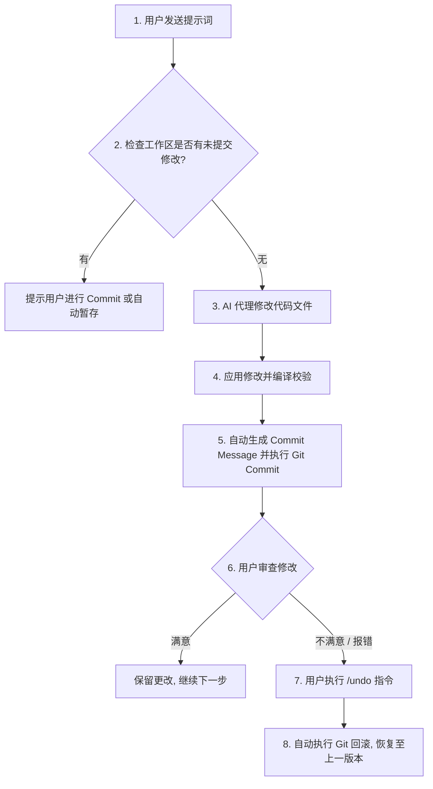

# Aider 的 Git 自动提交与回滚机制解析

Aider 的一大标志性核心设计就是其与 **Git 仓库的强绑定与自动事务管理**。它把每一次 AI 代码修改当成一次 Git 提交，并为用户提供了低成本的“后悔药”（一键回滚）。

---

## 1. Aider 的 Git 核心工作流

Aider 会自动接管工作区的 Git 状态，其工作流如下：



### 1.1 自动提交 (Auto-Commit)
当 AI 成功修改文件并应用到工作区后，Aider 会：
1. **自动生成 Commit Message**：
   - Aider 会提取这次修改的文件 Diff，并调用一个轻量级 LLM 请求（或者本地启发式模板），自动生成符合 Conventional Commits 规范的提交信息（例如 `feat: add user signature verification logic`）。
2. **静默执行 Commit**：
   - 自动执行 `git add <modified-files>` 和 `git commit -m "<message>"`。
   - 这为用户的开发历史创建了极细粒度的“微提交（Micro-commits）”，清晰记录了 AI 的每一步尝试。

### 1.2 事务回滚 (Undo / Rollback)
如果 AI 的修改导致项目编译失败、测试报错，或者单纯不符合用户预期，用户只需在终端中输入：
`/undo`
Aider 就会立即在后台执行：
`git reset --hard HEAD~1`（或者 `git checkout` 撤销对应文件的最新修改）。
工作区会瞬间**无缝恢复到 AI 修改前的精确状态**，完全避免了手动 Ctrl+Z 撤销多文件修改时的错乱与遗漏。

---

## 2. 引入 MCode 编辑器的改造设计方案

在 MCode 编辑器中接入 Aider 的 Git 自动提交与回滚机制，可以极大提升 AI 辅助编程的安全感。

### 2.1 增加 SCM Git 控制器接口 (`mcodeSCMTypes.ts`)
我们在前端添加与主进程 Git 交互的接口：
```typescript
export interface IVoidSCMService {
	readonly _serviceBrand: undefined;
	gitStat(path: string): Promise<string>;
	gitSampledDiffs(path: string): Promise<string>;
	gitBranch(path: string): Promise<string>;
	gitLog(path: string): Promise<string>;
	isWorkspaceDirty(path: string): Promise<boolean>;
	createAutoCommit(path: string, message: string): Promise<void>;
	performUndo(path: string): Promise<void>;
}
```

### 2.2 主进程 Git 命令行封装 (`mcodeSCMMainService.ts`)
主进程通过封装本地 Git 命令行进行交互，实际实现类为 `VoidSCMService`：

```typescript
import { promisify } from 'util'
import { exec as _exec } from 'child_process'
import { promises as fs } from 'fs'
import * as pathLib from 'path'
import { IVoidSCMService } from '../common/mcodeSCMTypes.js'

const exec = promisify(_exec)

export class VoidSCMService implements IVoidSCMService {
	readonly _serviceBrand: undefined

	// 1. 判断当前工作区是否有脏代码
	async isWorkspaceDirty(path: string): Promise<boolean> {
		try {
			const stdout = await git('git status --porcelain', path);
			return stdout.trim().length > 0;
		} catch (e) {
			return false;
		}
	}

	// 2. 自动提交修改
	async createAutoCommit(path: string, message: string): Promise<void> {
		await git('git add -A', path);
		// 提交，并在 commit 消息中附带 [Void Auto] 标识便于后续识别
		const formattedMsg = `🤖 [Void Auto] ${message}`;
		const msgFilePath = pathLib.join(path, '.git', 'VOID_COMMIT_EDITMSG');
		try {
			await fs.writeFile(msgFilePath, formattedMsg, 'utf8');
			await git(`git commit -F "${msgFilePath}"`, path);
		} finally {
			try {
				await fs.unlink(msgFilePath);
			} catch (e) {
				// Ignore
			}
		}
	}

	// 3. 一键撤销上一次 AI 提交
	async performUndo(path: string): Promise<void> {
		// 先确认最后一次提交是不是 Void 自动生成的
		const lastCommitSubject = await git('git log -1 --pretty=%s', path);
		if (lastCommitSubject.startsWith('🤖 [Void Auto]')) {
			// 回滚最新一次提交，并彻底擦除（--hard）
			await git('git reset --hard HEAD~1', path);
		} else {
			throw new Error('最后一次提交不是由 AI 自动生成的，拒绝回滚以保护您的手写代码！');
		}
	}
}
```

### 2.3 前端 UI 交互设计
1. **撤销按钮（Undo Button）**：
   在 Chat 侧边栏的每一条 AI 消息下方，如果该消息触发了代码修改且已自动提交，渲染一个 **“Undo (撤销更改)”** 按钮。点击即可触发后台 `performUndo()`，界面提示 `已成功回滚至修改前`。
2. **脏工作区警告哨兵**：
   当用户在 Chat 中要求 AI 修改代码时，如果检测到 `isWorkspaceDirty === true`，在发送前提示用户：*“您有未提交的手写代码，AI 修改可能会影响您的工作区，建议先 Commit 您的修改。”*，保护用户手写资产的安全。
