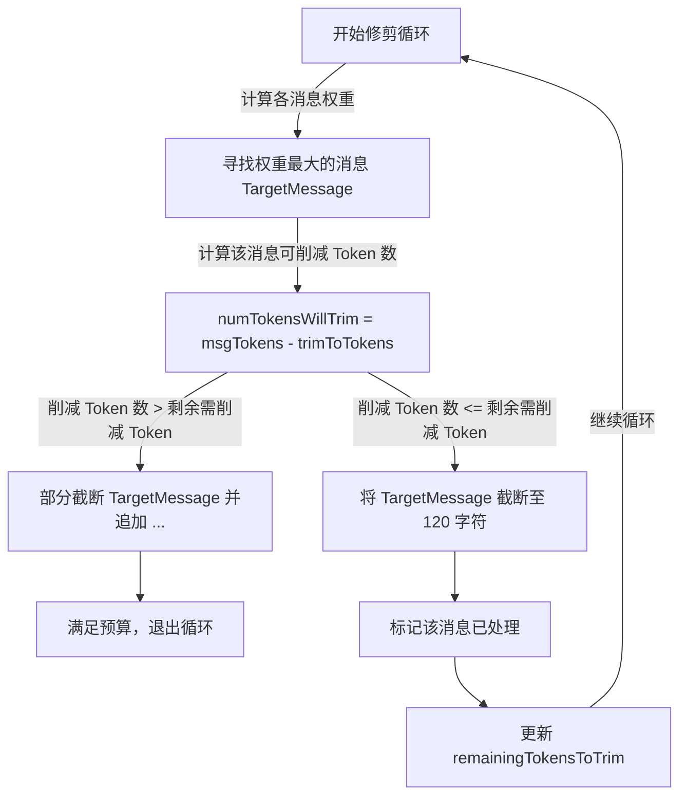

# Context Window 管理机制与截断算法解析

在大语言模型交互中，合理管理 **Context Window（上下文窗口）** 是保证会话不因 Token 溢出而报错、且尽可能保留关键历史信息的关键。MCode 编辑器在 [convertToLLMMessageService.ts](file:///d:/work/void/src/vs/workbench/contrib/mcode/browser/convertToLLMMessageService.ts) 中实现了一套精密、基于权重启发式的上下文截断算法。

---

## 1. 📂 会话（Thread）与上下文（Context）的关系

在 MCode 中，**“会话 (Thread)”** 与 **“上下文 (Context)”** 是两个职责解耦、但紧密相连的概念：

| 维度 | 会话 (Thread / 聊天记录) | 上下文 (Context / 最终 Payload) |
| :--- | :--- | :--- |
| **定义** | 逻辑上的**历史记录容器**。 | 模型接收到的**最终文本/Token 输入流**。 |
| **存在形态** | 存储在本地硬盘或内存中的 `ChatMessage` 数组。 | 即时（JIT）编译生成的 API 请求 Payload。 |
| **包含内容** | 你与 AI 的对话文本、AI 工具调用和执行结果。 | 会话历史 + 系统 Prompt + 编辑器状态 + RAG 代码片段。 |
| **容量限制** | 无限制（支持无限追溯和滚动）。 | 受模型上下文窗口（如 200k Tokens）硬性限制。 |

### 动态转换流程

在每次发送消息给 LLM 前，[`convertToLLMMessageService.ts`](file:///d:/work/void/src/vs/workbench/contrib/mcode/browser/convertToLLMMessageService.ts) 会将**会话（Thread）**与**编辑器实时环境状态**拼装并转换成**上下文（Context）**：

```mermaid
graph TD
    subgraph 会话数据 (Thread)
        MsgHistory[会话历史记录 messages]
    end
    
    subgraph 编辑器环境 (Editor State)
        OpenFiles[当前打开的文件内容]
        Selections[用户划词选中的代码段]
        SysRules[.mcoderules 项目规则]
        MCPTools[MCP/系统可用工具声明]
    end

    MsgHistory -->|1. 滑动截断与修剪| Trim[Token 估算与剪枝]
    OpenFiles & Selections & SysRules & MCPTools -->|2. 拼装系统指令| SysPrompt[生成系统 System Prompt]
    
    Trim & SysPrompt -->|3. 封装为大模型 API 格式| FinalContext[最终发送给 LLM 的上下文 (Context)]
```

---

## 2. ⚙️ 上下文预算计算

在每次发送消息给 LLM 前，MCode 首先计算当前的 Token 预算：

1. **获取模型元数据**：
   从 [modelCapabilities.ts](file:///d:/work/void/src/vs/workbench/contrib/mcode/common/modelCapabilities.ts) 获取选定模型的 `contextWindow`（输入 Token 限制）和 `reservedOutputTokenSpace`（保留输出 Token 空间，通常默认 4096）。
2. **计算保留输出区**：
   为了防止大模型输出被硬截断，MCode 会保留指定的输出空间。
3. **轻量级 Token 估算器 (Lightweight Token Estimator)**：
   MCode 避免了高昂的本地 Tokenizer 计算，在 [tokenEstimate.ts](file:///d:/work/void/src/vs/workbench/contrib/mcode/common/helpers/tokenEstimate.ts) 中实现了一个轻量级 CJK 敏感的估算器：
   - CJK（中日韩）字符算作 `1 / 1.5` 个 Token。
   - 其他字符算作 `1 / 4` 个 Token。
   - 估算公式为：
     $$\text{tokenCount} = \lceil \text{cjk} / 1.5 + \text{other} / 4 \rceil$$
4. **计算需要修剪的 Token 数**：
   - 输入 Token 预算：
     $$\text{inputTokenBudget} = \max(\text{contextWindow} - \text{reservedOutputTokenSpace}, \, 500)$$
   - 需要修剪的 Token 数：
     $$\text{tokensNeedToTrim} = \text{totalLen} - \text{inputTokenBudget}$$

---

## 3. ⚖️ 启发式消息权重算法

当总会话 Token 长度超过预算时，MCode 不会简单地删除旧消息，而是为每条消息计算一个**修剪权重（Weight）**。**权重越高，代表该消息越倾向于被截断**。

```typescript
const weight = (message: SimpleLLMMessage | ChatMessage, messages_: (SimpleLLMMessage | ChatMessage)[], idx: number) => {
    const base = message.content.length // 基础字符长度
    let multiplier = 1 + (messages.length - 1 - idx) / messages.length // 衰减系数 (从 2 缓慢降到 1)
    
    // 1. 角色加权
    if (message.role === 'user') {
        multiplier *= 1.0;  // 用户提问：正常权重
    } else if (message.role === 'system') {
        multiplier *= 0.01; // 系统提示词：极低权重（几乎不被修剪）
    } else {
        multiplier *= 10.0; // AI 回复与工具调用结果：极高权重（优先被修剪）
    }

    // 2. 已修剪标记
    if (alreadyTrimmedIdxes.has(idx)) {
        multiplier = 0; // 已修剪过的消息在此轮中免除修剪
    }

    // 3. 安全区间保护
    if (idx <= 1 || idx >= messages.length - 1 - 3) {
        multiplier *= 0.05; // 首条/第二条消息（通常是 System）和最后 3 条消息（最新对话）受到高度保护
    }

    return base * multiplier;
}
```

### 权重乘数因子解析：
* **时间衰减（Rampdown）**：越旧的消息（`idx` 越小），乘数越大（最高为 2），表明在同等长度下优先修剪更老的历史对话。
* **角色保护**：AI 的输出（Assistant）和工具的返回结果（Tool Output）通常包含大量冗余代码，因此乘数乘以 `10.0`，最优先被修剪；而系统的规则（System）则乘以极低系数进行保留。
* **首尾端点保护**：首两条消息以及最后 3 条消息乘以 `0.05`。因为最新发生的对话和最开始的初始化指令对大模型理解当前任务最为关键，必须免于截断。

---

## 4. 🔄 循环剪枝截断执行流程

当计算出 `remainingTokensToTrim > 0` 时，系统将启动修剪循环，最大迭代 100 次：



1. **查找最大权重**：在消息列表中找出权重最高的消息。
2. **计算可削减 Token 数**：
   - 消息原 Token 数为 `msgTokens`。
   - 最小保留字符长度 `TRIM_TO_LEN = 120` 对应保留 Token 数 `trimToTokens = Math.ceil(120 / 4) = 30`。
   - 该消息可削减的 Token 数为 `numTokensWillTrim = msgTokens - trimToTokens`。
3. **局部截断或硬截断**：
   - 如果该消息能贡献的修剪 Token 数大于剩余所需修剪 Token，则按比例计算需要保留的字符数，将其末尾截断至刚好满足预算并拼上 `...`，随即**退出循环**。
   - 如果不够，则将该消息硬性截断至 `TRIM_TO_LEN = 120` 字符，更新 `remainingTokensToTrim`，将其索引记入 `alreadyTrimmedIdxes`（防止在后续循环中被二次处理），然后**继续下一轮循环**。

---

## 5. 📝 总结

MCode 的 Context Window 管理机制体现了极佳的实用主义设计：
* **智能估算**：引入了轻量级 CJK 估算器，规避了高昂的本地 Tokenizer 计算，又能对中文等字符提供更为准确的 Token 估算。
* **语义保护**：通过首尾保护与角色加权，确保 **系统指令不丢、最新对话不丢、用户输入不丢**。
* **渐进截断**：优先对历史 AI 输出和工具结果的大段代码进行截断，保证了上下文的可用性与模型认知的连贯性。

---

## 6. 🔄 上下文满额（如 99%+）时的应对与重置策略

当上下文占用率达到 99% 或以上时，MCode 提供了三种层面的应对机制，允许用户“重新从 0 开始”或通过裁剪优化会话：

### 6.1 自动滑动窗口截断（不需要用户手动重置）
即使上下文满了，系统也不会报错崩溃。在底层 `convertToLLMMessageService.ts` 中，系统会**自动运行修剪算法**：
* 优先裁剪老旧的、冗长的 AI 回复与工具输出（如大段的 `cat` 文件内容或编译日志）。
* **始终强制保护**首条系统提示词和最后 3 条最新对话，保证大模型能够理解当前意图。因此，它实际上是一个**自动向后滑动的上下文窗口**。

### 6.2 手动从 0 开始新会话（New Chat Thread）
如果用户希望彻底清空历史，让 AI 忘掉之前的全部对话，从 0% 上下文占用率重新开始：
* **操作方法**：点击 UI 界面上的 **“New Chat” / “新对话”** 按钮。
* **底层实现**：前端会触发 `IChatThreadService.openNewThread()`，创建一个全新的 `ThreadType`。旧的 Thread 会归档到侧边栏历史记录中，当前活跃会话的上下文占用率将**瞬间重置为 0%**。

### 6.3 回滚到历史检查点（Jump to Checkpoint）
如果用户不想丢失全部上下文，而只是想撤销到之前的某一步：
* **操作方法**：在 Chat 消息流中找到历史的某个节点，点击“回滚至此（Jump to Checkpoint）”。
* **底层实现**：触发 `jumpToCheckpointBeforeMessageIdx`，抹除该节点之后的所有对话和工具执行记录。这样可以截断不必要的历史，释放大量被冗长上下文占用的空间。
