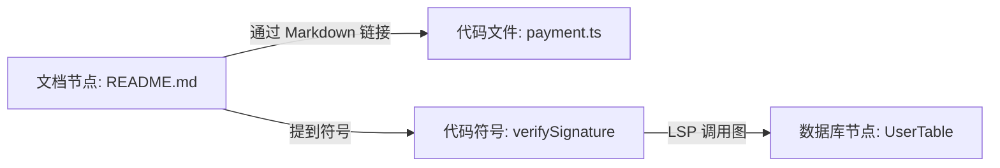

# Git 仓库与工作区文档索引及优化方案

> **文档状态**：2026-06 更新。Phase 6 本地 Git/文档增强**已实现**（manifest v4）。Phase 7 **Milvus 三分区**（含 `git_commit`）**已实现**。Phase 10 增量后自动刷新 git commit 索引。  
> 任务：[TODO.md § Phase 6](./TODO.md#phase-6--git-与文档索引本地p2) · 路线图：[设计方案_RAG分阶段实施路线图.md](./设计方案_RAG分阶段实施路线图.md) §6

在现代软件开发中，大模型不仅需要阅读代码，还需要理解 **Git 提交历史（Commit History）**、**当前未提交更改（Git Diff）** 以及 **项目说明文档（如 Markdown、API 文档）**。

下面将详细拆解 MCode 编辑器如何对 Git 仓库与各类文档建立高保真索引，并提出相应的检索优化方案。

---

## 0. 实现状态

| 能力 | 状态 | 阶段 |
| :--- | :--- | :--- |
| 代码 `code_chunk` 向量索引 | ✅ 已实现 | Phase 0（本地 LlamaIndex） |
| Markdown `doc_chunk` 索引 | ✅ 已实现 | Phase 0 |
| Git commit 静态索引 | ✅ 已实现 | Phase 6 |
| Git commit **增量刷新** | ✅ 已实现 | Phase 10（`refreshGitCommitIndex`） |
| Git diff 动态召回 | ✅ 已实现 | Phase 6 |
| 文档 Parent-Child 检索 | ✅ 已实现 | Phase 4 |
| 文档 `linkedFiles` metadata | ✅ 已实现 | Phase 6 |
| Doc → 源码混合召回 | ✅ 已实现 | Phase 8（`buildLinkedCodeSnippets`，非完整 DocGraph） |
| Milvus `git_commit` 分区 | ✅ 已实现 | Phase 7（`git_partition` + RRF） |
| Git Blame → CodeGraph 边 | ⏳ 未实现 | 设计目标，见 §1.1 |

---

## 1. Git 仓库元数据及动态变更索引

对 Git 信息的索引分为两类：**静态历史提交索引**（存入向量库与关系图）和**动态变更实时索引**（基于 IPC 实时执行指令召回）。

```mermaid
graph TD
    subgraph Git Indexing Pipeline
        CommitLogs[Git Commit Logs] -->|批量提取| CommitParser[Commit 语法解析器]
        CommitParser -->|提取 Hash, 作者, 消息| VectorizeCommit[向量化 & 属性提取]
        VectorizeCommit -->|存入| VectorDB[(Git 历史向量库)]
        
        BlameData[Git Blame / File History] -->|提取修改关联| CodeGraphLink[CodeGraph 图关系连结]
        CodeGraphLink -->|存入| CodeGraphDB[(CodeGraph DB)]
    end

    subgraph Dynamic Git Retrieval (召回期)
        UserQuery[用户提问: 昨晚改了什么?] -->|判断 Git 相关| GitTrigger{Git 检索触发器}
        GitTrigger -->|是| RunGitCmd[执行 git diff / git log]
        RunGitCmd -->|清洗 Diff 噪音| CleanDiff[Diff 清洗器]
        CleanDiff -->|高优先级| LLMContext[LLM 最终上下文]
    end
```

### 1.1 静态提交历史索引（Git Commit Indexing）
* **提取策略**：在后台线程中，定期或在首次加载项目时，提取最近 100 次的 Git 提交日志（或 30 天内的提交）：
  `git log --pretty=format:"%H|%an|%ad|%s" --numstat`
* **向量化拆分**：将每次 Commit 组装成一个结构化文档：
  ```
  Commit Hash: [Hash]
  Author: [Author]
  Date: [Date]
  Message: [Commit Message]
  Modified Files:
  - [FilePath] (+[addedLines], -[deletedLines])
  ```
  对上述文本进行 Embeddings 计算并存入向量库。当用户模糊查询“关于微信支付模块的上次提交”时，可通过向量检索瞬间召回对应 Commit 节点。
* **CodeGraph 的 Blame 连结**（⏳ **未实现**）：
  设计目标：在生成 CodeGraph 节点时为符号运行 `git blame`，建立 `modified_by` / `introduced_in` 边。当前仅具备 **commit 向量检索** + **查询期动态 diff**，无 blame 侧车。

### 1.2 动态变更实时索引（Dynamic Git Diff）
由于用户处于实时开发状态，未提交的代码频繁变动，不适合写入静态向量库。
* **策略**：当 RAG 引擎分析到用户查询包含 `changes`、`diff`、`modified` 或“我刚刚改了什么”等时，直接触发执行：
  `git diff`（工作区修改）与 `git diff --cached`（暂存区修改）。
* **Diff 数据清洗**：
  原始 Git Diff 包含大量编译生成的配置文件变动（如 `package-lock.json` 或 `*.min.js`）或大段版权注释的增删。
  - **白名单过滤**：仅保留 `compile_commands.json` 或源码白名单（如 `.ts`, `.c`, `.py`）中的文件 Diff。
  - **最大行数截断**：单个文件的 Diff 超过 150 行时，对其进行折叠，仅保留函数签名处的修改行，防止 Token 溢出。

---

## 2. 工作区文档（Markdown/API 文档）的索引设计

项目文档（如 `README.md`、部署文档、架构设计说明、OpenAPI/Swagger JSON）对于宏观系统理解至关重要。

### 2.1 结构化 Markdown 切分 (MarkdownHeaderTextSplitter)
对 `.md` 文件的清洗与切片不能使用粗暴的字数切片（Character-based Splitting），这会导致标题与段落割裂。
* **策略**：使用 **标题层级切片器（Header-based Splitting）**。
  例如，针对以下文档：
  ```markdown
  # 微信支付接入指南
  ## 1. 签名校验
  在商户后台配置公钥...
  ```
  切片器会将文本切分为：
  - Chunk 1: `pageContent: "在商户后台配置公钥...", metadata: { Header1: "微信支付接入指南", Header2: "1. 签名校验" }`
* **优势**：保证每个 Chunk 在向量计算和被大模型阅读时，都带有完整的“面包屑”上下文，避免脱离上下文导致模型误读。

### 2.2 双亲-子节点检索 (Parent-Child Retrieval)
文档段落往往较长。如果我们使用大段落计算向量，向量表达的含义会变模糊；但如果切片太小，大模型又会因为缺乏上下文而无法理解。
* **优化策略**：
  1. **子切片 (Child Chunks)**：将文档细分为 100-200 字符的极小片段，并计算向量存入向量库。用于实现极高精度的语义检索。
  2. **双亲文档 (Parent Docs)**：保留原始文档大段落（800-1500 字符）在 Key-Value 存储中，并与子切片的 ID 绑定。
  3. **召回替换**：当子切片被向量相似度命中时，Retriever **不将子切片发给 LLM**，而是将其**替换为其对应的 Parent Doc** 发送给 LLM。这在保证检索精度的同时，提供了极为完备的阅读上下文。

---

## 3. 代码与文档的“跨域混合”设计（Hybrid Code-Doc）

> **实现状态**：Phase 6 `linkedFiles` metadata + Phase 8 检索期 `buildLinkedCodeSnippets` **已实现**；Markdown 链接写入 CodeGraph 文档节点边 **未实现**（见 [TODO.md § 已知限制](./TODO.md#已知限制当前实现)）。

为了让大模型在阅读文档的同时能瞬间定位到真实代码，检索编排层打通**文档与代码的边界**：



1. **链接解析 (Link Resolution)**：
   - 扫描 Markdown 文档中的相对文件链接（例如 `[支付设计](./src/services/payment.ts)`），在 CodeGraph 中建立指向对应 `FileNode` 的依赖边。
2. **提及符号连结 (Mention Linking)**：
   - 使用正则表达式扫描文档中的代码标记（如 `` `verifySignature()` `` 或 `` `PaymentService` ``），自动在 GraphDB 中建立关联边：
     $$\text{DocumentationChunkNode} \xrightarrow{\text{mentions}} \text{MethodNode (verifySignature)}$$
3. **混合召回效应**（✅ Phase 8）：
   - doc_chunk 向量命中后，`collectLinkedFilesFromDocNodes` + `buildLinkedCodeSnippets` 拉取链接路径上的源码符号片段，与文档块一并注入 Chat。

---

## 4. Phase 6 本地实施（✅ 已实现）

> Git / 文档增强在本地 `VectorStoreIndex` 完成；manifest **v4** 含 `gitCommitCount`、`graphEngine`。Milvus 模式下 git/doc/code 三分区见 §4.6。

### 4.1 Git commit 静态索引

| 组件 | 路径 |
| :--- | :--- |
| 提取与解析 | `electron-main/rag/gitLogIndexer.ts` |
| 集成 | `llamaIndexService.scanWorkspaceNodes()` 在文件扫描后追加 git nodes |
| 侧车 | `git_commit_index.json`（doc id 列表，供增量删除/重建） |

1. 执行 `git log -n 100 --numstat --pretty=format:"COMMIT|%H|%an|%ad|%s"`
2. 每条 commit → `docType: git_commit`，metadata：`commitHash`, `author`, `date`, `message`, `filesChanged`, `linesAdded`, `linesDeleted`
3. 文档 ID：`git::commit::{hash}`；manifest 字段 `gitCommitCount`

### 4.2 Git diff 动态召回（查询期）

| 组件 | 路径 |
| :--- | :--- |
| 意图检测 + git 命令 | `electron-main/rag/gitDynamicContext.ts` |
| 注入 | `llamaIndexService.queryContext()` 高优先级前缀 |

- 关键词（中/英）：`diff`、`改了什么`、`未提交`、`last commit` 等
- `working_diff` 模式：`git diff` + `git diff --cached`，过滤 lock/min 文件，单文件 diff 最多 150 行
- `recent_commits` 模式：`git log -n 5` + `git show --stat`
- **不写入向量库**（避免频繁 rebuild）

### 4.3 文档链接 metadata

- `markdownLinkParser.ts` 解析 `[text](./src/foo.ts)` → metadata `linkedFiles: ['src/foo.ts']`（相对 workspace 根）
- 检索格式化时在 context header 显示 `Links: ...`

### 4.4 compile_commands.json 与 Git 刷新策略

| 事件 | 行为 |
| :--- | :--- |
| `compile_commands.json` 变更 | 触发 **全量 rebuild**（代码白名单 + Git commit 重新索引） |
| 单文件保存 / 批量增量同步 | 增量更新代码 chunk；批次结束后 **`refreshGitCommitIndex()`**（Phase 10） |
| Settings **Rebuild Local Index** | 全量 rebuild，含 Git |

Git 静态索引在 **全量 rebuild** 与 **每次增量批次完成** 时更新；动态 diff 在 Git 相关查询时实时生成（不写入向量库）。

### 4.5 与 Milvus 的衔接（✅ Phase 7 已实现）

`git_commit` / `doc_chunk` / `code_chunk` 映射至 [设计方案_Milvus混合索引与检索设计.md](./设计方案_Milvus混合索引与检索设计.md) 统一 Schema：

| docType | Milvus 分区 | 检索 |
| :--- | :--- | :--- |
| `code_chunk` | `code_partition` | Dense + BM25 Sparse + RRF |
| `git_commit` | `git_partition` | 同上；Router 意图为 git 时 `partition_names` 过滤 |
| `doc_chunk` | `doc_partition` | 同上 |

编排层 `routeQueryTargets` + `targetsToMilvusPartitions` 在 Milvus 模式走分区路由；本地索引走 docType 过滤 + 过量采样（P10-1）。详见 [milvus/README.md](../milvus/README.md)。

### 4.6 本地 Router 与 git 检索

本地 `VectorStoreIndex` 无物理分区时，git commit 与 code/doc 块共存于同一索引；Router 通过后过滤 `docType === 'git_commit'` 召回。增量刷新保证新 commit 可被 git 意图问题检索到，无需手动 Rebuild。

---

## 5. 相关文档

- [TODO.md](./TODO.md) — Phase 6 / 7 / 10 任务与已知限制
- [设计方案_Milvus混合索引与检索设计.md](./设计方案_Milvus混合索引与检索设计.md) — Milvus Schema 与 RRF
- [设计方案_LlamaIndex接入与优化方案.md](./设计方案_LlamaIndex接入与优化方案.md) — 本地索引、编排层、Settings UI
