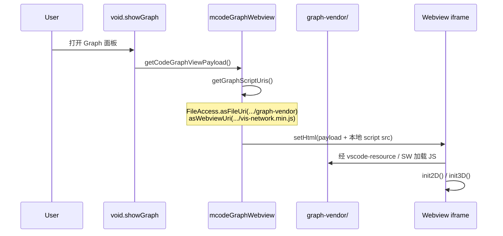
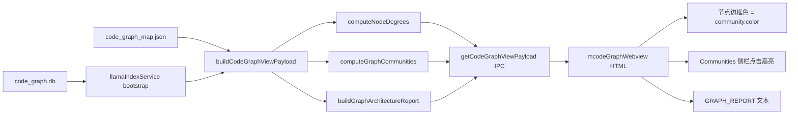

# 解析：Graphify 离线 Bundle 与社区发现

> 对应完善计划 **T7（离线 bundle）** 与 **T10（社区发现）**。  
> 关联文档：[Graphify集成_完善计划与任务清单.md](./Graphify集成_完善计划与任务清单.md)

---

## 1. 背景与动机

### 1.1 离线 Bundle 要解决什么

Graph 可视化 Webview 原先通过 **unpkg CDN** 加载：

- `vis-network` — 2D 力导向图
- `3d-force-graph` — 3D WebGL 图（大图默认模式）

问题：

| 问题 | 影响 |
|------|------|
| 内网 / 离线环境无法访问 unpkg | Graph 面板空白 |
| CDN 延迟与版本漂移 | 首屏慢、行为不可复现 |
| Webview CSP 对外域脚本依赖 | 安全与打包审查风险 |

**目标**：将库文件 vendoring 到仓库内，经 VS Code `asWebviewUri` 本地加载，断网可用。

### 1.2 社区发现要解决什么

Graphify 原设计含「模块社区 / 架构簇」能力；实现阶段 A 仅有 **Hub 节点（度中心性）**，缺少**结构分区**视图。

**目标**：在不做重量级图算法（Louvain、PageRank 全量）的前提下，给出可解释的「代码结构簇」，供：

- Webview 着色与高亮
- `GRAPH_REPORT` 架构摘要
- 后续 Agent / RAG 引用（可选）

---

## 2. 离线 Bundle 方案解析

### 2.1 资源布局

```
src/vs/workbench/contrib/mcode/browser/media/graph-vendor/
├── vis-network.min.js      (~689 KB, 2D)
├── 3d-force-graph.min.js   (~691 KB, 3D + Three.js 内联)
├── vis-network.LICENSE
└── 3d-force-graph.LICENSE
```

npm 源包（`package.json` 依赖）：

- `vis-network@9.1.9`
- `3d-force-graph@1.73.3`

同步脚本：

```bash
npm run copy-mcode-graph-vendor
# → scripts/copy-mcode-graph-vendor.mjs
```

升级库版本时：**先改 package.json → npm install → 再跑 copy 脚本**。

### 2.2 加载链路



核心代码（`mcodeGraphWebview.ts`）：

1. **`getGraphScriptUris()`** — 将磁盘路径转为 Webview 可访问 URI（一次性缓存）。
2. **`localResourceRoots`** — 打开 Webview 时声明允许加载的本地根目录：

   ```typescript
   contentOptions: {
     allowScripts: true,
     localResourceRoots: [getGraphVendorResourceRoot()],
   }
   ```

3. **`getGraphHtml(payload, scriptUris)`** — HTML 内 `<script src="${scriptUris.visNetwork}">`，不再写 unpkg URL。

### 2.3 降级与容错

| 场景 | 行为 |
|------|------|
| WebGL 不可用 | `init3D()` 检测 `canvas.getContext('webgl')` 失败 → 强制 2D |
| `vis` 未定义（脚本 404） | 2D 容器显示提示：运行 `copy-mcode-graph-vendor` |
| `ForceGraph3D` 未定义 | 回退 2D，与 WebGL 降级一致 |
| 节点数 > 200 | 默认 3D（若库与环境均可用） |

### 2.4 与 VS Code 打包的关系

- Vendor 文件位于 `src/vs/workbench/contrib/mcode/browser/media/`，随 workbench 资源一并打包。
- 路径通过 `FileAccess.asFileUri('vs/workbench/contrib/mcode/browser/media/graph-vendor')` 解析，与 Welcome 页等媒体资源模式一致。
- **不**在运行时读 `node_modules`；提交到 repo 的是 `media/graph-vendor/` 副本。

---

## 3. 社区发现方案解析

### 3.1 算法选择

| 方案 | 复杂度 | 当前采用 | 说明 |
|------|--------|----------|------|
| **Louvain 模块度** | O(E·passes) | ✅ **默认** | `graphLouvainCommunities.ts`，边权按关系类型加权 |
| 连通分量（BFS/DFS） | O(V+E) | ✅ 回退 | 节点 >6000、无边、Louvain 不可用时 |
| Label Propagation | O(E·k) | ❌ | 后续可选 |

**边权（Louvain 默认）**：

| 关系 | 权重 | 意图 |
|------|------|------|
| `imports` | 2.0 | 模块边界 |
| `calls` | 1.0 | 调用耦合 |
| `inherits` | 1.5 | 类型层次 |
| `contains` | 0.25 | 文件内结构，避免主导分区 |

**Louvain 流程**：

1. `buildWeightedGraphFromCodeGraph()` — 无向加权邻接
2. `runLouvain()` — 局部模块度优化（最多 16 pass）+ 可选一层图聚合后再优化
3. `computeModularity()` — 报告 Q 值
4. 节点数 > `LOUVAIN_MAX_NODES`（6000）→ 自动回退连通分量

**与连通分量的差异**：两团密集子图仅有一条弱桥相连时，连通分量合并为 1 块；Louvain 倾向拆成 2 个语义模块。

### 3.2 数据结构

**主进程**（`codeGraphBuilder.ts`）：

```typescript
interface CodeGraphCommunity {
  id: number;           // 0..N-1
  nodeIds: string[];    // 分量内所有节点 id
  size: number;         // |nodeIds|
  label: string;        // 展示名：分量内节点最多的 file 的 symbol 或 basename
  color: string;        // 12 色调色板循环
}
```

**Payload 扩展**（`CodeGraphViewPayload`）：

| 字段 | 含义 |
|------|------|
| `communities` | Top-12 大社区（展示用） |
| `nodeCommunity` | **全部**节点的 Louvain/分量 id |
| `communityColors` | `commId → 颜色`（全部分区） |
| `communityMethod` | `'louvain'` \| `'components'` |
| `graphModularity` | Louvain 模块度 Q（仅 louvain 时） |
| `architectureReport` | Markdown 摘要，含 Q 值 |

### 3.3 算法步骤（`computeGraphCommunities`）

```
输入: CodeGraph G
1. if |V| > 6000 or |E| = 0 → computeConnectedComponentCommunities
2. weighted ← buildWeightedGraphFromCodeGraph(G)
3. { assignment, modularity } ← runLouvain(weighted)
4. 按 assignment 分组 → 全节点 nodeCommunity + communityColors
5. 取 size Top-12 → communities[]
6. method ← 'louvain', graphModularity ← modularity
```

### 3.4 数据流（索引 → 面板）



调用入口：

- `llamaIndexService.getCodeGraphViewPayload()` → `buildCodeGraphViewPayload(this.codeGraph)`
- 浏览器 `IVoidRagService.getCodeGraphViewPayload()` → IPC

### 3.5 Webview 呈现

| UI 元素 | 行为 |
|---------|------|
| 节点边框 | 若 `nodeCommunity[id]` 存在，边框用社区色；填充仍按 symbol 类型（file/class/function） |
| **Communities** 面板（底部） | 列出 Top 社区：`label (size)`，点击调用 `highlightCommunity(id)` |
| 高亮 | 2D：`vis-network` 更新节点 background；3D：`nodeColor` 回调 |
| **GRAPH_REPORT** | 右栏 `<pre>`，含 `## Top Communities` 列表 |

与 **Hub 面板** 区别：

- Hub = 度最高节点（「枢纽」）
- Community = 连通块（「岛屿 / 模块」）

二者正交：一个 Hub 节点所在社区可能很大，也可能只是小分量的中心。

---

## 4. 关键文件索引

| 职责 | 路径 |
|------|------|
| 图谱 SQLite | `electron-main/rag/codeGraphSqliteStore.ts` |
| 社区算法 + Louvain | `electron-main/rag/graphLouvainCommunities.ts` |
| Payload 组装 | `electron-main/rag/codeGraphBuilder.ts` |
| 单测 | `codeGraphBuilder.test.ts`, `graphLouvainCommunities.test.ts` |
| Webview + 离线脚本 URI | `browser/mcodeGraphWebview.ts` |
| Vendor 静态资源 | `browser/media/graph-vendor/*` |
| 复制脚本 | `scripts/copy-mcode-graph-vendor.mjs` |
| 类型定义 | `common/mcodeRagTypes.ts` |
| IPC 出口 | `electron-main/rag/llamaIndexService.ts` → `getCodeGraphViewPayload()` |

---

## 5. 验收与自测

### 5.1 离线 Bundle

1. 断开外网，编译后执行 `void.showGraph`。
2. 2D 模式应正常渲染；开发者工具 Network 中 **无** `unpkg.com` 请求。
3. 删除 `graph-vendor/*.js` 后应看到加载失败提示。

### 5.2 社区发现

1. 索引含多文件 import/call 关系。
2. Communities 标题显示 `Louvain Q≈0.xxx`（非回退时）。
3. GRAPH_REPORT 含 `Louvain modularity` 行。
4. 单测：`graphLouvainCommunities.test.ts`（双团弱桥 → 2 社区）。

---

## 6. 已知限制与后续方向

### 6.1 离线 Bundle

- Vendor 合计 ~1.4 MB，增加安装包体积；未做按需拆分（仅 2D 时可不加载 3D 库）。
- 3d-force-graph.min.js 内联 Three.js，暂无法独立升级 Three 版本。

### 6.2 社区发现

- 符号节点 ≤ 6000：**符号级 Louvain**。
- 符号节点 > 6000：**文件级 Louvain**（`louvain-file`），符号继承所属文件的 community。
- 无跨文件边时仍回退连通分量。
- Webview payload 按图 revision **缓存**，避免重复计算。

**可演进**：

1. 按边类型过滤的子图 Louvain（文件级 / 符号级）。
2. 多层 Louvain 迭代加深（当前仅一层聚合）。
3. 3D 脚本 lazy-load。

---

## 7. 与完善计划任务对照

| 任务 ID | 内容 | 本文档章节 |
|---------|------|------------|
| T7 | 离线 bundle、WebGL 降级 | §2 |
| T10 | Louvain 社区 + Communities 面板 | §3 |
| T8 | GRAPH_REPORT 含 Communities | §3.4 |
| T11 | 独立 `code_graph.db` 存储 | [解析_图存储架构选型.md](./解析_图存储架构选型.md) |

---

*文档版本：2026-07-01，含 Louvain 与 `code_graph.db` 存储。*
