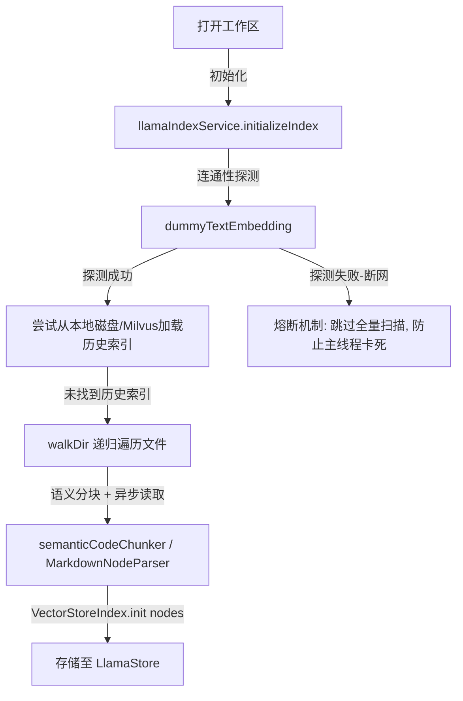
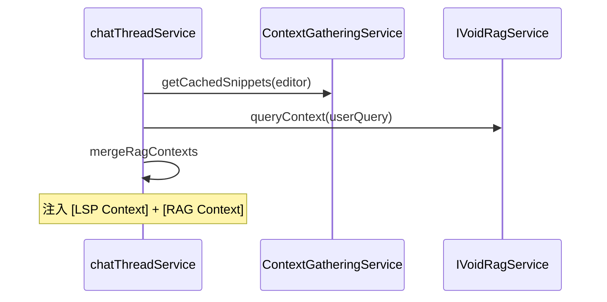

# Code 索引与 RAG 上下文检索机制

> **文档状态**：2026-06 更新。向量通道已落地本地 LlamaIndex；LSP 通道待 **Phase 1** 启用。  
> 任务清单：[TODO.md](./TODO.md) · 路线图：[设计方案_RAG分阶段实施路线图.md](./设计方案_RAG分阶段实施路线图.md)

MCode 编辑器中设计了一套 **双重混合 RAG 架构（Hybrid RAG System）**。它将高精度的 **基于 IDE 静态分析（Language Server Protocol / LSP）的局部符号依赖检索** 与高视野的 **基于 LlamaIndex 的本地向量语义检索** 结合，为大模型提供最精准、低开销的代码上下文。

**当前实现状态**：

| 通道 | 状态 | 说明 |
| :--- | :--- | :--- |
| 通道 B：向量 RAG | ✅ 已实现 | Main 进程 `VectorStoreIndex`，语义切片，TopK=8，Chat 注入 |
| 通道 A：LSP 检索 | ✅ 已实现 | `contextGatheringService.ts` 已注册；Chat 与 Autocomplete 使用 |
| 双通道合并 | ✅ 已实现 | `mergeRagContexts` + `chatThreadService._gatherHybridRagContext` |

Milvus 为 **Phase 7** 可选存储后端；当前运行时始终使用本地 `LlamaStore`。

---

## 1. 🔍 双重 RAG 核心设计思想

为了解决大语言模型在处理复杂项目时“缺乏上下文”或“上下文冗余卡死”的痛点，MCode 采用了双通道检索设计：

1. **通道 A：基于 LSP 的局部符号依赖检索（高精度）**：
   * 不依赖耗时的向量库或外部网络，直接利用 IDE 自带的 Language Server 能力（Go to Definition, Find References等）。
   * 当用户编辑代码或在聊天框中提问时，实时动态抓取光标点及上下文周围的直接依赖项（如引用的类签名、调用的函数签名），实现精确的“符号寻源”。
2. **通道 B：基于 LlamaIndex 的本地向量语义检索（大视野）**：
   * 针对整个工作区的代码与 Markdown 文档进行索引与向量化。
   * 当前使用本地 **LlamaStore** 磁盘持久化（`%APPDATA%/MCode/LlamaStore/{workspaceHash}`）。
   * Milvus 混合索引为 **Phase 7** 规划，见 [设计方案_Milvus混合索引与检索设计.md](./设计方案_Milvus混合索引与检索设计.md)。
   * 即使光标周围没有直接依赖，也能通过语义近似搜索出项目各处的关联逻辑片段。

---

## 2. 🌊 数据采集流向与触发

### 2.1 LSP 检索数据流
```mermaid
graph TD
    UserEdit[用户在编辑器中编辑代码] -->|触发事件| OnDidChangeContent[model.onDidChangeContent]
    OnDidChangeContent -->|获取当前光标位置| UpdateCache[updateCache(model, pos)]
    
    subgraph Context Gathering Service
        UpdateCache --> GatherNearby[_gatherNearbySnippets]
        UpdateCache --> GatherParent[_gatherParentSnippets]
        
        GatherNearby -->|LSP 符号查询| DocSymbols[DocumentSymbolProvider]
        GatherNearby -->|LSP 引用查询| RefSymbols[ReferenceProvider]
        GatherNearby -->|寻找外部定义| DefSymbols[DefinitionProvider]
        
        GatherParent -->|寻找外层包裹函数| FindContainer[_findContainerFunction]
        GatherParent -->|对包裹函数中的符号寻源| DefSymbols
        
        DefSymbols -->|跨文件获取模型| AddSnippet[_addSnippetIfNotOverlapping]
    end
    
    AddSnippet -->|过滤空行/注释并限制行数| CleanAndNormalize[清理与格式化]
    CleanAndNormalize -->|缓存更新| SnippetCache[(this._cache : string[])]
    SnippetCache -->|提供上下文给 LLM| getCachedSnippets[getCachedSnippets()]
```

* `ContextGatheringService` 作为一个强注册单例，会在初始化时订阅 `IModelService` 的 `onModelAdded` 事件。
* 只要检测到用户在当前活跃编辑器中输入内容，便会触发 `model.onDidChangeContent`，捕获光标点并调用 `updateCache(model, pos)` 动态织成符号依赖网。

### 2.2 向量 RAG 检索数据流


---

## 3. ⚙️ 向量 RAG 核心实现与性能优化

本地向量 RAG 的核心逻辑封装 in [llamaIndexService.ts](file:///d:/work/void/src/vs/workbench/contrib/mcode/electron-main/rag/llamaIndexService.ts) 中，运行在 Electron Main（主进程）中。为了确保主进程不遭遇阻塞和卡死，MCode 实现了以下关键性能优化：

### 3.1 接口连通性智能熔断 (Circuit Breaker)
在系统启动执行 RAG 初始化时，会自动执行一次 dummy 文本嵌入测试。如果用户的网络断开或代理设置错误，导致 dummy 测试抛出异常，系统会智能熔断，**直接跳过全量扫描与索引重建**。因为在网络不通时，全量扫描会引发数百次连续的网络超时与重试，这在主进程单线程中是毁灭性的。

### 3.2 异步非阻塞文件扫描与加载
放弃了原先阻塞主线程的 `fs.readFileSync`，全面改用异步的 `fs.promises.readFile` 对工作区文件进行读取。

### 3.3 主线程事件循环主动让渡 (Event Loop Yielding)
为了防止在大型项目（如包含数千个 TS/JS 文件的项目）全量扫描时主进程事件循环被计算任务占满，MCode 引入了让渡技术：
* 扫描循环中，每处理 **20 个文件**，主动通过 `await new Promise(resolve => setImmediate(resolve))` 让渡一次主线程控制权。
* 这极大地释放了 Electron 主进程处理窗口重绘、IPC 消息、鼠标点击的能力，**彻底消除了“Electron 应用程序未响应”的系统卡死弹窗**。

---

## 4. ⚙️ 基于 LSP 的局部依赖图检索算法

服务在 `updateCache` 中并行调度了两个搜索策略，构建深度为 `3` 的递归检索依赖图。

### 4.1 附近片段检索 (`_gatherNearbySnippets`)
1. **视口聚焦**：首先提取光标前后若干行（默认为上下各 3 行）的区域 `Range`，通过检查去重区间 `_snippetIntervals` 确认未处理后，将其作为基础 Snippet 载入。
2. **符号与引用发现**：
   - 调用 `DocumentSymbolProvider` 获取当前区间内的所有局部符号（变量、函数名、类属性）。
   - 同时，用正则表达式提取该区间的所有单词，调用 `ReferenceProvider` 获取这些词在该区间内的引用标志。
3. **追踪跨文件定义 (Def-Tracking)**：
   - 针对发现的每一个符号或变量，调用 `DefinitionProvider`（相当于用户按住 Ctrl 点击跳转定义）定位其真正的声明处（通常在其它文件或当前文件开头）。
   - 如果声明文件已被 VS Code 加载，则通过 `_modelService` 提取其声明位置的周围代码作为 Snippet 载入。
4. **递归下钻**：以定义处为新起点，将深度（depth）减 1，递归执行附近检索，最终织成一张当前位置依赖的“符号网”。

### 4.2 父级/外层片段检索 (`_gatherParentSnippets`)
1. **寻找容器 (Container)**：
   - 调用 `_findContainerFunction` 分析当前光标所处的 innermost（最内层）包裹函数（Function 或 Method 节点）。
2. **提取上下文**：
   - 将该函数的整个声明区间提取并记为 Context。
   - 解析该函数体内引用的所有外部变量/函数，并同样触发 `DefinitionProvider` 进行寻源和 Snippet 提取。
3. **向外层递归**：
   - 获得当前包裹函数后，以包裹函数的声明起点为新位置，向上一层寻找它的父级/外层函数（例如类定义或高阶闭包函数），深度减 1 并继续迭代。

---

## 5. 🧹 剪枝、清洗与去重

为了防止抓取到的 Snippets 导致大模型上下文过载（Context Window Bloat），MCode 在抓取时实现了多重约束：

* **长度限制**：提取的 Snippet 被限制最大行数（[contextGatheringService.ts:L37](file:///d:/work/void/src/vs/workbench/contrib/mcode/browser/contextGatheringService.ts#L37) 中定义为 `_MAX_SNIPPET_LINES = 7`），保证只抓取最精炼的函数签名或上下文。
* **物理去重**：维护 `IVisitedInterval` 数组（记录 `{ uri, startLine, endLine }`），在每次插入前调用 `_isRangeVisited`。若存在交叉区间，直接合并或丢弃，确保同一行代码绝对不重复出现在 AI 的上下文中。
* **忽略规则支持**：优先匹配工作区根目录下的 **`.mcodeignore`** 忽略文件（同时向后兼容 `.voidignore`），过滤掉用户明确排除的代码目录。
* **噪音过滤**：
   - `_cleanSnippet` 剔成了纯注释行（如 `//`）和空行。
   - `_normalizeSnippet` 将多个连续空行压缩，并去除尾随空白。

---

## 6. 💡 总结

MCode 的双重混合 RAG 系统是目前最适合 IDE 辅助编码场景的高性能方案：

1. **LSP 符号级检索（Phase 1 启用）**：精准提供光标周围直接代码依赖签名，无向量化延迟，开销极低。
2. **LlamaIndex 本地向量检索（已实现）**：异步非阻塞主进程，提供跨文件语义检索，支撑复杂重构与跨模块问答。

两者相辅相成；**下一迭代优先完成 Phase 1 合并逻辑**，详见 §7。

---

## 7. Phase 1 双通道融合方案（已实现）

> 实现文件：`ragContextMerger.ts`、`chatThreadService._gatherHybridRagContext`

### 7.1 启用 LSP 服务

在 `mcode.contribution.ts` 取消注释并注册：

```typescript
import './contextGatheringService.js'
```

服务启动后订阅 `IModelService.onModelAdded`，在用户编辑时更新 `SnippetCache`。

### 7.2 Chat 合并流程



### 7.3 合并规则

| 规则 | 值 / 行为 |
| :--- | :--- |
| 并行度 | LSP 与向量检索 `Promise.all` |
| 优先级 | LSP 片段优先占用字符预算 |
| 去重 | `(uri, startLine, endLine)` 或内容 hash |
| 字符预算 | 默认总量 ≤ 12k（Settings 可调 `ragContextMaxChars`） |
| Git 段 | 独立 `[Git Context]`，默认 cap 2k（`ragGitContextMaxChars`） |
| 分块 | FILE / GRAPH / LINKED / Git 独立填充预算 |
| @file 去重 | staging 文件路径从 RAG chunk 排除 |
| Agent 缓存 | 同一条 user 消息多步 Agent 只检索一次 |
| 无编辑器 | 仅 `queryContext` |
| Autocomplete | P1-6 可选：恢复 `readCachedSnippets` |

### 7.4 与 Autocomplete 的关系

`autocompleteService.ts` 中 ContextGathering 调用当前被注释；Phase 1 完成 Chat 合并并验证稳定后，可复用同一 `mergeRagContexts` 工具函数接入补全链路。

---

## 8. 相关文档

- [设计方案_LlamaIndex接入与优化方案.md](./设计方案_LlamaIndex接入与优化方案.md) — 向量 RAG 实现细节
- [解析_切片规则.md](./解析_切片规则.md) — 代码语义切片
- [设计方案_RAG分阶段实施路线图.md](./设计方案_RAG分阶段实施路线图.md) — 全阶段路线图
