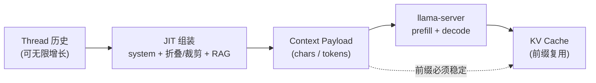
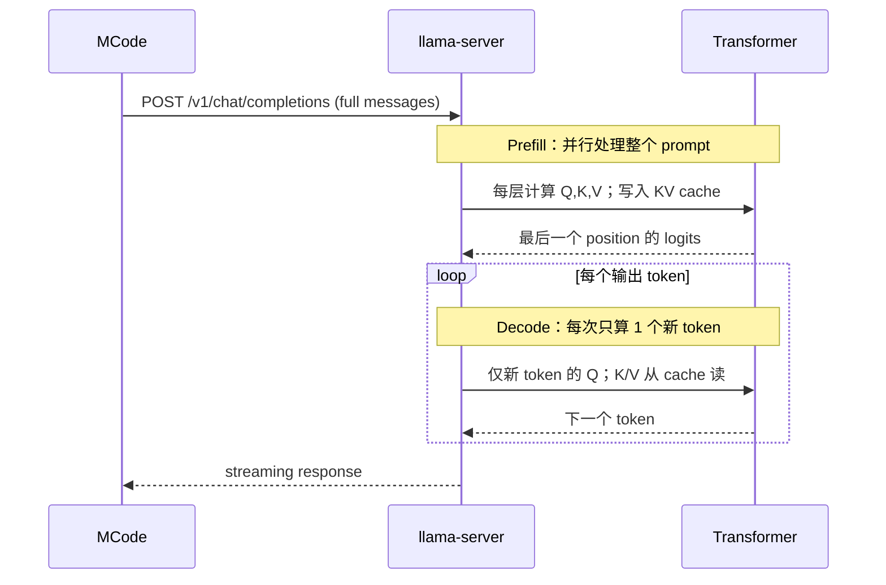
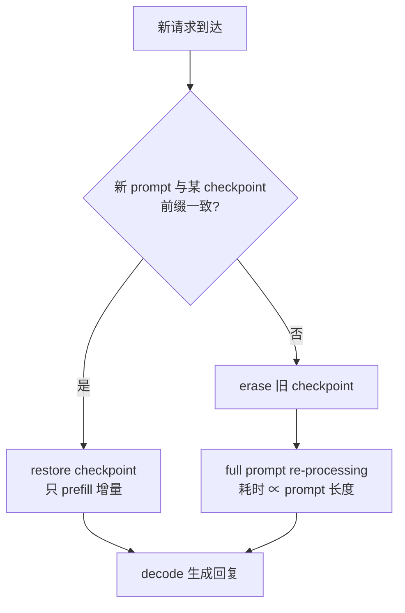
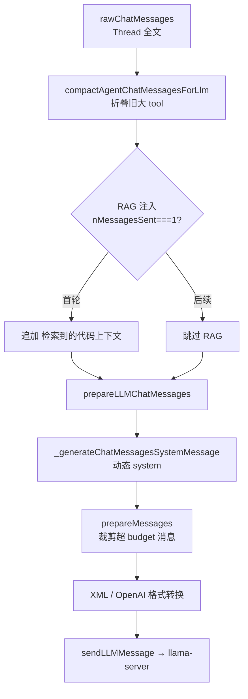
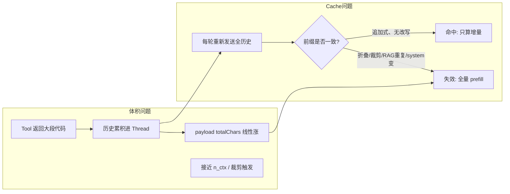

# Context 体积与 KV Cache 原理

本文从 **Transformer 推理机制**、**llama-server 实现**、**MCode Agent 数据流** 三个层面，说明「上下文体积（context 体积）」与「KV cache 命中/失效」的关系。读完应能区分：

- **Context 满了（n_ctx 超限）** vs **Cache 失效（prompt 变了但远未超限）**
- **Thread 里存什么** vs **每轮实际发给后端的 payload 是什么**
- **为什么 Agent 越跑越慢**，以及 log 里各条 warning 的含义

---

## 1. 概念总览

### 1.1 三个容易混淆的「上下文」

| 名称 | 含义 | 有无硬上限 | MCode 中的载体 |
|------|------|------------|----------------|
| **Thread（会话历史）** | UI 里可见的完整聊天记录 | 无（本地持久化） | `chatThreadService` 的 `messages[]` |
| **Context Payload（发给模型的上下文）** | 单次 HTTP 请求里的全部输入 token | 有（`n_ctx` / `contextWindow`） | `prepareLLMChatMessages` 输出 |
| **KV Cache（键值缓存）** | 后端对已算过的 prompt 前缀保存的 K/V 张量 | 受 GPU/CPU 内存与 slot 限制 | llama-server 进程内，对客户端透明 |

关系：



**关键**：Thread 可以很大，但 **KV cache 只关心「本轮 payload 与上一轮 payload 的前缀是否字节级/ token 级一致」**，与 Thread 本地存多少无关。

### 1.2 Context 体积的度量

| 度量 | 典型值（本仓库 Agent 场景） | 说明 |
|------|---------------------------|------|
| **字符数 `totalChars`** | system ~13k；单轮 RAG ~3k；`read_files` 单页 8k | MCode `[LLM][send] payload totalChars` |
| **Token 数 `n_tokens`** | 4k → 17k（长任务）；报错时常 25k~35k | llama-server log；约为 chars/4（英文代码），CJK 更密 |
| **硬上限 `n_ctx`** | 后端 `-c 65536`；IDE `contextWindow` 应对齐 | prompt + generation 合计不得超过此值 |
| **输入预算** | `contextWindow - reservedOutputTokenSpace` | MCode 裁剪触发线，默认 reserved ≥ 4096 |

体积组成（Agent 一轮典型 payload）：

```text
┌─────────────────────────────────────────────────────────┐
│ system: 工具 XML 定义 + 工作区概览 + 分页规则  (~13k chars) │
├─────────────────────────────────────────────────────────┤
│ user: 原始问题 + [检索到的代码上下文] (仅首轮, ~3k)        │
├─────────────────────────────────────────────────────────┤
│ assistant + tool 历史 (每轮追加, 主要膨胀来源)            │
│   · get_dir_tree        ~6k                              │
│   · read_files (分页)   ~8k/页                           │
│   · terminal 输出       不定                              │
├─────────────────────────────────────────────────────────┤
│ 本轮 assistant (tool call XML) + 等待生成的 completion    │
└─────────────────────────────────────────────────────────┘
```

---

## 2. Transformer 推理：Prefill 与 Decode

### 2.1 一次 LLM 请求的两个阶段



| 阶段 | 输入 | 计算量 | 耗时感受 |
|------|------|--------|----------|
| **Prefill** | 整个 prompt（可能 1 万~2 万 token） | O(n²) 量级（与层数、序列长相关） | **首 token 延迟（TTFT）** 的主要来源 |
| **Decode** | 每次 1 个新 token | O(n) 每步 | 流式输出，相对均匀 (~45 tok/s) |

Agent 每轮都是 **新的一次 HTTP 请求**，因此每轮至少要对「新增 prompt 部分」做 prefill；若 cache 全失效，则对 **整段 1 万+ token** 从头 prefill。

### 2.2 KV Cache 存的是什么

对每一层 Transformer、每一个已处理的 token position，推理引擎会缓存：

- **K**（Key）与 **V**（Value）—— attention 中用于与后续 token 的 Query 做点积的部分结果
- 可选：量化后的版本（如 `--cache-type-k q8_0`）

**作用**：Decode 阶段不必对历史 token 重新做 attention 的前向传播，直接从 cache 读取。

**Prefill 阶段**若发现「位置 0..P-1 的 token 与上次请求完全一致」，则可 **跳过** 这 P 个 token 的矩阵计算，称为 **KV cache 命中 / prompt 前缀复用**。

本仓库实测 checkpoint 大小约 **75 MiB/checkpoint**（Qwen3-Coder-Next-Q6，q8_0 KV），与 log 中 `size = 75.376 MiB` 一致。

---

## 3. Context 上限（n_ctx）与 Cache 失效：两件事

### 3.1 Context 上限：「能不能装下」

```text
n_ctx = prompt_tokens + generation_tokens ≤ -c 参数
```

超出时：请求被拒绝、截断、或 OOM——取决于服务端实现。

**本案例**：`-c 65536`，log 中 `n_tokens` 约 4k~17k，**远未触顶**。因此后端 warning **不是**「context 满了」。

### 3.2 Cache 失效：「能不能少算一点」

即使 `n_tokens ≪ n_ctx`，只要 **新 prompt 与已缓存前缀不一致**，就必须对变化部分（甚至全文）重新 prefill。

| 现象 | 含义 |
|------|------|
| `restored context checkpoint` | 找到可复用的前缀 checkpoint，从该 pos 继续算 |
| `erased invalidated context checkpoint` | 某 checkpoint 与新 prompt 不兼容，删除 |
| `forcing full prompt re-processing due to lack of cache data` | 无可用前缀，**整段 prompt 从头 prefill** |



### 3.3 理想 Agent 多轮：单调前缀追加

Cache **最友好**的模式：

```text
轮次 1:  [system][user₁]                          → prefill 全部
轮次 2:  [system][user₁][asst₁][tool₁][?]         → 复用前缀到 tool₁，只算末尾
轮次 3:  [system][user₁][asst₁][tool₁][asst₂][tool₂][?]  → 复用更多
```

MCode 使用 XML 工具格式时，assistant 与 tool 结果会被合并进 user/assistant 交替结构，但 **逻辑上仍是末尾追加**。

实测 log（`--parallel 1`）中 **task 162 / 240**：

```text
sim_best = 0.962 / 0.965, f_keep = 1.000
restored context checkpoint (pos_min = 15779, n_tokens = 15780)
prompt eval: 719 / 676 tokens   ← 仅增量，~2.5s
```

这是 **健康状态**。

---

## 4. llama-server 中的两层缓存

llama.cpp server 与 KV 相关的机制有两层，日志里都会出现。

### 4.1 Slot 内 Context Checkpoints

启动 log：

```text
context checkpoints enabled, max = 32, min spacing = 256
```

- 每个 **slot**（`--parallel N` → N 个 slot）在 **同一会话连续请求** 中维护最多 32 个 checkpoint
- prefill 过程中按 token 位置周期性 `create context checkpoint`
- 新请求来时用 **LCP（最长公共前缀）** 找最佳 checkpoint：`Checking checkpoint with [pos] against ...`
- 匹配则 `restored`；不匹配的旧 checkpoint `erased invalidated`

**`--parallel 1`**（用户已采用）：`n_slots = 1`，消除多 slot 之间的 cache 争用；**不能**解决 prompt 中间被改写的问题。

### 4.2 跨请求 Prompt Cache（RAM）

```text
prompt cache is enabled, size limit: 8192 MiB
prompt_save: saving prompt with length 17246, total state size = 290.306 MiB
cache state: 3 prompts, 1609.764 MiB
```

- 在 **不同请求** 之间保存完整 prompt 状态（含多个 checkpoint）
- 新请求通过 `LCP similarity` / `f_keep` 选父 prompt：`selected slot by LCP similarity, sim_best = 0.443, f_keep = 0.184`
- 若选错父节点（如恢复到很旧的 pos 3042 而非 17166），会 **误删** 一批新 checkpoint 并大量重算

可选关闭（减少「选错父」风险，但失去跨会话复用）：

```bash
--cache-ram 0
```

### 4.3 日志字段速查

| 日志片段 | 解读 |
|----------|------|
| `n_tokens = 15780` | 当前 slot 中已处理的 prompt token 数 |
| `sim_best = 0.965` | 新 prompt 与缓存 prompt 前缀相似度；越接近 1 越好 |
| `f_keep = 1.000` | 可保留的 cache 比例；1.0 = 完全增量 |
| `progress = 0.33` 的 prefill | 正在从头算，已完成 33% |
| `prompt eval time = 32293 ms / 13938 tokens` | 全量 prefill ~32s，Agent 「卡住」的直接原因 |
| `graphs reused = 216` | 计算图复用次数；cache 命中高时更大 |

---

## 5. MCode 如何组装 Context 体积

### 5.1 数据流（Agent 每一轮）



涉及文件：

| 步骤 | 文件 |
|------|------|
| Agent 循环 | `browser/chatThreadService.ts` → `_runChatAgent` |
| 历史折叠 | `common/helpers/agentContextCompaction.ts` |
| System + 裁剪 | `browser/convertToLLMMessageService.ts` |
| 工具分页 | `browser/toolsService.ts`（`MAX_READ_FILES_COMBINED_PAGE = 8000`） |
| contextWindow | `common/modelCapabilities.ts` + `common/llamaServerContextService.ts`（`/props` 同步） |

### 5.2 体积控制手段与副作用

| 手段 | 降低 context 体积 | 对 KV cache 的影响 |
|------|-------------------|-------------------|
| **RAG 仅首轮注入** | 每轮少 ~3k chars | ✅ 后续轮 system+history 前缀更稳定 |
| **read_files 8k 固定页** | 单次 tool 更小 | ✅ 单轮增量变小；⚠️ 需 LLM 续页 |
| **agentContextCompaction** | 旧 tool 变摘要 | ❌ **改写历史中间内容**，前缀断裂 |
| **prepareMessages 权重裁剪** | 超 budget 时截断中间 assistant/tool | ❌ 中间消息内容变化，前缀断裂 |
| **system 动态字段**（打开文件、终端 ID） | 略 | ⚠️ system 段微变，影响前缀起点 |

**Compaction 机制（已实现）**：

```typescript
// 超过 2k chars 的 read_files / get_dir_tree 等
// 保留最近 2 条全文，更早的 → "[read_files summary] path... (N chars omitted)"
compactAgentChatMessagesForLlm(messages)  // 仅影响发给 LLM 的副本
```

Thread 存全文，但 **第 N 轮发给 server 的第 5 条 tool 消息** 可能在第 N+1 轮变成摘要 → llama-server 认为 prefix 在 pos X 处 **token 内容变了** → checkpoint 作废。

这解释了 **`--parallel 1` 后仍出现** 的 log 模式：

```text
task 240: n_tokens = 17246  → 正常追加
task 320: f_keep = 0.184, restored pos 3042, 最终 n_tokens = 7200  ← 变短 + 中间改写
task 362: forcing full re-processing, 13938 tokens  ← 全量 ~33s
```

### 5.3 IDE contextWindow 与后端 n_ctx 对齐

MCode 裁剪使用 **IDE 侧的 `contextWindow`**，不是 llama-server 的 `-c`：

```typescript
inputTokenBudget = contextWindow - reservedOutputTokenSpace
tokensNeedToTrim = totalLen - inputTokenBudget
```

若 IDE 认为 32768、后端实际 65536：

- 114k chars (~28k tok) **不会触发 IDE 裁剪**（以为还够用）
- 但 **28k prefill 全量重算** 仍然很慢
- 已通过 `GET /props` 同步 `contextWindow=65536`（见 `llamaServerContextService.ts`）

---

## 6. Context 体积增长 vs KV Cache：因果链



| 用户感受 | 更可能的主因 |
|----------|-------------|
| 报错 / 无法继续 | context **超限**（n_ctx） |
| 越跑越慢、log 大量 erased checkpoint | **cache 失效** + payload 变长导致每次全量 prefill 更贵 |
| 任务完不成、代码读不全 | tool **分页**未续读（见 `read_files分页LLM不续读.md`） |

**两者独立**：28k token 远小于 65536，仍可能每轮花 30s prefill。

---

## 7. 量化对比：命中 vs 失效

基于用户环境（Qwen3-Coder-Next-Q6_K，`--parallel 1`，`-c 65536`）：

| 场景 | sim / f_keep | prompt eval | 总耗时量级 |
|------|--------------|-------------|------------|
| 首轮 | — | ~4090 tok, ~9s | ~10s |
| 追加命中（task 162） | 0.962 / 1.0 | **719 tok**, ~2.5s | ~4s |
| 追加命中（task 240） | 0.965 / 1.0 | **676 tok**, ~2.5s | ~4s |
| 折叠后前缀断裂（task 362） | 极低 | **13938 tok**, ~32s | ~34s |
| 继续断裂（task 434） | 0.162 | **~20k tok**, 进行中 | 40s+ |

**结论**：优化 context 体积（少塞历史）与 **保持前缀稳定**（少改写已发送内容）同样重要；只压体积但每轮改中间消息，cache 仍失效。

---

## 8. 设计权衡与推荐策略

### 8.1 三角权衡

```text
        信息完整（全历史全文）
              /\
             /  \
            /    \
           /      \
          /________\
   KV cache 命中     context 不超限
```

只能三角取二时，MCode 当前策略：

1. Thread **保留全文**（用户可回看）
2. 发给 LLM **折叠 + 裁剪**（控体积）
3. **牺牲** llama-server KV 命中（本地 Agent 场景）

### 8.2 针对本地 llama-server 的推荐

| 优先级 | 措施 | 目的 |
|--------|------|------|
| P0 | `--parallel 1` | 单 slot，避免 slot 争用 |
| P0 | IDE `contextWindow` 与 `/props` n_ctx 对齐 | 裁剪线与后端一致 |
| P1 | RAG 仅首轮 | 减体积 + 稳定前缀 |
| P1 | read_files 8k 页 + prompt 续页硬规则 | 控单次增量 |
| P2 | **粘性折叠**：已发送过的 message 不再改内容 | 恢复 cache 命中 |
| P2 | Agent 循环内 **冻结 system 快照**（打开文件列表等） | 减少 system 段抖动 |
| P3 | 仍频繁误恢复时试 `--cache-ram 0` | 避免 prompt cache 选错父 |

### 8.3 何时值得增大 `-c`

- prompt + 预期输出 **经常 > 当前 n_ctx 的 80%**
- 且 **无法** 再通过折叠/分页压缩

若 n_tokens 只有 20k、瓶颈是 **prefill 时间** 而非 OOM，增大 `-c` **几乎无帮助**；应优先 **前缀稳定 + 控历史体积**。

---

## 9. 排查清单

### 9.1 MCode 侧（`log.txt`）

```text
[LLM][send] payload totalChars=...     ← 体积趋势
[LLM][send] message[i] role=... chars=...  ← 谁最大
[RAG][inject] skipped agent loop ...   ← RAG 是否重复
[RAG][compact] folded N tool result(s) ← 折叠是否触发（→ 可能断 cache）
[LLM] Synced contextWindow=65536 ...   ← 是否与后端一致
```

### 9.2 llama-server 侧

```bash
curl -s http://HOST:8080/props | jq '.default_generation_settings.n_ctx, .total_slots'
```

关注：

- `sim_best` 是否经常 < 0.5
- 是否交替出现「短 prompt（7k）」与「长 prompt（17k）」—— 暗示折叠/裁剪改写
- `forcing full prompt re-processing` 出现频率

### 9.3 健康 vs 异常（一句话）

| 健康 | 异常 |
|------|------|
| 每轮 `n_tokens` 单调递增，sim > 0.9，prompt eval 仅数百 token | `n_tokens` 突降、sim 低、full re-processing、prefill >10s |

---

## 10. 与相关文档的分工

| 文档 | 内容 |
|------|------|
| **本文** | Context 体积 + KV cache **原理**、llama-server 机制、MCode 因果链 |
| [解析_ContextWindow管理机制.md](./解析_ContextWindow管理机制.md) | MCode **裁剪算法**细节（权重、TRIM_TO_LEN） |
| [解析_AgentLoop工作原理分析.md](./解析_AgentLoop工作原理分析.md) | Agent 循环控制流 |
| [bug解决/LLM不收敛.md](./bug解决/LLM不收敛.md) | 具体 bug 现象、重复读、已实施修复 |
| [bug解决/read_files分页LLM不续读.md](./bug解决/read_files分页LLM不续读.md) | 分页与 LLM 行为 |

---

## 11. 小结

1. **Context 体积** = 单次请求里所有 message 的 token 总和，受 `n_ctx` 与 MCode `contextWindow` 预算约束；Agent 历史与 tool 输出是主要膨胀源。
2. **KV cache** = 对已计算 prompt 前缀的 K/V 复用；要求 **新一轮 prompt 与上一轮相比是「前缀不变、末尾追加」**。
3. **`erased invalidated context checkpoint` 不等于 context 满了**；在 n_tokens ≪ n_ctx 时仍会因 **历史折叠、裁剪、system 变化** 而全量 prefill，表现为越跑越慢。
4. **最优本地 Agent 体验** = 控制体积 **且** 保持已发送前缀稳定；`--parallel 1` + contextWindow 同步是必要但不充分条件。
5. 读 log 时同时看 **MCode payload 曲线** 与 **llama-server sim / f_keep / prompt eval ms**，才能判断是「太大了」还是「前缀断了」。
