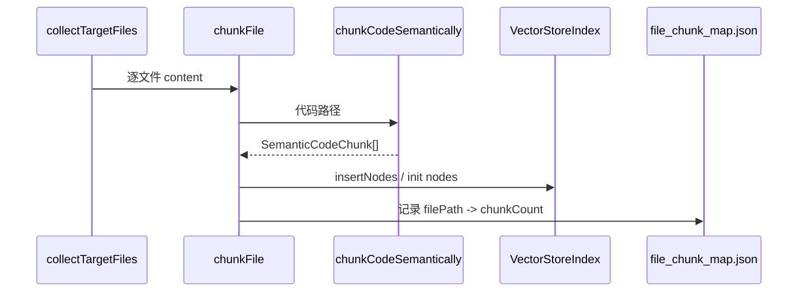

# RAG 索引切片规则解析

本文档描述 MCode 本地向量 RAG 在**建索引阶段**如何将工作区文件切分为可检索的 chunk，并与代码实现一一对应。

> **实现位置**  
> - 代码语义切片：`src/vs/workbench/contrib/mcode/electron-main/rag/semanticCodeChunker.ts`  
> - 文档切片与入库：`src/vs/workbench/contrib/mcode/electron-main/rag/llamaIndexService.ts`  
> - 设计总览：[设计方案_LlamaIndex接入与优化方案.md](./设计方案_LlamaIndex接入与优化方案.md)

---

## 1. 设计目标

| 目标 | 说明 |
| :--- | :--- |
| **语义完整** | 一个 chunk 对应一个可理解的代码单元（函数、struct、class 等），而非固定字符窗口 |
| **检索可定位** | metadata 携带 `symbolType`、`symbolName`、行号，便于 LLM 与用户对号入座 |
| **语言分治** | 按扩展名选择 C++/TS/JS/Python 不同规则 |
| **稳健降级** | 解析失败时整文件作为一个 chunk，避免漏索引 |

**历史变更**：早期版本使用 LlamaIndex `SentenceSplitter`（1024 字符 + 128 overlap），已在当前实现中替换为语义切片。

---

## 2. 总体流程

```mermaid
graph TD
    File[读取单个源文件] --> Ext{扩展名?}
    Ext -->|.md / .txt| MD[MarkdownNodeParser]
    Ext -->|代码扩展名| Sem[chunkCodeSemantically]
    
    MD --> MDNodes[按 Markdown 标题分节]
    Sem --> Lang{语言族}
    
    Lang -->|python| Py[按 def/class 缩进块]
    Lang -->|cpp/ts/js| Pat[正则匹配 + 括号边界]
    Lang -->|unknown| Whole[整文件单 chunk]
    
    Py --> Chunks[SemanticCodeChunk[]]
    Pat --> Chunks
    Whole --> Chunks
    MDNodes --> Nodes[BaseNode[]]
    Chunks --> Doc[Document + metadata]
    Doc --> Embed[Embedding 向量化]
    MDNodes --> Embed
    Embed --> Store[LlamaStore 持久化]
```

**入口函数**：`llamaIndexService.chunkFile()`  
- 文档 → `MarkdownNodeParser.getNodesFromDocuments()`  
- 代码 → `chunkCodeSemantically()` → 每个 chunk 包装为 `Document`

---

## 3. 文件类型与扩展名映射

### 3.1 参与索引的扩展名

定义于 `llamaIndexService.ts`：

| 类别 | 扩展名 |
| :--- | :--- |
| 代码 | `.ts`, `.tsx`, `.js`, `.jsx`, `.cpp`, `.h`, `.hpp`, `.c`, `.py`, `.sci`, `.sce` |
| 文档 | `.md`, `.txt` |

`.sci` / `.sce`（Scilab）无专用语法规则，走 **unknown → 整文件 chunk**。

### 3.2 语言族（`semanticCodeChunker.ts`）

| 扩展名 | `LanguageFamily` |
| :--- | :--- |
| `.c`, `.h`, `.cpp`, `.hpp`, `.cc`, `.cxx` | `cpp` |
| `.ts`, `.tsx` | `typescript` |
| `.js`, `.jsx` | `javascript` |
| `.py` | `python` |
| `.sci`, `.sce` | `scilab` |
| `.m` | `matlab`（MATLAB / Octave M 语言） |
| `.java` | `java` |
| 其他 | `unknown` |

---

## 4. 代码语义切片规则

### 4.1 核心数据结构

```typescript
interface SemanticCodeChunk {
    text: string;           // 切片正文（含完整语法块）
    symbolType: string;     // struct | class | function | ...
    symbolName?: string;    // 符号名（尽力解析）
    startLine: number;      // 1-based 起始行
    endLine: number;        // 1-based 结束行
    partIndex?: number;     // 超大符号拆分时的分片序号（Phase 3）
    partTotal?: number;     // 分片总数
}
```

**超大符号**：单 chunk 超过 `MAX_SYMBOL_LINES`（512）时按空行优先二次切分，metadata 写入 `partIndex` / `partTotal`。

### 4.2 C/C++（`CPP_PATTERNS`）

| symbolType | 匹配思路 | 边界确定 |
| :--- | :--- | :--- |
| `struct` | `(typedef)? struct [Name]? {` | 从 `{` 起括号配对至匹配 `}` |
| `class` | `(template<...>)? class Name (final)? {` | 同上 |
| `enum` | `enum (class\|struct)? Name (: Base)? {` | 同上 |
| `union` | `union Name {` | 同上 |
| `namespace` | `namespace Name {` | 同上 |
| `function` | 有 `{` 的定义：返回类型 + 名 + `(...)` + `{` | 括号配对 |
| `function` | **仅声明**（`.h`）：`... name(...);` | 至分号（Phase 3） |

**示例**（`pay.cpp`）：

```cpp
struct PaymentConfig {
    int timeout;
};

int verify_signature(const char* data) {
    return 1;
}
```

产出 **2 个 chunk**：
1. `symbolType=struct`, `symbolName=PaymentConfig`, Lines 1-3  
2. `symbolType=function`, `symbolName=verify_signature`, Lines 5-7  

### 4.3 TypeScript（`TS_PATTERNS`）

| symbolType | 匹配思路 |
| :--- | :--- |
| `function` | `(export)? (async)? function name (` 或 `export default function` |
| `function` | **箭头函数**（Phase 3）：`(export)? const name = (async)? (...) =>` |
| `class` | `(export)? (abstract)? class Name extends? implements? {` |
| `interface` | `(export)? interface Name extends? {` |
| `enum` | `(export)? (const)? enum Name {` |
| `type` | `(export)? type Name = ... ;`（到分号或嵌套 `{}` 结束） |
| `method` | 行首 `(public\|private\|...)? name(...) (: ReturnType)? {` |

### 4.4 JavaScript（`JS_PATTERNS`）

| symbolType | 匹配思路 |
| :--- | :--- |
| `function` | `(export)? (async)? function name (` 或 `export default function` |
| `function` | **箭头函数**（Phase 3）：`(export)? const name = (async)? (...) =>` |
| `class` | `(export)? class Name extends? {` |
| `method` | 行首 `(async)? name(...) {` |

> **未覆盖**：对象字面量 shorthand 方法等，可能仅被外层 `class` 包含。

### 4.5 Scilab（`chunkScilab`）

| symbolType | 匹配思路 |
| :--- | :--- |
| `function` | 行首 `function [out=]name(` … 至 `endfunction`（跳过 `//`、`#` 注释行） |

### 4.6 MATLAB M 语言（`chunkMatlab`）

| symbolType | 匹配思路 |
| :--- | :--- |
| `function` | 行首 `function [out=]name` … 至匹配 `end`（嵌套 `if/for/while` 等计数） |
| `class` | 行首 `classdef Name` … 至匹配 `end` |

> `.m` 纯脚本（无 `function`/`classdef`）时整文件 fallback 为 `symbolType: file`。

### 4.7 Java（`JAVA_PATTERNS`）

| symbolType | 匹配思路 |
| :--- | :--- |
| `class` | `(modifiers)* class Name extends? implements? {` |
| `interface` | `(modifiers)* interface Name extends? {` |
| `enum` | `(modifiers)* enum Name implements? {` |
| `record` | `(modifiers)* record Name implements? {` |
| `method` | 行首注解 + modifiers + 返回类型 + `name(...) throws? {`（类内 method 与外层 class 重叠时仅保留 class chunk） |

### 4.8 Python（`chunkPython`）

不依赖 `{}`，按**缩进**划分块：

1. 匹配行首：`^(async)? (def|class) name`  
2. 从该行向下，直到遇到：
   - 同级或更浅缩进的下一个 `def`/`class`，或  
   - 同级或更浅缩进的非空行（块结束）

**示例**：

```python
class Handler:
    def run(self):
        return 1

def main():
    pass
```

产出 2 个 chunk：`class Handler`、`function main`。

### 4.6 降级：整文件 chunk

当满足以下任一条件时，整个文件作为 **1 个** chunk：

- 扩展名不在语言映射中（如 `.sci`）  
- 所有正则/缩进规则均未匹配到有效块（`text.length < 8` 的块会被丢弃）  
- 文件 trim 后为空 → 返回空数组，不索引  

此时：

```typescript
{ symbolType: 'file', startLine: 1, endLine: <文件总行数> }
```

---

## 5. 边界解析算法（括号型语言）

### 5.1 `findBlockEnd(content, openBraceIndex)`

从第一个 `{` 开始做**深度计数**（`depth++` / `depth--`），`depth === 0` 时块结束。

扫描时会**忽略**以下上下文中的括号，避免误截断：

| 状态 | 处理 |
| :--- | :--- |
| 行注释 `//` | 跳过至换行 |
| 块注释 `/* */` | 跳过至 `*/` |
| 字符串 `" ' \`` | 跳过转义与闭合引号 |

### 5.2 `findSemicolonEnd`（TypeScript `type` 别名）

用于 `type Foo = ...;` 一类无外层 `{}` 或内含嵌套 `{}` 的声明：在字符串-aware 前提下找**顶层分号**。

### 5.3 重叠去重

同一文件内，若新匹配区间与已有 chunk 在原文位置上重叠（`overlaps()`），则**丢弃新 chunk**，避免嵌套 class 内的 method 与 class 自身重复入库（method 规则命中时可能仍与 class 块重叠而被跳过）。

最终按 `startLine` 升序排序。

---

## 6. 文档切片规则（Markdown / txt）

由 LlamaIndex **`MarkdownNodeParser`** 处理，**按标题层级**切分（非语义代码规则）。

| 字段 | 来源 |
| :--- | :--- |
| `docType` | `'doc_chunk'` |
| `Header_1`, `Header_2`, ... | Parser 自动从 `#` / `##` 提取 |
| `headers` | 合并为 breadcrumb，如 `Payment System > API Configuration` |

`.txt` 无 `#` 标题时，通常产生较少或单个 section chunk。

---

## 7. 入库 metadata 与文档 ID

### 7.1 代码 chunk 入库字段

`llamaIndexService.semanticChunksToNodes()` 写入：

```typescript
{
    filePath: string,      // 规范化绝对路径
    fileName: string,
    docType: 'code_chunk',
    symbolType: string,
    symbolName?: string,
    startLine: number,
    endLine: number,
}
```

### 7.2 文档 ID 规则

```typescript
getChunkDocId(filePath, chunkIndex)
// => "{normalizedPath}::chunk::{index}"
```

- 同一源文件的第 N 个 chunk → index 为 `0, 1, 2, ...`  
- **增量更新**时：按 `file_chunk_map.json` 记录的数量，逐个 `deleteRefDoc` 再 `insertNodes`  
- 兼容旧索引：删除时额外尝试 `deleteRefDoc(normalizedPath)`

### 7.3 检索输出格式

`formatNodeContext()` 拼装给 Chat 的上下文：

```
--- FILE: D:\proj\src\pay.cpp (Type: code_chunk) (function: verify_signature, Lines: 5-7) ---
int verify_signature(const char* data) {
    return 1;
}
```

文档 chunk 示例：

```
--- FILE: docs/setup.md (Type: doc_chunk) (Section: Payment > API, Lines: 12-20, Links: src/pay.cpp) ---
...
```

Git commit chunk 示例（Phase 6）：

```
--- FILE: git://abc123def456 (Type: git_commit) (Commit: abc123def456, Author: Alice, Date: 2026-06-01) ---
Commit Hash: abc123...
Message: Fix payment module
...
```

### 7.4 Phase 6 扩展 metadata

| docType | 额外字段 |
| :--- | :--- |
| `doc_chunk` | `linkedFiles?: string[]` — Markdown 相对链接解析结果 |
| `git_commit` | `commitHash`, `author`, `date`, `message`, `filesChanged`, `linesAdded`, `linesDeleted` |

Git commit 文档 ID：`git::commit::{fullHash}`（不在 `file_chunk_map.json` 中）。

---

## 8. 与索引流水线的衔接



| 阶段 | 行为 |
| :--- | :--- |
| 全量建索引 | `buildLocalIndex` → 每文件 chunk → `VectorStoreIndex.init({ nodes })` |
| 增量更新 | `applyIncrementalChanges` → 单文件 `upsertFileInIndex` → 先删后插 |
| Embedding 变更 | manifest 不兼容 → 全量 rebuild（需 Settings 中 Rebuild） |

---

## 9. 已知限制与后续改进

| 限制 | 原因 | 可能影响 |
| :--- | :--- | :--- |
| **混合 AST + 正则** | Phase 5：C++/TS/JS/Python 走 tree-sitter，其余语言仍用正则 | Scilab/MATLAB/Java 等不受 AST 影响 |
| **嵌套符号去重** | AST/regex 均丢弃严格内层重叠 chunk | class 内 method 可能不单独立 chunk |
| **Preproc 宏** | 不解析 `#if/#define` | 条件编译代码块边界可能不准 |
| **箭头函数 / 匿名函数** | 对象字面量方法等仍未完全覆盖 | 可能仅被外层 class 覆盖 |

**后续方向**（分阶段实施，见 [TODO.md](./TODO.md)）：

| 阶段 | 改进项 |
| :--- | :--- |
| Phase 3 | ✅ 已完成 | 箭头函数、头文件声明、512 行拆分、Scilab、ignore purge |
| **Phase 5** | ✅ tree-sitter AST 混合切片；manifest v2 |
| **Phase 4** | ✅ 文档 Parent-Child、混合 rerank |

路线图：[设计方案_RAG分阶段实施路线图.md](./设计方案_RAG分阶段实施路线图.md) §5。

---

## 12. Phase 3 / Phase 5 切片改进规格（规划）

### 12.1 Phase 3：regex 规则扩展

**TS/JS 箭头函数**（示例）：

```typescript
export const handler = async (req) => { ... }  // → symbolType: function, symbolName: handler
```

**C++ 头文件声明**（无 `{`）：

```cpp
void verify_signature(const uint8_t* data, size_t len);  // → 独立 chunk
```

**超大符号**：单符号超过 `MAX_SYMBOL_LINES`（建议 512）时，按空行或内层 `{}` 块二次切分，metadata 增加 `partIndex` / `partTotal`。

### 12.2 Phase 5：tree-sitter 混合策略（✅ 已实现）

```
chunkCodeForIndexing(content, filePath)
  if (canTreeSitterParse(ext))     // .cpp/.ts/.js/.py 等
    chunks = treeSitterChunker.chunkWithTreeSitter()
    if (chunks.length > 0) return applyLargeChunkSplit(chunks)
  return semanticCodeChunker.chunkCodeSemantically()   // regex 回退
```

| 组件 | 路径 |
| :--- | :--- |
| WASM 加载 | `electron-main/rag/treeSitterRuntime.ts`（`createRequire` + `define.amd`） |
| AST 切片 | `electron-main/rag/treeSitterChunker.ts` |
| 混合入口 | `semanticCodeChunker.chunkCodeForIndexing()` |
| 加载说明 | `electron-main/rag/TREE_SITTER_LOADER.md` |

**Grammar 覆盖**：`tree-sitter-cpp`、`tree-sitter-typescript`、`tree-sitter-tsx`、`tree-sitter-javascript`、`tree-sitter-python`。

**manifest v2**：`version: 2`，`chunkEngine: "tree-sitter-hybrid-v1"`。与 v1 索引不兼容，需 Rebuild。

AST 与 regex 输出 metadata 字段一致（`symbolType`、`symbolName`、`startLine`、`endLine`、`partIndex`/`partTotal`）。

---

## 10. 验证建议

1. 在 Settings 执行 **Rebuild Local Index**（语义规则或 doc id 变更后必须重建）  
2. 打开 `%APPDATA%/MCode/LlamaStore/{workspaceId}/file_chunk_map.json`，确认单文件 `chunkCount` 与预期符号数一致  
3. 在 Chat 提问某函数名，检查返回上下文是否包含 `(function: xxx, Lines: ...)`  
4. 修改某函数后保存，观察日志：`[RAG] Incremental update: 1 file(s), Δchunks=...`

---

## 11. 相关文档

- [设计方案_LlamaIndex接入与优化方案.md](./设计方案_LlamaIndex接入与优化方案.md) — RAG 架构与 manifest  
- [解析_RAG与上下文检索机制.md](./解析_RAG与上下文检索机制.md) — 检索链路与 LSP 双通道  
- [设计方案_Milvus混合索引与检索设计.md](./设计方案_Milvus混合索引与检索设计.md) — 未来 `code_chunk` Schema 对齐参考  
- [TODO.md](./TODO.md) — Phase 3 / 5 切片任务  
- [设计方案_RAG分阶段实施路线图.md](./设计方案_RAG分阶段实施路线图.md) — 全阶段路线图
