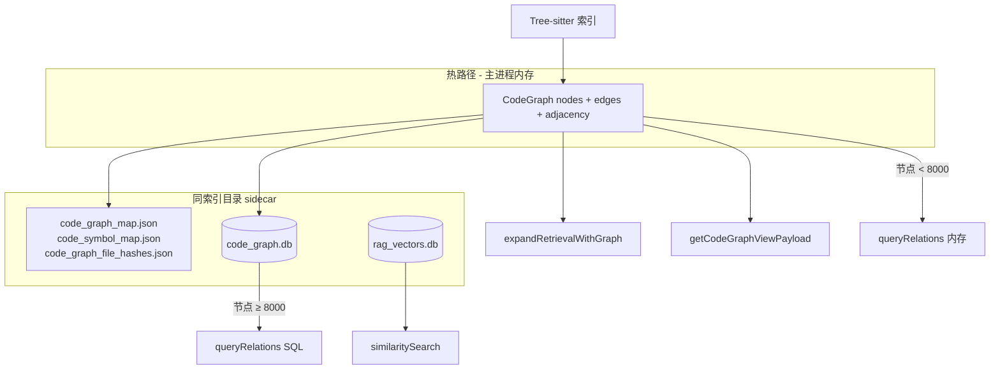

# 解析：代码图谱存储架构选型

> 对应完善计划 **T11（存储重构）**。  
> 关联：[方案设计_原生JS集成Graphify与GraphRAG.md](./方案设计_原生JS集成Graphify与GraphRAG.md) §2.2

---

## 1. 问题背景

原方案设计将 `code_entities` / `code_relations` 表**并入** `rag_vectors.db`（`localSqliteVectorStore.ts`）。实现过程中暴露出：

| 风险 | 说明 |
|------|------|
| 生命周期耦合 | 向量库全量重建会 wipe 或长时间锁库，图谱不应随向量一起消失 |
| 写锁竞争 | 索引 batch 写向量 + 增量写关系，同一 DB 易 WAL 争用 |
| 职责混杂 | 向量 chunk 与图实体是不同域模型，联表收益有限 |
| 中间态冗余 | 曾引入 `code_graph_relations.db`（仅边、只写不读），无实体 JOIN 能力 |

**结论**：采用 **内存热路径 + JSON checkpoint + 独立 `code_graph.db`**。

---

## 2. 最终架构

### 2.1 各层职责

| 层 | 实现 | 用途 |
|----|------|------|
| 内存 | `llamaIndexService.codeGraph` | Graph RAG 二阶扩展、Louvain、Webview、Repository Map |
| JSON | `code_graph_map.json` 等 | 人类可读 checkpoint、版本迁移、调试 |
| SQLite | `code_graph.db` | 大图 Agent `query_codebase_relations` SQL JOIN |
| 向量 | `rag_vectors.db` | **仅** `rag_chunks`，与图分离 |

### 2.2 `code_graph.db` 表结构

由 `codeGraphSqliteStore.ts` 管理：

- `code_entities(id, fs_path, name, type, start_line, end_line)`
- `code_relations(from_id, to_id, kind)` — `calls | imports | inherits | contains`
- `code_graph_meta` — schema 版本

索引：`fs_path`、`name`、`from_id`、`to_id`、`kind`。

---

## 3. 读写流程

### 3.1 启动 / 加载索引

1. `loadSidecarMaps()` 读 JSON 到内存。
2. `bootstrapCodeGraphStore()`：
   - 打开 `code_graph.db`；
   - 若 `entityCount > 0` → `loadGraph()` **覆盖**内存（DB 为权威）；
   - 否则若 JSON 有节点 → `syncFromGraph()` 一次性迁移。

### 3.2 索引构建 / 增量更新

1. Tree-sitter 更新内存 `CodeGraph`。
2. `writeSidecarMaps` / `writeSidecarMapsAsync` 写 JSON。
3. `syncFromGraph()` 全量替换 DB 内容（事务内 DELETE + INSERT）。

单文件删除：`purgeFileFromCodeGraph` + `purgeFile()` 删该路径实体及关联边。

### 3.3 Agent 关系查询

`queryRelations(entityName?, filePath?, relationType?)`：

- 节点数 **< 8000**（`CODE_GRAPH_SQL_QUERY_NODE_THRESHOLD`）：内存遍历边。
- **≥ 8000**：SQL `JOIN code_entities`，失败回退内存。

Graph RAG 扩展（`expandRetrievalWithGraph`）**始终走内存** adjacency，保证低延迟。

### 3.4 SQLite 增量同步（T12）

| 场景 | DB 行为 |
|------|---------|
| 全量索引结束 | `syncFromGraph()` 全表替换 |
| 单文件增量（local / Milvus graph-only） | `syncFileFromGraph()`：purgeFile + 插入该文件实体与关联边 |
| 单文件删除 | `purgeFile()` |
| 增量批次末尾 | 仅写 JSON sidecar（DB 已在单文件路径更新） |

### 3.5 文件监听策略

**不**单独建图谱 Watcher；与 RAG 共用 `mcodeRagSyncContrib`（2s debounce）。

| 索引模式 | 文件变更行为 |
|----------|--------------|
| local | 向量 upsert + 图谱增量 + `syncFileFromGraph` |
| milvus（无 dual-write） | **graph-only**：chunk 符号 + 图谱 + sidecar，不 re-embed |
| milvus dual-write | 与 local 相同 |

---

## 4. 为何不用其他方案

| 方案 |  verdict |
|------|----------|
| 并入 `rag_vectors.db` | ❌ 生命周期与锁竞争 |
| 仅 JSON | ❌ 超大仓库 Agent 关系查询 O(E) 内存扫描 |
| 仅 SQLite、无内存 | ❌ Graph RAG / Louvain / Webview 需反复加载 |
| `code_graph_relations.db` 仅边 | ❌ 无法实体 JOIN，且从未用于读 |
| 独立图数据库（Neo4j 等） | ❌ 部署与 Electron 打包成本过高 |

---

## 5. 关键文件

| 文件 | 说明 |
|------|------|
| `electron-main/rag/codeGraphSqliteStore.ts` | DB 打开、schema、sync/load/purge/query |
| `electron-main/rag/llamaIndexService.ts` | bootstrap、sidecar 写、queryRelations 路由 |
| `electron-main/rag/codeGraphBuilder.ts` | 内存图构建与 payload |
| `electron-main/rag/codeGraphSqliteStore.test.ts` | roundtrip 单测 |

---

## 6. 迁移说明

- 旧索引目录若存在 `code_graph_relations.db`，**不再读取**；下次索引写 sidecar 时会生成 `code_graph.db`。
- 已有 `code_graph_map.json` 的用户：首次启动 bootstrap 自动 `syncFromGraph` 填充 DB。
- 可手动删除 `code_graph_relations.db` 释放空间（可选）。

---

*文档版本：2026-07-01 · 实现：`codeGraphSqliteStore.ts` + `llamaIndexService` bootstrap/sync。*
