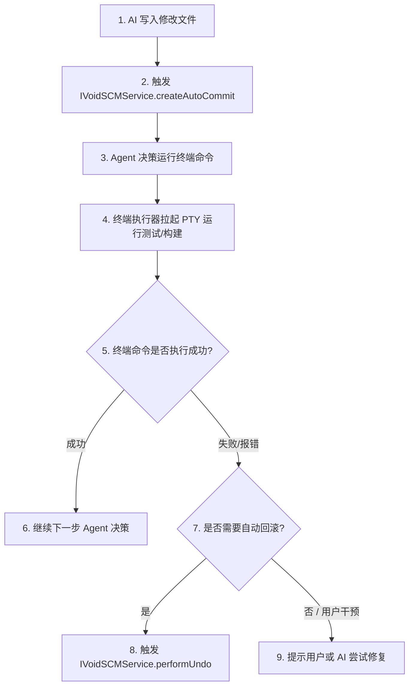

# Aider 模式后台终端执行器改造方案

---

## 1. 当前方案痛点分析 (Pain Points)

虽然利用 VS Code 的 Shell Integration 机制非常巧妙，但在实际复杂的 Agent 开发场景下，暴露出了严重的稳定性与体验痛点：

1. **冷启动与挂载延迟 (Mounting Lag)**：
   - 依赖的 `CommandDetection` 必须等待 VS Code 终端脚本（`shellIntegration-bash.sh`）注入完成。这在机器卡顿时常有 1-3 秒的延迟，导致 Agent 执行命令时有明显的等待卡顿。
2. **跨平台兼容性脆弱 (Cross-platform Flakiness)**：
   - 在 Windows 系统上，默认的 PowerShell 经常因为执行策略限制（`ExecutionPolicy`）拦截 VS Code 注入的 Shell 脚本，导致 `cmdCap` 获取失败。
   - 系统降级回退到**不活跃超时（Inactivity Timeout）**机制，每个命令执行完必须白白干等 10-15 秒，导致 Agent 运行效率呈几何倍数下降。
3. **交互式命令挂起死锁 (Interactive Deadlock)**：
   - 只要命令中途出现 `Do you want to continue? [y/N]`、`Password:` 或 `Enter path:` 等等待输入的交互场景，Shell Integration 无法触发 `onCommandFinished`，导致 Agent 只能卡住直到超时，完全无法进行交互式回应。
4. **用户工作区面板污染 (UI Clutter)**：
   - 临时/常驻终端直接在 VS Code 底部终端面板以明文执行，充斥着 AI 生成的大量冗余命令（如 `cat`、`pytest`、`npm run build` 等），污染了用户自己的终端工作空间。

---

## 2. Aider 模式改造核心架构 (Aider Execution Model)

我们参考 Aider，将终端执行器剥离 VS Code 的 UI 层，下沉到 **Electron 主进程** 中，使用**纯后台的 node-pty 进程池**配合**状态机提示符检测**来实现。

```mermaid
graph TD
    subgraph Browser UI (前端)
        Chat[Sidebar Chat UI] -->|1. 发送命令/中止/交互输入| Client[TerminalToolServiceClient]
        Client -->|2. 流式接收 stdout| Render[Xterm-like Web Terminal / Log Panel]
    end

    subgraph Electron Main Process (主进程)
        Client <-->|IPC Tunnel: void-channel-pty| PtyManager[PTY Manager Service]
        PtyManager -->|监控与管道写| PtyProcess[node-pty Shell Process]
        
        PtyProcess -->|3. 原始 stdout 读| StateMachine[Prompt & Interact State Machine]
        StateMachine -->|4. 清洗与检测状态| PtyManager
    end
```

---

## 3. 改造细节与核心实现 (Implementation Details)

### 3.1 主进程后台独立 PTY 池 (`ptyManager.ts`)
不再调用 `terminalService.createTerminal`。在主进程使用 `node-pty` 原生模块在后台隐式拉起进程：

```typescript
import * as pty from 'node-pty';
import { generateUuid } from '../../../../base/common/uuid.js';

export class PtyInstance {
    public id: string;
    private ptyProcess: pty.IPty;

    constructor(shell: string, cwd: string) {
        this.id = generateUuid();
        this.ptyProcess = pty.spawn(shell, [], {
            name: 'void-agent-pty',
            cols: 120,
            rows: 40,
            cwd,
            env: process.env
        });

        // 监听底层输出，输入流状态机
        this.ptyProcess.onData((data) => {
            this.stateMachine.feed(data);
        });
    }

    public write(data: string) {
        this.ptyProcess.write(data);
    }

    public interrupt() {
        // Unix 系统下发送 SIGINT 到进程组，Windows 下调用 taskkill
        if (process.platform !== 'win32') {
            process.kill(-this.ptyProcess.pid, 'SIGINT');
        } else {
            // Windows 平台发送 ctrl+c 信号
            this.ptyProcess.kill('SIGINT');
        }
    }
}
```

### 3.2 状态机与提示符正则匹配器 (Prompt Detection State Machine)
类似于 Aider，我们需要基于数据流的尾随特征，精准识别命令执行是否结束，或者是否处于交互等待状态。

#### 定义三态状态机
* **`Idle`**：处于等待输入命令状态，前一个命令已执行完毕。
* **`Running`**：命令正在运行，正常输出流数据中。
* **`AwaitingInput`**：命令挂起，等待用户或 AI 代理输入交互应答。

#### 匹配算法
```typescript
export class TerminalStateMachine {
    private buffer: string = '';
    public state: 'Idle' | 'Running' | 'AwaitingInput' = 'Idle';

    // 常见 Shell 的 Prompt 模式（如: user@host:~$ 或 C:\Users> 或 PS >）
    private readonly promptRegex = /([$#>]|PS\s+[^>]+>)\s*$/;
    // 常见交互式输入询问模式
    private readonly interactRegex = /(confirm\??|\[y\/n\]|\[Y\/n\]|Password:|y\/n\s*\?)\s*$/i;

    public feed(data: string) {
        this.buffer += data;
        // 限制缓冲区大小防止内存泄露
        if (this.buffer.length > 50000) this.buffer = this.buffer.slice(-10000);

        const lines = this.buffer.split('\n');
        const lastLine = lines[lines.length - 1].trim();

        if (this.state === 'Running') {
            // 1. 检查是否回到了 Shell 提示符（即命令结束）
            if (this.promptRegex.test(lastLine)) {
                this.state = 'Idle';
                this.onCommandFinished(this.extractOutput());
            }
            // 2. 检查是否触发了交互提问
            else if (this.interactRegex.test(lastLine)) {
                this.state = 'AwaitingInput';
                this.onAwaitingInteractiveInput(lastLine);
            }
        }
    }

    private extractOutput(): string {
        const out = this.buffer;
        this.buffer = ''; // 消费后清空
        return out;
    }
}
```

### 3.3 交互机制的前端 React 挂载 (React Interactive Hook)
当状态机跳转为 `AwaitingInput` 时，PTY Manager 通过 IPC 通知前端：

1. **前端响应**：侧边栏接收到 `onAwaitingInteractiveInput` 事件，判定当前命令“未结束且处于交互阻断”。
2. **渲染就地表单**：在侧边栏终端输出日志的正下方，动态挂载一个 Mini 确认框：
   ```tsx
   {currentState === 'AwaitingInput' && (
       <div className="p-2 border border-yellow-500 rounded bg-void-bg-2 flex gap-2">
           <span className="text-xs text-yellow-500">AI 正在等待输入: {promptText}</span>
           <input 
               type="text" 
               className="text-xs bg-void-bg-1 border border-void-border-3 rounded flex-1 px-1"
               onKeyDown={(e) => {
                   if (e.key === 'Enter') {
                       // 将用户的回答写入 PTY 管道
                       ptyService.writeInput(e.currentTarget.value + '\n');
                   }
               }}
           />
       </div>
   )}
   ```
3. **恢复状态**：当用户输入并回车后，主进程向 PTY 写入值，状态机状态切换回 `Running`，继续等待 Shell 提示符出现。

---

## 4. 与 Git 自动提交/回滚机制的协同设计

Aider 终端改造与 Git 自动提交/回滚是**两个独立但紧密协作的子系统**。

### 4.1 职责分工
1. **Aider 终端执行器**：仅负责**执行底层 Shell 命令**（如运行测试 `npm test`、安装依赖 `npm install` 等），管理 PTY 进程状态、流式输出和交互式输入劫持。它**不直接处理** Git 版本控制逻辑。
2. **Git 自动提交与回滚服务 (`IVoidSCMService`)**：负责在 AI 写入代码后创建“微提交 (Micro-Commit)”，并在用户输入 `/undo` 或点击撤销时执行 `git reset --hard`。

### 4.2 协同工作流
在 Agent Loop 中，这两个系统通过以下流程协同运作：



### 4.3 边界情况处理
- **终端命令自身修改了代码**（例如执行了 `npm run format`、`lint --fix` 或代码生成脚本）：
  PTY 终端命令执行完毕并返回 `Idle` 状态后，Agent Loop 会调用 `IVoidSCMService.isWorkspaceDirty()` 检测工作区是否产生新改动。如果有，自动将这些改动追加或单独创建一个微提交。
- **命令卡死回滚**：
  若终端执行器运行超时，或用户强制中止（SIGINT 中断进程），Agent 会接收到命令中断信号，并可以选择回滚在此之前的全部临时改动，保持代码仓库的纯净。

