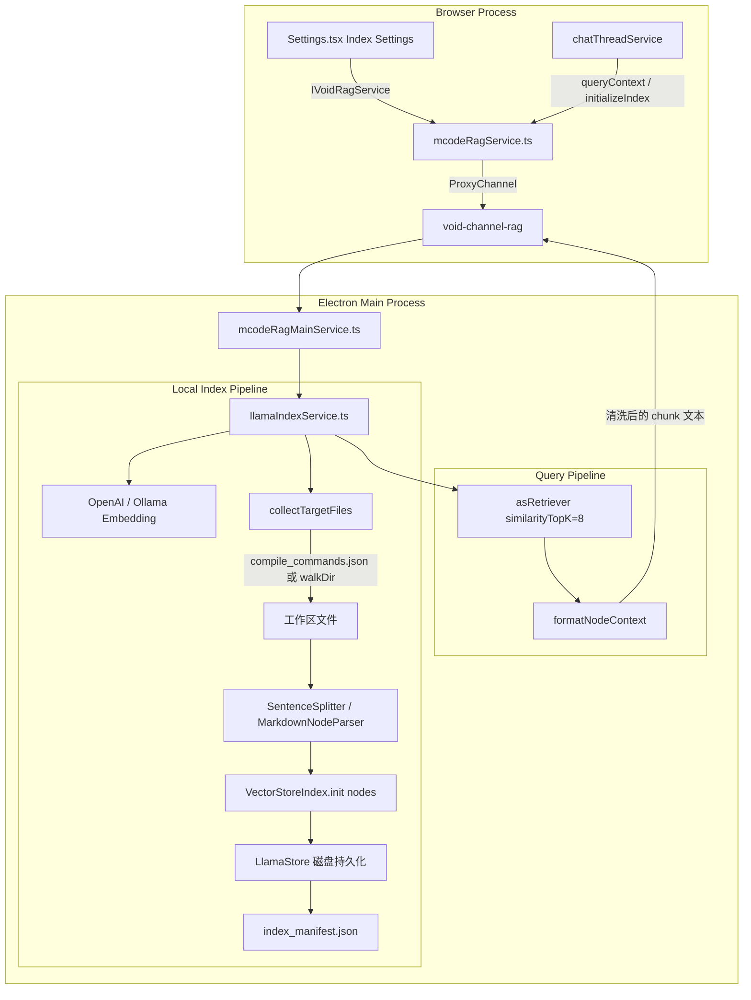
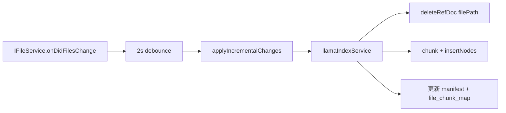
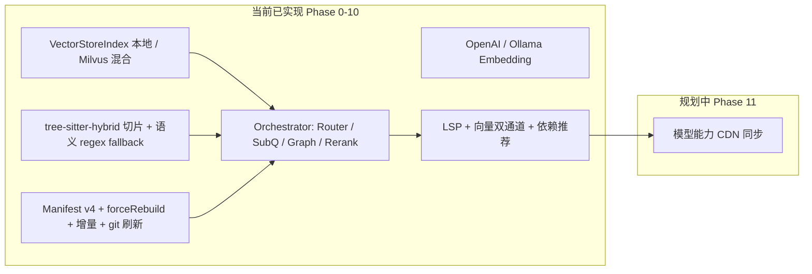

# LlamaIndex 接入与优化方案设计

> **文档状态**：已与当前代码实现对齐（截至 2026-06）。  
> 本文档描述 MCode 编辑器中 LlamaIndex RAG 的**设计目标、已实现架构与后续规划**。  
> **分阶段任务**见 [TODO.md](./TODO.md)；路线图见 [设计方案_RAG分阶段实施路线图.md](./设计方案_RAG分阶段实施路线图.md)。

LlamaIndex 是一个专为 LLM 应用设计的数据框架，在 RAG 场景下擅长数据摄取（Ingestion）、索引构建（Indexing）与检索编排。MCode 将其部署在 **Electron Main 主进程**，通过 IPC 为渲染进程的 Chat UI 提供本地向量语义检索能力。

---

## 1. 实现状态总览

| 能力 | 状态 | 说明 |
| :--- | :--- | :--- |
| 主进程 `VectorStoreIndex` 本地磁盘索引 | ✅ 已实现 | 持久化至 `%APPDATA%/MCode/LlamaStore/{workspaceHash}` |
| IPC 服务代理（Browser ↔ Main） | ✅ 已实现 | `void-channel-rag` + `IVoidRagService` |
| 语义代码分块（Chunking） | ✅ 已实现 | `semanticCodeChunker.ts`（函数/struct/class 等） |
| Markdown 文档分块 | ✅ 已实现 | `MarkdownNodeParser` → `doc_chunk` |
| Embedding 双通道（OpenAI / Ollama） | ✅ 已实现 | 动态维度探测 + manifest 校验 |
| 索引 Manifest 与强制重建 | ✅ 已实现 | `index_manifest.json` + `forceRebuild` |
| `compile_commands.json` 白名单 | ✅ 已实现 | C/C++ 项目优先按编译单元索引 |
| `.mcodeignore` / `.voidignore` 过滤 | ✅ 已实现 | 工作区级忽略规则 |
| 主进程非阻塞扫描（熔断 + 事件循环让渡） | ✅ 已实现 | 每 20 文件 `setImmediate` 让渡 |
| 设置 UI（Embedding / Rebuild） | ✅ 已实现 | `Settings.tsx` Index Settings 区块 |
| Chat 发消息前 RAG 检索 | ✅ 已实现 | `chatThreadService` 注入上下文 |
| Milvus 向量库 | ✅ 已实现 | Phase 7：`milvusStore.ts` 混合索引 + RRF |
| PropertyGraphIndex 图谱索引 | ✅ 已实现 | Phase 8 + P10-3：1–2 hop 可配 |
| SubQuestionQueryEngine | ✅ 已实现 | Phase 8 + P10-4：启发式 / 可选 LLM 拆分 |
| RouterQueryEngine / 分区路由 | ✅ 已实现 | Phase 8：`routeQueryTargets` + Milvus partition |
| 增量索引（文件变更监听） | ✅ 已实现 | `mcodeRagSyncContrib.ts` + `applyIncrementalChanges` |
| LSP 双通道 RAG（ContextGathering） | ✅ 已实现 | Phase 1：`mergeRagContexts` + Chat 双通道 |
| 索引进度 / 增量同步 UI | ✅ 已实现 | Phase 2：`onIndexProgress` + Settings 进度条 |
| Reranker / Parent-Child 检索 | ✅ 已实现 | Phase 4：`ragReranker` + doc/code sidecar maps |
| tree-sitter AST 切片 | ✅ 已实现 | Phase 5：`treeSitterChunker.ts` |
| Git commit 本地索引 | ✅ 已实现 | Phase 6：`gitLogIndexer.ts` |
| Git commit 增量刷新 | ✅ 已实现 | Phase 10：`refreshGitCommitIndex`（增量同步后） |
| 依赖推荐 / 模型意图路由 | ✅ 已实现 | Phase 9：`DependencyRecommendations` + `modelIntentRouter` |
| CodeGraph tree-sitter 建边 | ✅ 已实现 | Phase 10：`codeGraphTreeSitter.ts`，`graphEngine: code-graph-v2` |
| 编排层 Settings 开关 | ✅ 已实现 | Phase 10：Router / SubQuestion / Graph / LLM 子问题拆分 |
| RAG 单元测试 CI 脚本 | ✅ 已实现 | Phase 10：`npm run test-rag` |

---

## 2. 系统架构（当前实现）

LlamaIndex 运行在 Electron Main 主进程；渲染进程通过 DI + IPC 调用 RAG 服务。



### 2.1 关键文件路径

| 层级 | 文件 | 职责 |
| :--- | :--- | :--- |
| Main | `electron-main/rag/semanticCodeChunker.ts` | 代码语义切片（函数/struct/class） |
| Main | `electron-main/rag/llamaIndexService.ts` | 索引构建、检索、分块、manifest |
| Main | `electron-main/mcodeRagMainService.ts` | `IVoidRagService` 主进程门面 |
| Browser | `browser/mcodeRagService.ts` | IPC 代理，`ProxyChannel.toService` |
| Common | `common/mcodeRagTypes.ts` | 接口与 `RagInitOptions` / `RagEmbeddingConfig` |
| Browser | `browser/chatThreadService.ts` | 启动 `_initRag()`，发消息前 `queryContext()` |
| Browser | `browser/react/.../Settings.tsx` | Index Settings UI |
| Browser | `browser/mcodeRagSyncContrib.ts` | 文件变更监听与增量同步 |
| Browser | `browser/react/.../services.tsx` | React 层 `IVoidRagService` 注册 |
| Main | `code/electron-main/app.ts` | 注册 `void-channel-rag` channel |

### 2.2 IPC 注册方式

当前未使用独立 `ragChannel.ts`，而是通过 VS Code 标准 IPC 代理：

```typescript
// app.ts
const voidRagChannel = ProxyChannel.fromService(accessor.get(IVoidRagService), disposables);
mainProcessElectronServer.registerChannel('void-channel-rag', voidRagChannel);

// mcodeRagService.ts (Browser)
this.voidRag = ProxyChannel.toService<IVoidRagService>(
    mainProcessService.getChannel('void-channel-rag')
);
```

---

## 3. 依赖版本

`package.json` 当前依赖（非原方案草稿中的 `^0.8.0`）：

```json
{
  "llamaindex": "0.12.1",
  "@llamaindex/openai": "0.4.22",
  "ollama": "（项目已有）"
}
```

---

## 4. 本地索引详细设计

### 4.1 持久化路径

```
%APPDATA%/MCode/LlamaStore/{workspaceStoreName}/ (优先选用项目名命名，向后兼容 {workspaceHash} 命名)
├── {workspaceStoreName}.db        # 本地 SQLite 向量与元数据存储（包含 rag_chunks 等表）
├── {workspaceStoreName}.usearch   # 本地 USearch HNSW 向量索引二进制文件
└── index_manifest.json            # MCode 自定义 manifest（见 §4.3）
```

> 相比早期草案，当前持久化已全面废弃 JSON 文本存储，改用 SQLite DB + USearch 二进制文件，以极大提升大项目加载和检索效率。路径统一在 **`MCode/LlamaStore`** 下进行解析与隔离。

### 4.2 服务接口

```typescript
// common/mcodeRagTypes.ts

export interface RagInitOptions {
    /** 为 true 时清空本地 store 并全量重建 */
    forceRebuild?: boolean;
}

export interface RagEmbeddingConfig {
    provider?: 'openai' | 'ollama';
    model?: string;
    ollamaEndpoint?: string;
}

export interface IVoidRagService {
    initializeIndex(
        workspaceRoot: string,
        workspaceHash: string,
        useMilvus: boolean,
        milvusConfig?: any,
        embeddingConfig?: RagEmbeddingConfig,
        initOptions?: RagInitOptions,
    ): Promise<'local' | 'milvus'>;
    getActiveIndexType(): Promise<'local' | 'milvus' | null>;
    queryContext(queryText: string): Promise<string>;
}
```

### 4.3 Index Manifest

每次全量建索引后写入 `index_manifest.json`，用于判断是否需要重建：

```typescript
interface IndexManifest {
    version: number;              // 当前为 1
    embeddingProvider: string;    // 'openai' | 'ollama'
    embeddingModel: string;       // 如 'text-embedding-3-small' / 'nomic-embed-text'
    dimensions: number;           // 动态探测的向量维度
    fileCount: number;
    chunkCount: number;
    builtAt: string;              // ISO 8601
}
```

**重建触发条件**（满足任一即重建）：

1. `initOptions.forceRebuild === true`（Settings 中 Save & Apply / Rebuild 按钮）
2. 本地不存在 SQLite 数据库文件（如 `<WorkspaceStoreName>.db`）
3. manifest 缺失或与当前 embedding 配置不兼容（provider / model / dimensions 变化）

**不重建时**：直接 `VectorStoreIndex.init({ storageContext })` 加载已有索引。

### 4.4 Embedding 模型配置

| Provider | 实现类 | 配置来源 |
| :--- | :--- | :--- |
| `openai` | `@llamaindex/openai` → `OpenAIEmbedding` | `OPENAI_API_KEY` 环境变量 + Settings 中的 model |
| `ollama` | `CustomOllamaEmbedding extends BaseEmbedding` | Settings 中的 model + `ollamaEndpoint`（默认 `http://127.0.0.1:11434`） |

初始化时执行 dummy embed（`getTextEmbedding("test")`）以：

- 探测向量维度（OpenAI 1536、Ollama `nomic-embed-text` 768 等）
- 检测 embedding 服务是否在线

**熔断机制**：若 embedding 离线且需要重建，跳过全量扫描，避免主进程因数百次网络超时卡死；若已有兼容的旧索引则尝试加载。

全局 Settings 字段（`mcodeSettingsTypes.ts`）：

```typescript
indexType: 'local' | 'milvus';       // Milvus 混合索引已实现（Phase 7）；可选 dual-write
embeddingProvider: 'openai' | 'ollama';
embeddingModel: string;
ollamaEndpoint: string;
ragSimilarityTopK: number;           // 默认 12（Retrieve TopK）
ragFinalTopK: number;                // 默认 5（注入 Chat）
ragUseOrchestrator: boolean;         // Phase 10 编排总开关
```

### 4.5 文件采集策略

**优先级 1：`compile_commands.json` 白名单**

若工作区根目录存在 `compile_commands.json`，仅索引其中 `file` 字段列出的路径（适合 C/C++ 工程，避免索引无关文件）。

**优先级 2：目录递归 `walkDir`**

- 支持扩展名：`.ts/.tsx/.js/.jsx/.cpp/.h/.hpp/.c/.py/.java/.m/.sci/.sce/.md/.txt`
- 跳过目录：`node_modules`、`.git`、`.build`、`out`、`build`、`dist`
- 忽略规则：`.mcodeignore`（优先）或 `.voidignore`

### 4.6 分块（Chunking）策略

对齐 [设计方案_Milvus混合索引与检索设计.md](./设计方案_Milvus混合索引与检索设计.md) 中的 `doc_type` 概念，在本地索引 metadata 中标记类型：

| 文件类型 | 分块器 | `docType` | Metadata 附加字段 |
| :--- | :--- | :--- | :--- |
| 代码文件 | **`semanticCodeChunker`**（按函数/struct/class 等语义单元） | `code_chunk` | `filePath`, `fileName`, `symbolType`, `symbolName`, `startLine`, `endLine` |
| Markdown / txt | `MarkdownNodeParser` | `doc_chunk` | `filePath`, `fileName`, `headers`（标题 breadcrumb，如 `Payment > API`） |

**代码语义切片规则**（`semanticCodeChunker.ts`）：

| 语言 | 识别的语义单元 |
| :--- | :--- |
| C/C++ (`.c/.h/.cpp/.hpp`) | `struct`, `class`, `enum`, `union`, `namespace`, `function` |
| TypeScript (`.ts/.tsx`) | `function`, `class`, `interface`, `enum`, `type`, `method` |
| JavaScript (`.js/.jsx`) | `function`, `class`, `method` |
| Python (`.py`) | `def` / `class`（按缩进块） |
| MATLAB (`.m`) | `function` / `classdef`（至 `end`） |
| Scilab (`.sci/.sce`) | `function` / `endfunction` |
| Java (`.java`) | `class` / `interface` / `enum` / `record` / `method` |
| 其他 / 无法解析 | 整文件作为单个 `file` chunk |

每个语义 chunk 在向量库中的文档 id 为：`{filePath}::chunk::{index}`。删除/更新文件时会删除该文件的全部 chunk id。

> 原先使用 `SentenceSplitter`（1024 字符固定窗口）已替换为语义切片。  
> 详细规则与示例见 [解析_切片规则.md](./解析_切片规则.md)。

构建流程：

```typescript
// 1. 读取文件 → Document
// 2. 按类型分块 → BaseNode[]
// 3. enrich 节点 metadata
// 4. VectorStoreIndex.init({ nodes: allNodes, storageContext })
```

> 原方案使用 `SimpleDirectoryReader` + 整文件 `fromDocuments`；当前实现改为**预分块 nodes 再 init**，检索粒度更细。

### 4.7 性能优化

1. **异步读文件**：`fs.promises.readFile`，非阻塞
2. **事件循环让渡**：每处理 20 个文件 `await setImmediate(...)`，防止 Electron 主进程「未响应」
3. **Embedding 熔断**：离线时不触发全量 embed 扫描

### 4.8 增量索引（文件变更同步）

渲染进程 `mcodeRagSyncContrib.ts` 监听 `IFileService.onDidFilesChange`，2 秒 debounce 后批量调用主进程 `applyIncrementalChanges()`。



**单文件更新策略**（Document `id_` = 规范化绝对路径）：

1. `deleteRefDoc(normalizedFilePath)` — 移除该文件所有旧 chunk
2. 重新分块 → `insertNodes(newNodes)`
3. 更新 `file_chunk_map.json` 与 `index_manifest.json` 中的 `fileCount` / `chunkCount`

**辅助文件**：

| 文件 | 用途 |
| :--- | :--- |
| `file_chunk_map.json` | 记录每个已索引文件的 chunk 数量，用于增量更新 manifest |
| `index_manifest.json` | 全量/增量后更新 `builtAt`、计数 |

**特殊处理**：

| 变更 | 行为 |
| :--- | :--- |
| `compile_commands.json` 变更 | 触发全量 rebuild（白名单变化） |
| `.mcodeignore` / `.voidignore` 变更 | 重新加载忽略规则；后续 updated 事件按新规则处理 |
| 文件删除 | `deleteRefDoc` + 从 chunk map 移除 |
| 文件变为不可索引（扩展名/忽略/白名单） | 若曾索引则删除 |
| 任意增量批次完成 | **刷新 `git_commit` 索引**（Phase 10，`git_commit_index.json` 侧车） |

**接口**：

```typescript
// common/mcodeRagTypes.ts
export interface RagFileChange {
    filePath: string;
    type: 'updated' | 'deleted';
}

applyIncrementalChanges(changes: RagFileChange[]): Promise<void>;
```

---

## 5. 检索流程

### 5.1 初始化触发点

| 触发场景 | 调用方 | `forceRebuild` |
| :--- | :--- | :--- |
| 应用启动 / Chat 服务初始化 | `chatThreadService._initRag()` | `false`（manifest 不兼容时自动重建） |
| Save & Apply Embedding Model | `Settings.tsx` | `true` |
| Rebuild Local Index | `Settings.tsx` | `true` |
| 切换 Index Type | `Settings.tsx` | `false` |

### 5.2 查询与上下文注入

```typescript
// chatThreadService.ts — 每次用户发消息前
const context = await this._mcodeRagService.queryContext(queryText);
if (context && !context.startsWith("No context found")) {
    chatMessages[lastUserMsgIdx] = {
        ...lastUserMsg,
        content: `${queryText}\n\n[检索到的代码上下文 (RAG Context)]:\n${context}`
    };
}
```

### 5.3 检索实现

使用 `asRetriever({ similarityTopK })`（默认 **12**，Settings 可配）+ 可选 **Hybrid Reranker**（Phase 4，默认截断至 **finalTopK=5**）。启用编排层时走 `assembleOrchestratedContext()`（Router → SubQuestion → 向量 → Rerank → Graph 扩展 → Doc 链接源码）。

```
--- FILE: src/pay.cpp (Type: code_chunk) (Lines: 42-68) ---
int verify_signature(...) { ... }

--- FILE: docs/setup.md (Type: doc_chunk) (Section: Payment > API) ---
Configure SSL keys...
```

---

## 6. 设置 UI（Index Settings）

`Settings.tsx` → `IndexSettingsSection` 提供：

- **Index Type** 切换（Local / Milvus）— Milvus 混合检索已实现（Phase 7）；`ragMilvusDualWrite` 可选双写本地副本
- **Embedding Model Configuration**
  - Provider：Cloud (OpenAI) / Local (Ollama)
  - Model Name、Ollama Endpoint
  - **Save & Apply Embedding Model**（`forceRebuild: true`）
- **Local Index Status**（Phase 2 ✅）
  - 构建进度条、`builtAt` / file / chunk 计数、增量同步摘要
  - **Rebuild Local Index**（`forceRebuild: true`）
  - 图索引过期提示：manifest 缺 `graphEngine: code-graph-v2` 时显示 Rebuild 建议（Phase 10）
- **Retrieval Settings**（Phase 4 ✅）
  - Retrieve TopK / Final TopK、Hybrid Reranker 开关
- **Orchestration**（Phase 10 ✅）
  - Router / SubQuestion / Graph 扩展（hop 1–2）/ Doc→源码 / 可选 LLM 子问题拆分
- **Milvus Connection Details**
  - 地址、账号、**Test Connection**（Phase 7 ✅）

React 层通过 `services.tsx` 中的 `IVoidRagService` 获取 RAG 服务（须在 `getReactAccessor()` 中注册）。

---

## 7. 分阶段后续规划

> 完整任务勾选表：[TODO.md](./TODO.md)  
> 路线图设计：[设计方案_RAG分阶段实施路线图.md](./设计方案_RAG分阶段实施路线图.md)

| 阶段 | 优先级 | 内容 |
| :--- | :--- | :--- |
| Phase 1 | **P0** | ~~启用 LSP + 向量双通道融合~~ ✅ 已完成 |
| Phase 2 | **P0** | ~~索引构建 / 增量同步 UI 反馈~~ ✅ 已完成 |
| Phase 3 | P1 | ~~切片规则补强、`.mcodeignore` purge、单测~~ ✅ 已完成 |
| Phase 4 | P1 | ~~Reranker、Markdown Parent-Child、邻域扩展~~ ✅ 已完成 |
| Phase 5 | P2 | ~~tree-sitter AST 切片（regex fallback）~~ ✅ 已完成 |
| Phase 6 | P2 | ~~Git commit + 文档链接 metadata（本地索引）~~ ✅ 已完成 |
| Phase 7 | P3 | ~~Milvus Dense+Sparse+RRF~~ ✅ 已完成 |
| Phase 8 | P3 | ~~PropertyGraph、SubQuestion、Router~~ ✅ 已完成 |
| Phase 9 | P4 | ~~依赖推荐 UI、模型路由~~ ✅ 已完成 |
| Phase 10 | P1–P2 | ~~质量补强与工程化~~ ✅ 已完成 |
| Phase 11 | P4 | 模型能力 CDN 动态同步（进行中） |

---

## 8. LlamaIndex 高级能力（Phase 8 已实现）

以下为 Phase 8 接入的查询编排能力；实施见 [TODO.md § Phase 8](./TODO.md#phase-8--llamaindex-高级编排-p3)。

### 8.1 PropertyGraphIndex（属性图索引）

索引时由 `codeGraphBuilder.ts` + **`codeGraphTreeSitter.ts`**（P10-2）从符号表 + AST import/call 构建 `code_graph_map.json` 侧车（`graphEngine: code-graph-v2`）；检索后对 code_chunk 命中做 **1–2 hop** 图扩展（Settings `ragGraphExpandHops`）。

### 8.2 高级检索器

| 能力 | 实现 | 作用 |
| :--- | :--- | :--- |
| `RecursiveRetriever` / Parent-Child | Phase 4 `doc_parent_map` / `code_symbol_map` | 小 chunk 扩展父级 |
| `SubQuestionQueryEngine` | `splitSubQuestions` / 可选 `splitSubQuestionsWithLlm` | 复杂问题拆分子查询并行召回 |
| `RouterQueryEngine` | `routeQueryTargets` + Milvus `partition_names` | code/git/doc 毫秒级分流 |

### 8.3 Milvus 混合索引 — Phase 7

详见 [设计方案_Milvus混合索引与检索设计.md](./设计方案_Milvus混合索引与检索设计.md)：

- 统一 Collection Schema（`code_chunk` / `git_commit` / `doc_chunk`）
- Dense + Sparse（BM25）混合召回 + RRF 重排
- 物理分区（code / git / doc partition）

当前 `useMilvus: true` 时使用 `MilvusRagStore` 混合检索；编排层通过 `partition_names` 路由。详见 [milvus/README.md](../milvus/README.md)。

### 8.4 Code-Doc 混合召回 — Phase 8

文档 chunk 的 `linkedFiles`（Phase 6 `markdownLinkParser`）在 doc 命中后由 `buildLinkedCodeSnippets` 拉取链接源码符号片段。

### 8.5 已知限制与后续

Phase 0–10 核心能力已落地。本表与 [TODO.md § 已知限制](./TODO.md#已知限制当前实现)、[路线图 §10](./设计方案_RAG分阶段实施路线图.md#10-phase-10-与已知限制) **同步维护**。

| 类别 | 说明 | 详见 |
| :--- | :--- | :--- |
| CodeGraph 建边 | tree-sitter 优先，极端 C++ 模板/宏仍可能漏边 | [P10-2](./TODO.md#phase-10--质量补强与工程化-p1p2) · [解析_切片规则 §12](./解析_切片规则.md) |
| SubQuestion | LLM 拆分需 OpenAI key；默认启发式 | [P10-4](./TODO.md#phase-10--质量补强与工程化-p1p2) · Settings Orchestration |
| 缺 `code_graph_map` | 需 Rebuild（`graphEngine: code-graph-v2`） | [P10-11](./TODO.md#phase-10--质量补强与工程化-p1p2) · Settings 警告 |
| Git Blame → CodeGraph | **未实现**（仅 commit 向量 + 动态 diff） | [解析_Git §1.1](./解析_Git与文档索引机制.md#11-静态提交历史索引git-commit-indexing) |
| Doc mentions 建图 | 检索期 `linkedFiles` ✅；CodeGraph 文档边 ⏳ | [解析_Git §3](./解析_Git与文档索引机制.md#3-代码与文档的跨域混合设计hybrid-code-doc) |
| 模型能力 | `modelCapabilities.ts` 硬编码 | [Phase 11](./TODO.md#phase-11--模型能力动态同步扩展-p4) |
| 侧车图 / Reranker | 非官方 PropertyGraph；keyword+vector rerank | [L-2 / L-3](./TODO.md#长期可选非近期) |

Phase 10 已关闭项（过量采样、git 增量刷新、graph hop、编排 Settings 等）见 [TODO §10](./TODO.md#phase-10--质量补强与工程化-p1p2)。

---

## 9. 架构演进对比



| 维度 | 原方案草稿 | 当前实现 |
| :--- | :--- | :--- |
| 索引存储 | `Void/LlamaStore` 或 MilvusVectorStore | `MCode/LlamaStore` 本地 + 可选 **Milvus 2.4+ 混合索引**（RRF） |
| 文件读取 | `SimpleDirectoryReader` | 自研 `walkDir` + `compile_commands.json` |
| 分块 | 整文件 `fromDocuments` | tree-sitter 混合切片 + 预分块 `init({ nodes })` |
| Embedding | 仅 OpenAI | OpenAI + Ollama，动态维度 |
| 重建策略 | 仅「加载失败则新建」 | manifest v4 校验 + `forceRebuild` + 增量 + git 刷新 |
| 检索 | `asQueryEngine` | Retriever + Reranker + 编排层 + metadata 格式化 |
| IPC | 独立 `VoidRagChannel` | `ProxyChannel.fromService` 标准代理 |

---

## 10. 验证步骤

1. 启动 Ollama 并 `ollama pull nomic-embed-text`（或配置 `OPENAI_API_KEY`）
2. 打开工作区 → Settings → Index Settings
3. 选择 Embedding Provider / Model → **Save & Apply Embedding Model**
4. 确认控制台输出 `[RAG] Built local index: X files, Y chunks`
5. 检查 `%APPDATA%/MCode/LlamaStore/{workspaceId}/index_manifest.json`
6. 在 Chat 中提问，确认回复包含 `[检索到的代码上下文 (RAG Context)]` 及带 `FILE:` / `Lines:` / `Section:` 的片段

---

## 11. 总结

MCode 已完成 LlamaIndex **本地 + Milvus 混合 RAG 全链路（Phase 0–10）**：

1. **主进程 VectorStoreIndex / MilvusRagStore**，按工作区 hash 隔离；manifest **v4**
2. **tree-sitter 混合切片 + 语义 regex**，metadata 含路径、行号、符号、docType
3. **双 Embedding 通道**（OpenAI / Ollama）与 manifest 驱动的智能重建
4. **编排层**（Router / SubQuestion / Graph / Doc 链接）+ Reranker + LSP 双通道
5. **增量索引 + Git commit 刷新 + Settings UI + Chat 注入 + 依赖推荐**

后续见 [TODO.md](./TODO.md) **Phase 11**（模型能力 CDN）及长期项 L-1～L-4。协同文档：[设计方案_Milvus混合索引与检索设计.md](./设计方案_Milvus混合索引与检索设计.md)、[解析_Git与文档索引机制.md](./解析_Git与文档索引机制.md)、[设计方案_RAG分阶段实施路线图.md](./设计方案_RAG分阶段实施路线图.md)。
