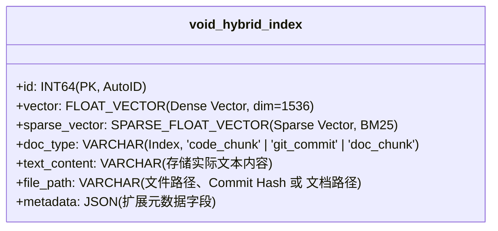

# Milvus 混合索引与检索方案设计 (代码 + Git 提交 + 文档)

> **文档状态**：2026-06 更新。Phase 7 **已实现**（Milvus 2.4+ Dense + Sparse + RRF）。  
> 任务：[TODO.md § Phase 7](./TODO.md#phase-7--milvus-混合索引-p3)

要在 Milvus 向量数据库中对 **C/C++ 源代码**、**Git 提交历史** 及 **项目文档（如 Markdown）** 建立统一的高精度向量索引和混合索引（Hybrid Index），我们需要设计合理的 Schema（表结构）、分区架构、索引类型，并利用 Milvus 2.4+ 提供的**多向量检索（Multi-Vector Search）与稀疏向量/标量混合查询**能力。

**当前行为**：Settings 选择 Milvus 时连接 `localhost:19530`（可配置），构建 `mcode_hybrid_{workspaceId}` collection；检索走 Dense+Sparse hybrid + RRF。可选 **Dual-write** 同步本地 LlamaStore。

---

## 0. Phase 7 前置条件与交付清单

| 前置 | 原因 |
| :--- | :--- |
| Phase 0–4 本地 RAG 稳定 | 避免 Milvus 掩盖切片/检索问题 |
| Phase 6 Git/文档 metadata | Schema 三分区 `doc_type` 与本地一致 |
| `milvus/docker-compose.yml` 可启动 | 开发/测试环境 |

| 交付项 | 说明 |
| :--- | :--- |
| `MilvusVectorStore` 适配层 | 替换/并行 `LlamaStore` |
| Dense + Sparse + RRF | 宏名/类名/Commit Hash 精确匹配 |
| Settings 连接测试 | Index Type 切换真正生效 |
| 可选双写 | 迁移期 local + milvus 同步 |

---

## 1. Milvus 集合模式设计 (Unified Collection Schema)

为了能够在一张表中进行全局多路归并检索，建议设计一个统一的 Collection（例如 `void_hybrid_index`），并通过 `doc_type` 区分三种不同数据实体。

### 1.1 Schema 结构定义



* **`vector` (密向量)**：用于捕获代码逻辑、提交消息、文档描述的通用**语义相似度**（维度根据 Embedding 模型确定，如 OpenAI `text-embedding-3-small` 为 1536 维，BGE-M3 为 1024 维）。
* **`sparse_vector` (稀疏向量)**：Milvus 2.4+ 原生支持稀疏向量，用于做 **BM25 全文检索**。这对代码 RAG 至关重要（用于精确匹配 Commit Hash 如 `a1b2c3d`、C 语言宏定义 `USE_SSL` 或特定类名 `PaymentService`）。
* **`metadata` (JSON 字段)**：根据 `doc_type` 存放特异性的过滤属性：
  - **代码切片 (`code_chunk`)**：`{ "startLine": 10, "endLine": 45, "symbols": ["verify"], "macros": ["DEBUG"] }`
  - **Git 提交 (`git_commit`)**：`{ "hash": "a1b2c3d4", "author": "alice", "date": "2026-06-22", "added": 12, "deleted": 2 }`
  - **文档切片 (`doc_chunk`)**：`{ "headers": ["Payment", "Setup"], "projectLinks": ["src/pay.c"] }`

---

## 2. 索引流水线与向量转化 (Indexing Pipelines)

### 2.1 Git Commit 向量构建
在索引 Git 历史时，我们使用大模型或特定的 Embedding 策略将提交信息与 Diff 统计转换为向量：

1. **输入清洗**：提取 `git log`，剔除 Merge 节点噪音。
2. **文本格式化**：将 Commit 信息重构为易于向量化和全文检索的文本格式：
   ```text
   Commit: a1b2c3d4
   Author: alice
   Message: Fix signature verification bug in C++ payment module.
   Diff Stat: Modified src/pay.cpp (+12 lines, -2 lines)
   Key Changes: Corrected bounds check in verify_signature().
   ```
3. **向量生成**：将上述格式化文本输入 Embedding 模型，生成 Dense Vector，并使用本地 Tokenizer（如 BM25）生成 Sparse Vector，一并写入 Milvus。

### 2.2 文档 (Doc) 向量构建
1. **标题路径带入**：利用 `MarkdownHeaderTextSplitter` 分片，将每段 Markdown 文本与它的所有父标题路径拼装在一起，增强语义边界：
   ```text
   Document: docs/setup.md
   Context: Payment System > API Configuration
   Content: To configure SSL keys, modify maximum buffers using #define MAX_BUF 2048...
   ```
2. **向量生成**：对上述带有“上下文面包屑”的文本进行 Embedding。

---

## 3. Milvus 物理分区与索引类型选型

### 3.1 物理分区 (Partitions)
为了在大规模项目中优化查询性能，我们为 Collection 建立三个 Partition（分区）：
* `code_partition`
* `git_partition`
* `doc_partition`

**检索优化**：若用户发起模糊问答，则全分区检索；若用户指明了范围（如“帮我分析最近的提交”），则检索请求显式指定 `partition_names=["git_partition"]`，直接跳过海量的代码向量，使得查询速度提升数倍。

### 3.2 索引类型 (Index Type)
为了确保高性能相似度召回，我们在 Milvus 中构建如下索引：

1. **Dense Vector 索引**：
   - 使用 **`HNSW`**（Hierarchical Navigable Small World）索引。
   - 参数配置：`M=16`, `efConstruction=200`，度量类型选择 `COSINE`（余弦相似度）。
2. **Sparse Vector 索引**：
   - 使用 **`SPARSE_INVERTED_INDEX`**（稀疏倒排索引），度量类型选择 `IP`（内积）。
3. **标量索引**：
   - 对 `doc_type` 建立 `INVERTED_INDEX`，加速标量过滤过滤路由。

---

## 4. 混合检索与多路召回执行流程 (Hybrid Search Query)

在召回时，我们将 **密向量语义搜索**、**稀疏向量全文搜索** 以及 **标量过滤** 结合，通过 Milvus 的 `hybridSearch` API 并应用 RRF（Reciprocal Rank Fusion）算法进行重排合并。

```typescript
import { MilvusClient, DataType } from "@zilliz/milvus-sdk-node";

async function queryHybridRag(
    client: MilvusClient,
    queryText: string,
    denseEmbedding: number[],
    sparseEmbedding: { [key: string]: number },
    workspaceHash: string
) {
    const collectionName = `void_hybrid_index_${workspaceHash}`;

    // 1. 定义密向量检索请求 (语义匹配)
    const denseSearchReq = {
        data: [denseEmbedding],
        annsField: "vector",
        params: { nprobe: 10 },
        limit: 10,
    };

    // 2. 定义稀疏向量检索请求 (精准关键字/Hash 匹配)
    const sparseSearchReq = {
        data: [sparseEmbedding],
        annsField: "sparse_vector",
        params: { drop_ratio_search: 0.2 },
        limit: 10,
    };

    // 3. 执行 Milvus 多路召回，并应用 RRF (倒数排名融合) 算法合并两路结果
    const searchResults = await client.hybridSearch({
        collection_name: collectionName,
        partition_names: ["code_partition", "git_partition", "doc_partition"],
        // 可以加入标量过滤，例如排除特定类型的文档
        // expr: "doc_type != 'temp'",
        search_requests: [denseSearchReq, sparseSearchReq],
        ranker: {
            type: "RRF", // Reciprocal Rank Fusion
            params: { k: 60 } // RRF 常数
        },
        output_fields: ["doc_type", "text_content", "file_path", "metadata"]
    });

    return searchResults.results;
}
```

### 💡 混合检索的优越性：
* **语义泛化召回**：通过 `denseSearchReq`（密向量），即使用户输入“如何验证证书”，也能匹配到文档中写有“Configure SSL keys”或代码中 `verify_signature()` 相关的逻辑。
* **物理关键字召回**：通过 `sparseSearchReq`（稀疏向量/BM25），如果用户输入 Commit 哈希 `a1b2c3d4`，或者宏定义 `MAX_BUF`，能够绕过语义相似度限制，通过字面精准碰撞直接命中对应的 Commit 节点或代码切片。
