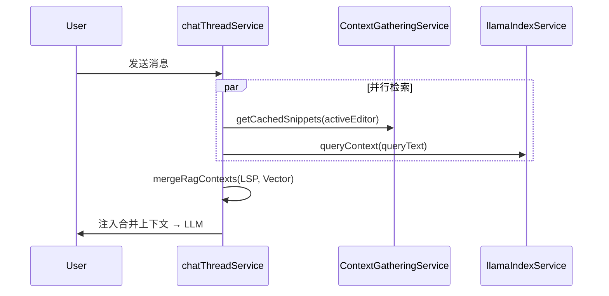

# RAG 分阶段实施路线图

> **文档状态**：2026-06 制定，与 [TODO.md](./TODO.md) 任务清单同步维护（**Phase 0–10 ✅**）。  
> **范围**：LlamaIndex 本地 RAG、LSP 双通道、切片质量、Git/文档索引、Milvus 混合检索、高级编排与 Phase 10 工程化。  
> **已知限制**：见 [§10](#10-phase-10-与已知限制) ↔ [TODO.md § 已知限制](./TODO.md#已知限制当前实现) ↔ [LlamaIndex §8.5](./设计方案_LlamaIndex接入与优化方案.md#85-已知限制与后续)

---

## 1. 背景与目标

MCode 已完成 **Phase 0–10 全链路**：

- Electron Main `VectorStoreIndex` / **Milvus 混合索引** + `MCode/LlamaStore/{workspaceHash}` 持久化
- **tree-sitter 混合切片** + 语义 regex fallback；**tree-sitter 建图**（`code-graph-v2`）
- 增量索引 + **git commit 增量刷新**；编排层 Router / SubQuestion / Graph / Reranker
- LSP 双通道、依赖推荐 UI、Settings 编排开关；`npm run test-rag` 单测脚本

**Phase 11**（模型能力 CDN）与 [长期项](./TODO.md#长期可选非近期) 为后续迭代，不阻塞日常使用。

---

## 2. 阶段总览

| 阶段 | 名称 | 优先级 | 核心产出 | 详细任务 |
| :--- | :--- | :--- | :--- | :--- |
| 0 | 基线 | — | 本地索引 + 语义切片 + 增量 | ✅ 已完成 |
| 1 | LSP + 向量双通道 | **P0** | Chat 合并 LSP snippets 与 RAG chunks | ✅ 已完成 |
| 2 | 索引与同步 UI | **P0** | Settings 进度/状态/增量反馈 | ✅ 已完成 |
| 3 | 切片与增量补强 | P1 | regex 增强 + ignore purge + 单测 | ✅ 已完成 |
| 4 | 检索增强 | P1 | Reranker、Parent-Child、邻域扩展 | ✅ 已完成 |
| 5 | tree-sitter AST | P2 | AST 切片 + regex fallback | ✅ [TODO §5](./TODO.md#phase-5--tree-sitter-ast-切片-p2) |
| 6 | Git / 文档索引 | P2 | `git_commit` + `linkedFiles` + 动态 diff | ✅ [TODO §6](./TODO.md#phase-6--git-与文档索引本地p2) |
| 7 | Milvus 混合索引 | P3 | Dense+Sparse+RRF、三分区 | ✅ [TODO §7](./TODO.md#phase-7--milvus-混合索引-p3) |
| 8 | 高级编排 | P3 | Graph / SubQuestion / Router / Doc 链接 | ✅ [TODO §8](./TODO.md#phase-8--llamaindex-高级编排-p3) |
| 9 | 智能推荐 | P4 | 依赖推荐 UI、模型意图路由 | ✅ [TODO §9](./TODO.md#phase-9--智能推荐与模型路由扩展p4) |
| 10 | 质量与工程化 | P1–P2 | 建图 AST、git 增量、编排 Settings、test-rag | ✅ [TODO §10](./TODO.md#phase-10--质量补强与工程化-p1p2) |
| 11 | 模型能力同步 | P4 | CDN `models.json`、Handshake Probe | ⏳ [TODO §11](./TODO.md#phase-11--模型能力动态同步扩展-p4) |

---

## 3. Phase 1：LSP + 向量双通道（✅ 已实现）

### 3.1 实现摘要

- `contextGatheringService` 已在 `mcode.contribution.ts` 注册
- `chatThreadService._gatherHybridRagContext()` 并行 LSP + `queryContext`，经 `mergeRagContexts` 合并
- Phase 9/10：`getRelatedDependencies` 供侧边栏依赖推荐（Graph + LSP 回退）

### 3.2 目标架构



### 3.3 合并策略

| 规则 | 说明 |
| :--- | :--- |
| **优先级** | LSP 片段优先保留（光标相关、零延迟） |
| **去重** | 按 `(filePath, startLine, endLine)` 或内容 hash 去重 |
| **预算** | 总字符上限（如 12k），LSP 占 30%，向量占 70%（可配置） |
| **降级** | 无活跃编辑器 → 仅向量；LSP 超时 → 仅向量 |
| **格式** | 分区标注 `[LSP Context]` / `[RAG Context]`，便于调试 |

详见 [解析_RAG与上下文检索机制.md](./解析_RAG与上下文检索机制.md) §7。

---

## 4. Phase 2：索引与同步 UI（✅ 已实现）

### 4.1 事件模型

```typescript
interface RagIndexProgressEvent {
    phase: 'scanning' | 'embedding' | 'persisting' | 'incremental' | 'idle';
    filesDone: number;
    filesTotal: number;
    chunks: number;
    currentFile?: string;
    error?: string;
}
```

- 全量重建：Settings 按钮 → 进度条 + 禁用重复点击
- 增量同步：最近一批 `{ fileCount, deltaChunks, timestamp }` 展示在 Index Status 区域

### 4.2 UI 状态机

| 状态 | 展示 |
| :--- | :--- |
| `idle` | manifest 中 `builtAt`、file/chunk 计数 |
| `building` | 进度条 + 当前文件 |
| `syncing` | 「正在同步 N 个文件…」 |
| `error` | 错误信息 + 重试入口 |

---

## 5. Phase 3–5：切片与检索质量

### 5.1 Phase 3（正则增强）

在不动 AST 的前提下，关闭已知缺口：

- ignore 变更后 purge 已索引文件
- TS/JS 箭头函数、C++ 头文件声明、超大符号二级切分

规范见 [解析_切片规则.md](./解析_切片规则.md) §12。

### 5.2 Phase 5（AST）— ✅ 已实现

- 引擎 `treeSitterChunker.ts` + `chunkCodeForIndexing()` 混合策略；manifest `chunkEngine: tree-sitter-hybrid-v1`
- AST 失败 → `semanticCodeChunker` fallback；函数上方 doc 注释保留（Phase 10 切片补强）

### 5.3 Phase 4（检索）— ✅ 已实现

- 文档 Parent-Child（`doc_parent_map.json`）+ 代码 `code_symbol_map.json`
- Hybrid Reranker：Retrieve TopK 12 → rerank → Final TopK 5（Settings 可配）

---

## 6. Phase 6–7：多数据源与 Milvus

### 6.1 本地 Git/文档（Phase 6）— ✅ 已实现

在不依赖 Milvus 时，Git commit 与 doc chunk 使用同一 `VectorStoreIndex`，metadata `docType` 区分。Phase 10 起增量批次后 **`refreshGitCommitIndex()`** 刷新 commit 块（侧车 `git_commit_index.json`）。

| docType | 来源 |
| :--- | :--- |
| `code_chunk` | tree-sitter 混合语义切片 |
| `git_commit` | `gitLogIndexer.ts` |
| `doc_chunk` | `MarkdownNodeParser` + `linkedFiles` |

动态 Git 召回（`git diff`）在**查询期**执行，不写入向量库。详见 [解析_Git与文档索引机制.md](./解析_Git与文档索引机制.md) §4。

### 6.2 Milvus（Phase 7）— ✅ 已实现

接入完成：

- 统一 Collection + **code / git / doc** 三分区
- Dense + BM25 Sparse + RRF（`MilvusRagStore`）
- Settings `indexType: milvus` 生效；可选 `ragMilvusDualWrite` 双写本地副本

详见 [设计方案_Milvus混合索引与检索设计.md](./设计方案_Milvus混合索引与检索设计.md) §0 · [milvus/README.md](../milvus/README.md)。

---

## 7. Phase 8–9：高级编排与智能推荐（✅ 已实现）

查询编排入口：`llamaIndexService.queryContext()` → `assembleOrchestratedContext()`（可通过 Settings 关闭 `ragUseOrchestrator`）。

### 7.1 Phase 8 — 编排层


| 能力 | 实现文件 | 说明 |
| :--- | :--- | :--- |
| **Router** | `ragQueryOrchestrator.routeQueryTargets` | 启发式分流 code / git / doc；Milvus 用 `partition_names`，本地 post-filter + P10 过量采样 |
| **SubQuestion** | `splitSubQuestions` / `splitSubQuestionsWithLlm` | 长句拆分并行召回；LLM 需 OpenAI key，8s 超时回退 |
| **PropertyGraph 风格扩展** | `codeGraphBuilder.ts` + `codeGraphTreeSitter.ts` | 侧车 `code_graph_map.json`，`graphEngine: code-graph-v2`；检索后 1–2 hop 邻居片段 |
| **Code-Doc 混合** | `buildLinkedCodeSnippets` | doc 命中 → `linkedFiles` 拉源码符号 |
| **配置** | `RagQueryOptions` / Settings Orchestration | `ragUseRouter`、`ragGraphExpandHops` 等 |

设计细节：[设计方案_LlamaIndex §8](./设计方案_LlamaIndex接入与优化方案.md#8-llamaindex-高级能力phase-8-已实现) · 任务：[TODO §8](./TODO.md#phase-8--llamaindex-高级编排-p3)。

### 7.2 Phase 9 — 依赖推荐与模型路由

| 能力 | 实现 | 说明 |
| :--- | :--- | :--- |
| **依赖推荐** | `DependencyRecommendations.tsx` + `contextGatheringService.getRelatedDependencies` | `@file` staging 显示 Related files；CodeGraph 优先，LSP references 回退 |
| **模型意图路由** | `modelIntentRouter.ts` + Settings General | fast / reasoning 分流；**每条 user 消息**重新分类，tool 循环保持已选模型 |
| **Graph 数据源** | 索引时 `mergeFileIntoCodeGraphAsync` | 无图时需 **Rebuild**；Settings 显示 `graphEngineReady` 警告 |

产品方案：[设计方案_RAG智能推荐与模型路由.md](./设计方案_RAG智能推荐与模型路由.md) · 任务：[TODO §9](./TODO.md#phase-9--智能推荐与模型路由扩展p4)。

---

## 10. Phase 10 与已知限制

Phase 10 在 Phase 8–9 之上做**质量补强**（不新增存储后端）。完整任务表：[TODO §10](./TODO.md#phase-10--质量补强与工程化-p1p2)。

| 主题 | 要点 |
| :--- | :--- |
| 建图 | tree-sitter import/call（`codeGraphTreeSitter.ts`） |
| Git | 增量后 `refreshGitCommitIndex` |
| 编排 UX | Settings Orchestration 区块；`defaultRagQueryOptions` 默认值齐全 |
| 工程 | `npm run test-rag`；移除 debug 日志；`milvus/volumes/` gitignore |

**仍存在的限制**（与 [TODO § 已知限制](./TODO.md#已知限制当前实现) 同步）：

| 限制 | 说明 |
| :--- | :--- |
| Git Blame → CodeGraph | 未实现，见 [解析_Git §1.1](./解析_Git与文档索引机制.md#11-静态提交历史索引git-commit-indexing) |
| Doc mentions 建图 | 仅检索期 linkedFiles，非 CodeGraph 文档边 |
| 轻量侧车图 | JSON 侧车非官方 PropertyGraph；>2 hop 见 [L-2](./TODO.md#长期可选非近期) |
| 模型能力 | `modelCapabilities.ts` 硬编码 → Phase 11 |

汇总表亦见 [设计方案_LlamaIndex §8.5](./设计方案_LlamaIndex接入与优化方案.md#85-已知限制与后续)。

---

## 8. 风险与原则

1. **先融合、后扩容**：Phase 1 启用 LSP 比上 Milvus 收益更快、风险更低
2. **本地优先**：Milvus 是存储与混合检索升级，不是切片前提
3. **manifest 版本化**：切片引擎 / schema 变更递增 `version`，避免 silent 索引损坏
4. **主进程非阻塞**：新索引路径继续遵守 20 文件 `setImmediate` 让渡与 embedding 熔断

---

## 9. 相关文档索引

| 文档 | 用途 |
| :--- | :--- |
| [TODO.md](./TODO.md) | 可勾选任务清单、**已知限制**、Phase 10/11 |
| [设计方案_LlamaIndex接入与优化方案.md](./设计方案_LlamaIndex接入与优化方案.md) | 架构、Settings、编排 §8、**§8.5 已知限制** |
| [解析_RAG与上下文检索机制.md](./解析_RAG与上下文检索机制.md) | 双通道 RAG 机制 |
| [解析_切片规则.md](./解析_切片规则.md) | 代码切片规则 |
| [解析_Git与文档索引机制.md](./解析_Git与文档索引机制.md) | Git/文档索引、Milvus 分区 |
| [设计方案_Milvus混合索引与检索设计.md](./设计方案_Milvus混合索引与检索设计.md) | Milvus Schema 与混合检索 |
| [设计方案_RAG智能推荐与模型路由.md](./设计方案_RAG智能推荐与模型路由.md) | Phase 9 产品方案 |
