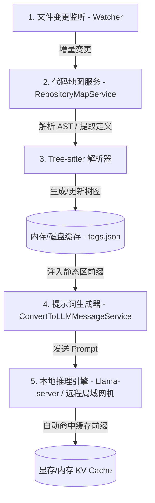

# 设计方案：本地代码地图与本地 KV 缓存结合设计

本方案旨在 MCode 本地环境中，通过引入**基于 Tree-sitter 的轻量化本地代码地图（Repository Map）**与**本地 Llama-server 的 KV Cache 机制**进行深度结合，在极小 Token 惩罚下，让大模型获得项目级的全局视野，并保持秒级的推理响应。

---

## 1. 核心设计架构

系统由三个核心模块构成：



---

## 2. 详细技术实现

### 2.1 本地代码地图生成与动态剪枝（Repository Map）

为了不让大模型在不知道项目结构的情况下盲目读盘，我们利用 Tree-sitter 构建一个低 Token 开销的全局代码地图。

1. **依赖解析器 (Tree-sitter)**：
   - 引入 `web-tree-sitter`，支持主流语言（TS、JS、C++、C#、Python、Go 等）。
   - 提取文件中的**高价值符号定义**（Class, Interface, Function, Method, Exports, Imports），忽略函数体具体实现。
2. **大型项目的“动态剪枝”优化（RAG-based Map Culling）**：
   - 如果项目庞大（数百万行代码），完整的地图文件（可能会达到几兆字节，几十万 Token）如果全部发送给大模型，会瞬间撑爆大模型的 Context Window。
   - 方案采用 **动态剪枝**：基于当前用户提问或最近读取的活跃文件，通过轻量级文本检索（如 TF-IDF）或语义召回，**只筛选出最相关的 20~30 个文件的结构地图**。
   - 将发送的地图 Token 严格控制在 **2000~3000 Token**（约 10KB 文本）以内，秒级完成数据构建和局域网网络传输。
3. **KV 分片磁盘缓存与异步增量更新**：
   - 地图在本地不以单一文本形式保存，而是使用 KV 键值对数据库（分片 JSON 结构缓存），只有被修改过的文件才在后台异步重新解析，未修改文件读取缓存耗时 `< 1ms`。

### 2.2 静态前缀与本地 KV Cache 锁定

本地 Llama-server（或 Ollama）使用 `slot` 分配缓存。任何对 Prompt 前部内容的修改都会导致 KV 缓存完全失效并重算全量 Prefill。

我们重新规划发送给大模型的 Prompt 结构：

```text
+-------------------------------------------------------------+
| [静态前缀区 1] 核心系统提示词 (System Prompt Instructions)     | => 100% 缓存命中
+-------------------------------------------------------------+
| [静态前缀区 2] 本地代码地图 (Repository Map)                  | => 95% 缓存命中（文件增删时微量失效）
+-------------------------------------------------------------+
| [半动态前缀区] 活跃文件上下文 (Active Files Context)          | => 部分重算（文件变动时重算此段之后的内容）
+-------------------------------------------------------------+
| [动态对话区] 对话历史 (Chat History)                        | => 顺推追加（KV 缓存自然延伸）
+-------------------------------------------------------------+
```

* **完全避免中间修改**：历史聊天记录（尤其是 `tool` 消息体）绝对不进行 folding 修改，其体积通过之前的轻量化方案已降到极低。
* **分层排序**：越稳定的内容越靠前，越动态的内容越靠后。

### 2.3 远程局域网 Llama 服务适用性

即使推理服务（如 Llama-server）部署在局域网内的另一台机器上，该方案依然适用且性能不减：
- **地图生成与剪枝**完全在开发者本地运行，只将生成的极小地图文本（~10KB）随着 API HTTP 请求发给局域网远端。
- 局域网传输延迟在 **1~3ms** 内，几乎无感。
- 远端的 `llama-server` 只要前缀没有变化，会同样在它的显存中命中 **KV 缓存**，极速响应。

---

## 3. 演化实施计划

整个方案分三个阶段实施：

### 阶段一：本地 RepositoryMapService 建立 (Phase 1)
* **任务**：
  1. 创建 `RepositoryMapService`（位于 `browser/services` 目录），订阅工作区文件变更。
  2. 实现基于 Tree-sitter（或内置 LSP API 备用方案）的类与函数定义解析器。
  3. 建立本地磁盘缓存，在工作区初始化时进行增量扫描。
* **文件变动**：
  - 新建 `src/vs/workbench/contrib/mcode/common/repositoryMapService.ts`
  - 修改 `src/vs/workbench/contrib/mcode/browser/mcode.contribution.ts` 注册服务。

### 阶段二：提示词生成器前缀重构 (Phase 2)
* **任务**：
  1. 修改 `convertToLLMMessageService.ts`，在系统提示词的头部注入 `[REPOSITORY MAP]` 块。
  2. 优化 Prompt 拼接逻辑，确保格式和顺序的稳定性。
* **文件变动**：
  - 修改 `src/vs/workbench/contrib/mcode/browser/convertToLLMMessageService.ts`

### 阶段三：Llama-server 配置优化与联调校验 (Phase 3)
* **任务**：
  1. 配置 Llama-server 启动参数，启用 `--parallel 1`、`--ctx-size 65536` 和本地 slot 缓存策略。
  2. 编写自动化基准脚本，测量前缀缓存命中时的 TTFT（Time-To-First-Token）延迟（预期从 30s 降至 1s 内）。
