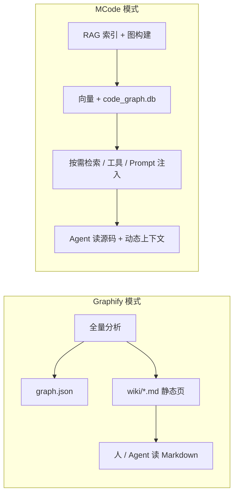

# 调研：Graphify 式 Per-Node Wiki 页面必要性评估

> 关联：[需求_集成Graphify知识图谱与GraphRAG服务.md](./需求_集成Graphify知识图谱与GraphRAG服务.md) §1.2  
> 完善计划：[Graphify集成_完善计划与任务清单.md](./Graphify集成_完善计划与任务清单.md)（T0–T11 未含 wiki）

---

## 1. 调研背景

Graphify（`graphifyy`）在构建代码知识图谱后，除 `graph.json`、`GRAPH_REPORT.md`、`graph.html` 外，还会输出 **`wiki/` 目录**：为每个代码实体（类、函数、模块等）生成独立的 Markdown 说明页。

MCode 已完成 Graphify 核心能力原生化（图谱构建、Graph RAG、Webview、Repository Map、`code_graph.db` 等）。产品侧需明确：**是否仍需补齐 Graphify 式 per-node wiki？**

---

## 2. Graphify Wiki 机制简述

### 2.1 产物形态

```
graphify-out/
├── graph.json
├── GRAPH_REPORT.md
├── graph.html
└── wiki/
    ├── CSvgParser.md
    ├── SvgReader_read.md
    └── ...
```

典型 wiki 页内容（推断自 Graphify 设计目标）：

| 区块 | 内容 |
|------|------|
| 实体摘要 | 类/函数职责的自然语言描述 |
| 签名与位置 | 文件路径、行号、类型 |
| 关系摘要 | 被谁调用、依赖谁、继承关系 |
| 可选扩展 | 使用示例、注意事项（常由 LLM 生成） |

### 2.2 生成方式

- **触发**：全量 `graphify` 分析完成后批量生成。
- **输入**：AST 符号 + 调用图 + 部分源码片段。
- **输出**：静态 Markdown 文件，与 `graph.json` 节点 ID 一一对应。
- **更新**：代码变更后需重新运行分析并**整批或增量**刷新 wiki。

### 2.3 设计意图

1. **人类可读**：非源码读者也能快速理解模块职责。
2. **Agent 可读**：作为预计算的「说明书」，减少 `read_file` 与探索轮次。
3. **可导出**：wiki 目录可独立发布为文档站或接入 Obsidian 等。

---

## 3. MCode 现状对照

### 3.1 已实现能力矩阵

| Graphify wiki 试图覆盖的需求 | MCode 现有实现 | 动态 / 静态 |
|-----------------------------|----------------|-------------|
| 理解符号职责 | RAG 语义切片召回 + Agent `read_file` | 动态 |
| 符号签名与位置 | `codeSymbolMap` + Repository Map | 动态（按活跃文件） |
| 上下游关系 | `query_codebase_relations` | 动态 |
| 二阶关联上下文 | `expandRetrievalWithGraph` | 动态 |
| 架构级概览 | `GRAPH_REPORT` + Webview Hub / Communities |  quasi-静态（索引时计算） |
| 可视化导航 | Webview 双击节点 → 源码行 | 动态 |
| 机器可读图数据 | `code_graph.db` + 内存 `CodeGraph` | 索引时更新 |

### 3.2 需求文档中的定位

`wiki/` 仅出现在 **§1.2 调研对象** 的产物列表中，**未**列入 FE-1～FE-4 核心功能需求，完善计划 T0–T11 亦未纳入。

```text
FE-1  图谱构建与增量更新     ✅
FE-2  Graph RAG              ✅
FE-3  Webview 可视化         ✅
FE-4  智能 Repository Map    ✅
wiki  per-node 说明页        ❌ 未立项
```

### 3.3 架构差异



MCode 是 **IDE 内实时 Agent**：上下文在对话时组装；Graphify wiki 是 **离线批处理文档**。

---

## 4. 必要性评估

### 4.1 结论摘要

| 维度 | 评估 |
|------|------|
| **当前是否必须做** | **否** — 核心 FE 已闭环，wiki 不阻塞 Graphify 集成 |
| **优先级** | **P3 / 可选增强** |
| **推荐策略** | 暂不实现全量 wiki；若未来有需求，采用「按需单节点生成」 |

### 4.2 不做全量 wiki 的理由

| # | 理由 | 说明 |
|---|------|------|
| 1 | **与 RAG 高度重叠** | 代码 chunk 已向量化；wiki 多为 LLM 对同一段代码的二次摘要 |
| 2 | ** staleness 风险** | IDE 内代码频繁改动，静态 wiki 易与源码不一致，误导 Agent |
| 3 | **成本与规模** | 万级节点 × LLM 调用 + 存储 + 失效策略，索引时间与费用显著上升 |
| 4 | **Repository Map 已覆盖骨架** | 活跃文件的 symbol + 1-hop 邻居已注入 Prompt，粒度与 wiki 部分重叠 |
| 5 | **Agent 工具链更精准** | `query_codebase_relations` + `read_file` 按问题定向取数，优于通读静态页 |
| 6 | **需求未立项** | 调研产物 ≠ 产品承诺，避免 scope creep |

### 4.3 仍可能有价值的场景

| 场景 | 说明 | 是否依赖全量 wiki |
|------|------|-------------------|
| 导出项目文档站 | 给 PM / 新人看的只读文档 | 是（或类似产物） |
| 离线无 LLM 浏览 | 无网络时浏览模块说明 | 是 |
| 超大仓库「模块导读」 | 仅对 Hub / Community 代表节点生成摘要 | 否（可裁剪范围） |
| 合规 / 交付物 | 客户要求附带架构说明文档 | 是（导出功能） |
| Webview 节点侧栏 | 点击节点显示 prose 说明而非仅跳源码 | 否（按需生成即可） |

---

## 5. 若未来实施：方案对比

### 5.1 方案 A：Graphify 式全量 `wiki/`（不推荐为默认）

- **流程**：索引完成 → 遍历 `code_entities` → 每节点 LLM 生成 Markdown → 写入 sidecar `wiki/`。
- **优点**：与 Graphify 产物对齐；可整体导出。
- **缺点**：成本最高；维护失效复杂；与 MCode 动态 Agent 哲学冲突。

### 5.2 方案 B：按需单节点生成（推荐若要做）

- **流程**：Webview 右键 / 命令面板「生成此符号说明」→ 取图邻居 + 源码片段 → 单次 LLM → 缓存至 `wiki_cache/{nodeId}.md`。
- **优点**：成本可控；与用户意图对齐；可设 TTL 或随文件 hash 失效。
- **缺点**：无「一键全项目文档」；需 UI 入口。

### 5.3 方案 C：仅 Hub / Community 摘要（低成本折中）

- **流程**：索引时对 Top-N Hub 节点或每个 Community 代表节点生成 1 页摘要；写入 `GRAPH_REPORT` 扩展节或独立 `wiki_hubs/`。
- **优点**：LLM 调用量 O(社区数)；契合架构分析场景。
- **缺点**：普通符号无专属页。

### 5.4 方案 D：纯模板、零 LLM（最轻）

- **流程**：由 `code_entities` + `code_relations` 模板渲染 Markdown（签名、关系列表、行号），不调 LLM。
- **优点**：零 Token、可全量、随索引同步。
- **缺点**：无自然语言「职责描述」，与 Graphify wiki 体验差距大。

| 方案 | LLM 成本 | staleness | 与 Graphify 相似度 | 推荐度 |
|------|----------|-----------|-------------------|--------|
| A 全量 wiki | 极高 | 高 | 高 | ⭐ |
| B 按需单节点 | 低 | 低 | 中 | ⭐⭐⭐⭐ |
| C Hub/Community | 低 | 中 | 低 | ⭐⭐⭐ |
| D 模板页 | 无 | 低 | 低 | ⭐⭐ |

---

## 6. 与现有模块的集成点（若选方案 B/C）

| 模块 | 可能改动 |
|------|----------|
| `codeGraphBuilder.ts` | 导出单节点子图 + 邻居列表供 Prompt |
| `llamaIndexService.ts` | 可选 sidecar `wiki_cache/` 读写、按 file hash 失效 |
| `mcodeGraphWebview.ts` | 节点详情面板 / 右键「生成说明」 |
| `toolsService.ts` | 可选工具 `get_symbol_wiki`（读缓存或触发生成） |
| 索引目录 | `wiki_cache/{nodeId}.md` 或 SQLite `code_wiki` 表 |

**不建议**写入 `code_graph.db` 或 `rag_vectors.db`；wiki 与图结构生命周期不同，宜独立 sidecar。

---

## 7. 决策建议

### 7.1 短期（当前版本）

- **不实现** Graphify 式全量 per-node wiki。
- 在 [需求_集成Graphify知识图谱与GraphRAG服务.md](./需求_集成Graphify知识图谱与GraphRAG服务.md) 中可将 `wiki/` 标注为 **「Graphify 参考产物，MCode 不纳入 FE」**（可选文档修订）。

### 7.2 中期（有明确产品需求时）

- 优先 **方案 B（按需生成）** 或 **方案 C（Hub 摘要）**。
- 触发条件示例：用户导出文档、Webview 显式请求、Agent 工具调用。

### 7.3 验收标准（若立项）

- [ ] 单节点生成延迟 ≤ 15s（本地模型）/ ≤ 5s（云端小模型）。
- [ ] 源文件 hash 变更后缓存自动失效或标记过期。
- [ ] 生成内容不替代 `read_file` 中的源码，仅作导读（Prompt 中注明）。

---

## 8. 参考资料

| 资料 | 说明 |
|------|------|
| Graphify / graphifyy | safishamsi/graphify，PyPI 包，含 wiki 输出 |
| MCode FE-1～FE-4 | [需求文档](./需求_集成Graphify知识图谱与GraphRAG服务.md) |
| 已实现图谱能力 | [Graphify集成_完善计划与任务清单.md](./Graphify集成_完善计划与任务清单.md) |
| Repository Map | `repositoryMapService.ts` + `repositoryMapFormatter.ts` |
| 架构报告 | `codeGraphBuilder.ts` → `buildGraphArchitectureReport` |

---

*调研结论：2026-07-01 · **当前不必做全量 wiki**；保留按需生成作为 P3 可选能力。*
