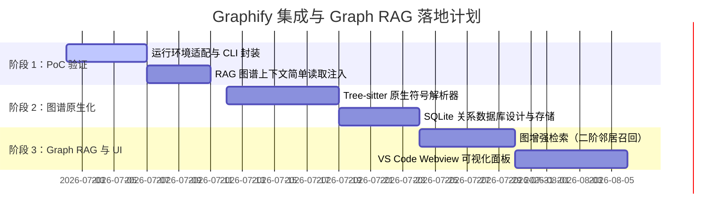

# 需求文档：集成 Graphify 知识图谱与 Graph RAG 服务

## 1. 背景与目标

### 1.1 现状与痛点
当前 MCode 工程在处理大项目时的代码理解与上下文召回仍存在以下局限：
1. **RAG 检索呈扁平化（Flat Semantic Search）**：目前 `llamaIndexService.ts` 结合 SQLite 向量数据库，采用传统的“语义向量匹配 + 切片召回”。这种方式割裂了代码实体（类、函数、接口）之间的**继承、调用、依赖与导入关系**。例如，召回了 `class A`，但与其紧密相连的 `class B`（`A` 的父类或主要调用者）可能因为语义距离稍远而被漏掉。
2. **代码地图（Repository Map）表达力有限**：现有的 `RepositoryMapService` 仅通过正则和简单的语法关键字匹配来提取 TS/JS/Python/C++ 签名，且只以纯文本形式追加在 System Message 头部。缺乏对项目全局拓扑结构（如高出度“上帝节点”、强连通分支）的计算，无法指导模型进行更深层的架构分析。
3. **缺乏直观的可视化界面**：开发者和 AI 均无法直观查阅项目的架构拓扑，对未知项目的上手成本较高。

### 1.2 调研对象：Graphify (safishamsi/graphify)
`Graphify` 是一个开源的 AI 编程辅助工具（PyPI 包为 `graphifyy`），其核心设计包括：
* **Tree-sitter 本地解析**：不消耗 LLM Token，完全在本地对 20+ 语言进行语法树解析，提取类、方法、导入和调用图（Call Graph）。
* **NetworkX 拓扑分析**：采用图论算法计算出度、度中心性（Degree Centrality），并利用社区发现算法（如 Leiden/Louvain）对代码实体进行模块化划分。
* **丰富的多维产物**：
  * `graph.json`：机器可读的知识图谱数据，适于 Agent 查询。
  * `GRAPH_REPORT.md`：自动总结的架构报告、核心“上帝节点”及潜在的知识断层。
  * `graph.html`：基于三维/二维力的交互式图谱可视化界面。
  * `wiki/`：为每个代码节点生成独立的 Markdown 说明页。

### 1.3 评估结论
**高度适用**。MCode 本身就是一个运行在 Electron 宿主环境下的 AI Agent 底座。引入 Graphify 的核心理念（或将其作为底座服务），能够让 MCode 升级为具备 **Graph RAG（图增强检索）** 与 **交互式可视化代码地图** 的下一代 AI 辅助系统。

---

## 2. 核心功能需求

### FE-1: 知识图谱自动构建与增量更新
* **需求描述**：在工作区初始化或检测到大规模文件变更时，自动在后台对项目建立依赖与调用图谱。
* **具体要求**：
  * 支持增量更新，利用文件哈希（SHA-256）建立缓存，避免每次都全量解析。
  * 解析范围包含：文件依赖图（Import/Export）、类继承树（Inheritance）、函数调用链（Call Graph）、以及文本关联（Markdown/PDF 概念链接）。
  * 排除 `node_modules`、`.git`、编译产物等非必要目录。

### FE-2: Graph RAG 增强检索服务
* **需求描述**：改造目前的 RAG 检索链路，将语义向量搜索与图谱遍历深度结合。
* **工作流设计**：
  1. **种子提取**：对于用户的输入 Query，首先通过语义向量检索（SQLite Vector Store）获取 Top-K 个最相关的代码片段（Node Chunks）。
  2. **二阶图扩展**：在图谱中定位这 K 个节点，自动拉取它们的一阶、二阶关联节点（例如：调用当前函数的上游函数、当前类所实现的接口、以及所在的模块 Community）。
  3. **拓扑排序与合并**：对扩展出的节点按图中心度（Centrality）进行排序，剪枝掉低价值节点，并最终融入大模型的 `[ACTIVE FILES CONTEXT]` 或 RAG Context，确保召回结构上的完整性。

### FE-3: VS Code Webview 交互式图谱面板
* **需求描述**：在 VS Code 侧边栏或编辑器区域提供可视化面板，呈现项目的代码关系图。
* **具体要求**：
  * 渲染交互式力导向图（Force-Directed Graph），节点大小代表其在项目中的重要性（Degree Centrality）。
  * 点击节点可直接定位并打开对应的本地源文件和行号。
  * 支持在图谱中搜索特定实体，高亮其调用链和上下游依赖。
  * 支持展示“架构报告”（类似 `GRAPH_REPORT.md` 中的高频修改区、高耦合上帝类警示）。

### FE-4: 基于知识图谱的系统提示词优化
* **需求描述**：取代目前死板的全量或局部 `RepositoryMap` 方案，通过图谱算法智能筛选最合理的“骨架图”注入 Prompt。
* **具体要求**：
  * 当活跃上下文超出阈值时，自动根据图的邻近度算法（K-Hop Neighbors），只保留与当前打开文件在调用图上距离 $\le 2$ 的类和函数签名，极大节省 Token，并提高本地 Llama-server 的 KV Cache 稳定性。

---

## 3. 技术实施方案评估

为了将该功能引入 MCode，有以下两种实施路径可供选择：

### 方案 A：封装 Python 命令行包（CLI Wrapper）
* **原理**：MCode 在 Electron-main 中检查本地 Python 环境，自动通过 `pip install graphifyy` 或 `pipx` 运行 `graphify` 命令行工具，并解析输出的 `graphify-out/graph.json` 与 `graph.html`。
* **优点**：
  * **开发成本极低**：直接复用 Graphify 已有的 Tree-sitter 和 NetworkX 算法能力。
  * **产物直接可用**：直接将生成的 `graph.html` 嵌入 Webview 即可完成可视化。
* **缺点**：
  * **用户环境摩擦极大**：依赖用户本地安装 Python 和 pip，在 Windows 环境下极易因为路径、权限、虚拟环境问题导致失败，极大影响 Extension 体验。
  * **集成度差**：进程间通信（IPC）成本高，难以做到真正的文件级细粒度实时增量更新。

### 方案 B：原生 TypeScript 移植与重构（Native Node.js/TS）
* **原理**：在 `mcode/electron-main/rag` 目录下，直接引入 `web-tree-sitter` (JS 版 Tree-sitter) 与 JS 侧的高性能图数据结构库（如 `graphology` 或 `cytoscape.js`），在 MCode 主进程中直接构建图谱，并将关系持久化至现有的 SQLite 数据库中。
* **优点**：
  * **零运行依赖**：完全开箱即用，不需要用户配置 Python 环境。
  * **性能极佳**：与现有的 SQLite 向量库和文件系统监听器（Watcher）深度缝合，可以做到毫秒级的实时增量构建与更新。
  * **深度可控**：图谱持久化于**独立** `code_graph.db`（与 `rag_vectors.db` 同目录），支持 SQL 关系查询且不干扰向量重建。
* **缺点**：
  * **前期开发量大**：需要使用 TypeScript 重新编写基于 Tree-sitter 查询模式（AST Queries）的符号关联解析器，并移植图中心度计算逻辑。

### 决议推荐
* **推荐采用【方案 B】（原生 TS 移植）作为最终目标**，但**第一阶段可使用【方案 A】进行概念验证（PoC）**。
* 在第一阶段中，开发一个可选开关，若检测到本地有 `graphifyy`，则由 Agent 自动触发 `/graphify` 分析，将 `graph.json` 的节点作为上下文信息注入给大模型。

---

## 4. 实施阶段计划

### 阶段一：PoC 阶段（基于 CLI 封装）
1. 在 [toolsService.ts](file:///d:/work/void/src/vs/workbench/contrib/mcode/browser/toolsService.ts) 中增加新工具 `run_graphify`。
2. 调用本地 Python 运行 `graphify` 并将结果输出到 `.gemini` 缓存目录下。
3. 读取 `graph.json` 并编写一个解析器，当用户提问时，由 Agent 直接从 JSON 中定位相关节点并丰富 System Message。

### 阶段二：原生化（TypeScript + SQLite）
1. 弃用 Python CLI，在 `mcode/electron-main/rag` 中集成 Tree-sitter WASM，编写各语言的 call-graph 规则（`codeGraphTreeSitter.ts`）。
2. 新增 **`codeGraphSqliteStore.ts`**：独立 `code_graph.db`（`code_entities` + `code_relations`），**不**扩展 `localSqliteVectorStore.ts`。
3. 内存 `CodeGraph` + JSON 侧车（`code_graph_map.json`）作热路径与 checkpoint；索引完成后同步 SQLite。
4. Repository Map 基于 `codeSymbolMap` + 1-hop 图邻居（已替代原 `repositoryMapService` 正则方案）。

### 阶段三：算法优化与可视化
1. 升级 [llamaIndexService.ts](file:///d:/work/void/src/vs/workbench/contrib/mcode/electron-main/rag/llamaIndexService.ts) 的 `retrieve` 流程，支持 **混合图检索模型（Hybrid Vector-Graph Retrieval）**。
2. 编写可视化组件，在侧边栏渲染 SVG/Canvas 交互式力导图。

---

## 5. 落地进度（2026-03）

| 需求 | 状态 |
|------|------|
| FE-1 图谱构建与增量 | ✅ 随 RAG 索引 + `code_graph_file_hashes.json` 跳过未变文件 |
| FE-2 Graph RAG | ✅ `ragUseGraphExpand` + orchestrator |
| FE-3 Webview | ✅ 2D/3D 离线 bundle、Hub、Louvain Communities、GRAPH_REPORT |
| FE-4 智能 Repository Map | ✅ symbol map + graph（T0） |
| 阶段二 SQLite 图谱 | ✅ `code_graph.db`（T11 存储重构） |
| 阶段一 PoC CLI | ⏭ 跳过，直接原生化 |

任务明细与优先级：[Graphify集成_完善计划与任务清单.md](./Graphify集成_完善计划与任务清单.md) · 存储选型：[解析_图存储架构选型.md](./解析_图存储架构选型.md)
