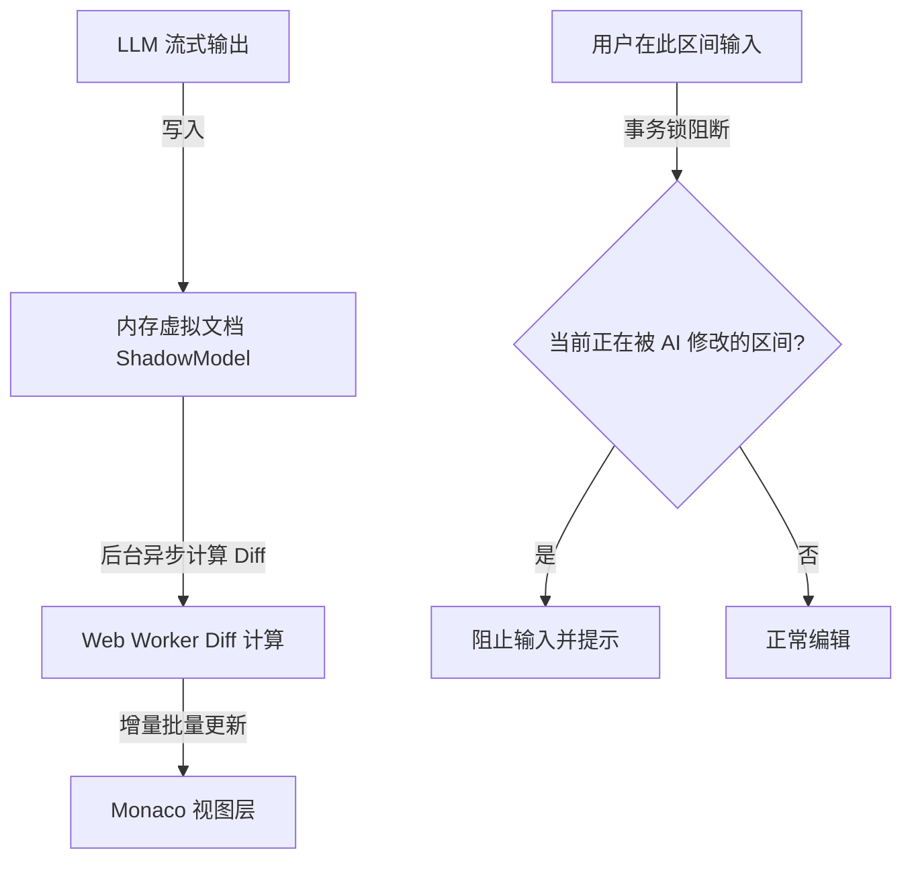
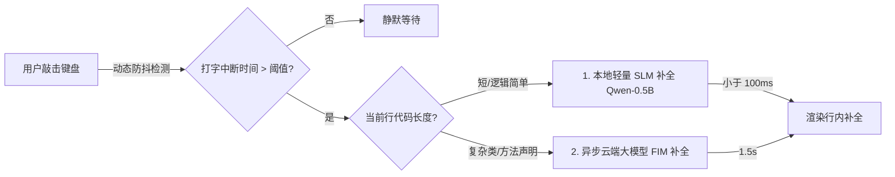

# Void 深度痛点分析与进一步优化方案

虽然之前的改造方案在 **RAG（LangChain/CodeGraph）**、**终端执行（Aider Subprocess）** 和 **Git 自动提交与回滚** 上做出了重大升级，但从一个“工业级”AI 编辑器的角度来看，Void 仍然存在以下四个深层次的瓶颈与痛点需要优化：

---

## 1. 痛点一：Monaco 实时流式 Diff 的性能与撤销栈损坏

### 1.1 痛点描述
在 [editCodeService.ts](file:///d:/work/void/src/vs/workbench/contrib/mcode/browser/editCodeService.ts) 中，AI 在应用修改时是直接向 Monaco Editor 实时流式写入字符，并计算渲染红/绿 DiffZone（即行内差分对比）：
* **性能卡顿**：大文件（> 1000 行）在接受流式写入时，Monaco 的 Tokenizer 和 ViewLine 渲染频繁重绘，导致明显的打字机卡顿。
* **撤销栈（Undo Stack）崩溃**：如果在 AI 正在写入代码的过程中，用户忍不住手动敲击了键盘，或者在流式中途点击了“取消（Abort）”，VS Code 的撤销/重做服务（`IUndoRedoService`）会出现历史状态混乱，导致用户按下 `Ctrl+Z` 时出现代码错位，甚至导致文件损坏。

### 1.2 优化方案：虚拟影本文档 + 事务锁机制

1. **虚拟影本文档（Shadow Model）**：
   - AI 的流式输出不直接写入当前的活动编辑器，而是写入一个不可见的内存虚拟文档（Shadow Model）。
   - 在后台 Web Worker 中异步、分时（Debounced）计算 Shadow Model 与当前文档的 Diff，再将 Diff 增量批量更新（Batch Decorate）到主编辑器的视图层。
2. **区域事务锁（Zone Transaction Lock）**：
   - 在 AI 流式编辑当前 `DiffZone` 时，临时锁定（Read-only）该代码行区间，阻止用户在此区间内键盘输入；但允许用户编辑文件的其他未受波及区域。
3. **原子撤销组合（Atomic Undo Grouping）**：
   - 将 AI 从“开始流式写入”到“写入结束”的所有 Monaco Edit 操作包裹在同一个 `UndoRedoElement` 事务中。使用户按下一次 `Ctrl+Z` 就能干净地回滚 AI 的全部修改，不会留下碎片状态。

---

## 2. 痛点二：上下文关联丢失（依赖感知 Staging 缺失）

### 1.1 痛点描述
目前在 Void 侧边栏中，用户只能手动通过 `@file` 提及或手动拖入文件来构建上下文：
* **问题**：如果用户修改了 `A.cpp` 中的一个类定义，但该类被 `B.cpp` 和 `C.h` 深度依赖。用户经常会忘记把 `B.cpp` 拖进上下文，导致 AI 生成的修改代码在调用处报错。

### 1.2 优化方案：静态分析依赖自动推荐 (Auto-Context Staging)
* **策略**：当用户在侧边栏添加或打开 `A.cpp` 时，RAG 服务通过 CodeGraph 自动解析其 AST（抽象语法树）中的 `import`、`include` 以及类继承关系。
* **UI 交互**：在输入框下方自动渲染一个小型的“推荐上下文”气泡：
  `💡 检测到修改了 Payment 类，建议同时将 [pay_handler.cpp](file:///...) 和 [pay_helper.h](file:///...) 放入上下文以防编译报错。 (一键添加)`

---

## 3. 痛点三：自动补全的延迟、高额 API 成本与高频打断

### 1.1 痛点描述
自动补全服务 [autocompleteService.ts](file:///d:/work/void/src/vs/workbench/contrib/mcode/browser/autocompleteService.ts) 在用户键入代码时频繁触发：
* **延迟与成本**：如果用户敲击每一个字母都向云端大模型发送请求，会产生高昂的 API 费用，且 1-2 秒的网络延迟使行内补全毫无实用价值。
* **高频打断**：用户在快速输入时，未写完的代码补全会不断闪烁，干扰思路。

### 1.2 优化方案：端侧 SLM (Ollama/WebGPU) + 令牌动态防抖

1. **混合端云补全**：
   - **本地端侧小模型 (SLM)**：在用户本地（基于 Ollama 或通过 WebGPU 在浏览器运行 Qwen-0.5B / DeepSeek-Coder-1.5B），在本地内存中完成 90% 的基础语法补全，响应时间在 100ms 以内。
   - **云端大模型**：只有当用户停顿超过 800ms，或者在书写复杂的类声明/复杂算法时，才触发异步云端大模型请求。
2. **动态令牌防抖（Dynamic Debounce）**：
   - 根据用户的**实时打字速度（WPM）**动态调整防抖延迟。用户打字极快时自动将 Debounce 延长至 1.5 秒，打字停顿时缩短至 200ms，确保绝不干扰连贯的编码思路。

---

## 4. 痛点四：缺乏多文件协同修改的“全局预览/撤销”视图 (Composer Mode)

### 1.1 痛点描述
当前的 Void 只能单文件应用修改。当遇到“重构某一模块并修改所有调用处”的多文件复杂任务时，AI 只能串行地、一个个地修改文件。用户无法在一个全局的、统一的视图下预览这一系列连带修改，很难进行合并审查。

### 1.2 优化方案：多文件事务 Composer 视图
* **设计细节**：
  1. **全局预修改暂存区**：AI 代理（Agent）执行任务后，生成一个多文件 Diffs 集合，但不直接应用到物理文件。
  2. **专属 Composer UI 面板**：在侧边栏或主编辑器区弹出一个类似于 Git Staging 的“多文件 Diff 审查视图”（如 VS Code 的 Multi-File Diff Viewer）。
  3. **细粒度接受/拒绝**：用户可以点击勾选接受 `file_A.ts` 的修改，拒绝 `file_B.ts` 的修改，最后点击“确认合并（Commit Changes）”，将整批修改以一个 SCM 事务原子的方式写入物理文件。
