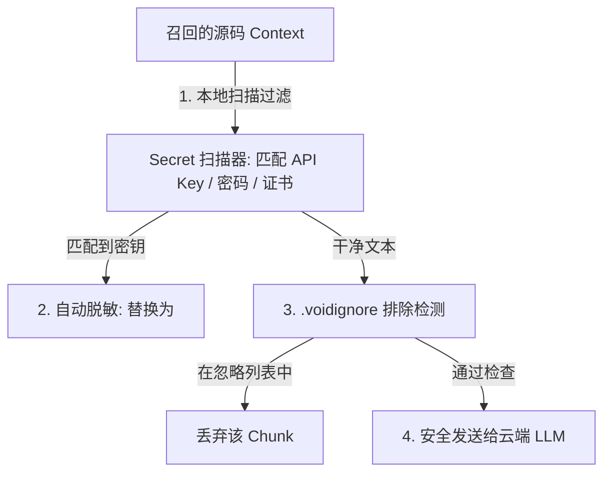

# Void 深度隐藏痛点与安全隐私演进方案

除了前台交互与核心检索外，在**模型兼容、数据安全、隐私合规以及 Agent 执行安全**等生产级深度场景下，Void 还有以下四个核心痛点需要优化：

---

## 1. 痛点一：硬编码模型能力映射导致的能力漂移（Capabilities Drift）

### 1.1 痛点描述
在 [modelCapabilities.ts](file:///d:/work/void/src/vs/workbench/contrib/mcode/common/modelCapabilities.ts) 中，Void 静态硬编码了数百行主流模型的能力列表（包括其 Token 限制、是否支持 reasoning、是否支持工具等）：
* **痛点**：大模型技术迭代极快。每当 OpenAI、Anthropic 或 DeepSeek 发布新模型时，用户在编辑器中即使填入新的模型名称，也无法使用该模型的高级功能（例如推理时间限制、原生 Tool 调用等），除非 Void 团队更新编辑器版本并重新编译分发。

### 1.2 优化方案：动态模型注册表与能力探测（Auto-Detector）
1. **云端动态注册表**：编辑器启动时，异步从 Void 官方的轻量级在线 CDN 获取最新的 `modelCapabilities.json`，在本地进行动态合并，确保新发布模型瞬间被支持。
2. **能力握手探测（Handshake Probing）**：
   对于用户自建或私有的模型，首次连接时后台进行一次极快的 JSON Schema 握手探测（例如发送一个包含系统角色、工具定义的 Mock 空请求）：
   - 若返回 HTTP 200，标记为“支持原生工具/系统角色”。
   - 若报错，则优雅降级为“提示词级 XML 工具格式”或“User-Role 包装 System Prompt”。

---

## 2. 痛点二：敏感数据与密钥泄露风险（Data Leakage & Secrets Masking）

### 2.1 痛点描述
在 RAG（向量检索与上下文抓取）检索时，代码切片会直接拼接进 LLM 负载发送给云端 API：
* **痛点**：开发人员经常在代码或配置文件（如 `.env`、`config.json`、`database.yml`）中遗留测试数据库密码、第三方 API 私钥或机密凭证。如果这些代码段被召回，它们会被**直接发送给公共大模型接口**，面临严峻的安全合规风险。

### 2.2 优化方案：本地隐私护盾与屏蔽网关 (Privacy Shield)

1. **本地脱敏器（Secret Masker）**：
   在 [convertToLLMMessageService.ts](file:///d:/work/void/src/vs/workbench/contrib/mcode/browser/convertToLLMMessageService.ts) 组装最终 Payload 之前，引入基于熵值与正则（如 `TruffleHog` 核心规则）的轻量级检测器。自动识别形如 `API_KEY = "sk-..."` 或 `password: "admin123"` 的行，将其替换为 `[MASKED_SECRET]`，确保敏感信息绝不出本地沙箱。
2. **`.voidignore` 支持**：
   允许项目根目录配置 `.voidignore` 文件，明确限制向量检索器和 Agent 的文件读取权限，禁止扫描敏感目录（如 `certs/`、`.git/`、`node_modules/`）。

---

## 3. 痛点三：缺乏意图感知的智能模型路由（Intent-based Model Routing）

### 3.1 痛点描述
目前用户在侧边栏手动绑定一个全局模型（如 `Claude 3.5 Sonnet`），所有操作（包括简单的“解释这行代码”、“写个注释”、“给变量起个名”）均使用该顶级模型。
* **痛点**：
  - **成本高昂**：简单问答使用高级模型造成严重的 Token 额度浪费。
  - **响应慢**：顶级模型的推理时间普遍长于小型模型。

### 3.2 优化方案：基于意图的模型分流路由器 (Intent Router)
* **策略**：当用户在侧边栏提交请求时，轻量级本地判定模型（或基于前缀指令分析）将请求分流至三条路由：
  - **快捷/解释类（Fast Lane）**：路由至速度极快、成本极低的模型（如 `GPT-4o-mini` 或 `Haiku`）。
  - **重构/代码生成（Code Lane）**：路由至主力代码模型（如 `Claude 3.5 Sonnet`）。
  - **架构设计/深度Debug（Reasoning Lane）**：路由至推理模型（如 `o3-mini` 或 `DeepSeek-R1`）。
* 并提供每月消费可视化统计图，让开发人员对其 AI 额度消耗一目了然。

---

## 4. 痛点四：MCP 服务执行的越权与恶意命令执行风险

### 4.1 痛点描述
Void 支持了 **Model Context Protocol (MCP)**（[mcpService.ts](file:///d:/work/void/src/vs/workbench/contrib/mcode/common/mcpService.ts)），允许大模型调用本地工具读取文件、执行终端指令。
* **痛点（安全漏洞）**：大模型容易受到“提示词注入攻击（Prompt Injection）”。如果大模型通过 RAG 读入了一篇恶意的第三方文档，该文档中隐藏了诱导大模型执行命令的指令，大模型可能会被劫持，通过 MCP 终端工具直接在用户电脑上静默执行恶意命令（如 `rm -rf /` 或窃取本地 SSH Keys 发送到攻击者服务器）。

### 4.2 优化方案：严格 MCP 权限网关与沙箱隔离
1. **破坏性动作二次确认（Confirmation Gate）**：
   对任何包含“修改文件 (Write)”、“执行 Shell 命令 (Execute)”的 MCP 调用，必须在 UI 界面弹出明确的安全授权卡片，显示具体要写入的文件内容或待执行的命令，待开发人员手动点击“允许（Allow）”后方可放行。
2. **轻量容器化隔离运行**：
   在企业高安全要求环境下，支持将 node-pty 或 MCP 进程封装在 Docker 容器或只读挂载（Read-only Bind Mount）的微型沙箱中运行，限制其访问宿主机的个人敏感目录。
